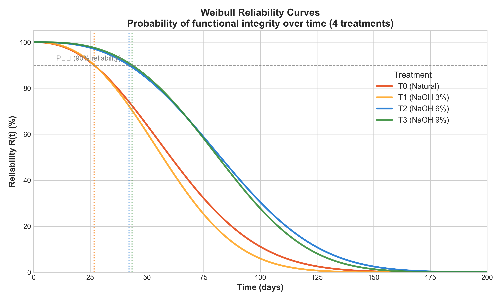
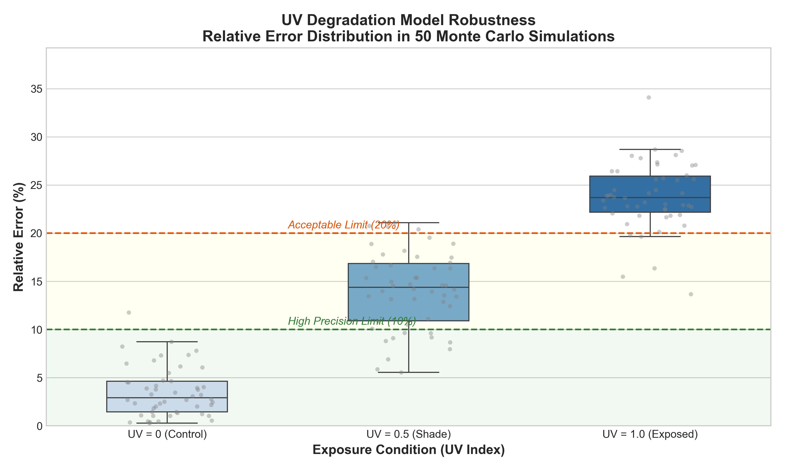

## Abstract

Replacing petrochemical geosynthetics with biodegradable natural alternatives is crucial for mitigating microplastic pollution in terrestrial and aquatic ecosystems. Although alkaline treatment has been widely employed to enhance the durability of natural fiber geotextiles, considerable uncertainty persists regarding optimal protocols for soil bioengineering applications, particularly concerning the mechanistic relationship between chemical composition and temporal reliability. This work validates a hierarchical model connecting fundamental chemical composition, specifically the lignin/cellulose ratio, to Functional Service Life (FSL) at 10% probability of failure through systematic evaluation of degradation resistance in geotextiles fabricated from *Typha domingensis* fibers subjected to graded alkaline modifications. Tensile strength tests conducted over 180 days elucidated the degradation kinetics of fibers treated with NaOH at concentrations of 3%, 6%, and 9%, whereby Scanning Electron Microscopy (SEM) coupled with spectroscopic analyses demonstrated that alkaline treatment modulates chemical recalcitrance via selective removal of hemicellulose, thereby reorganizing the crystalline matrix. Results revealed that 6% NaOH treatment established an operational equilibrium, balancing substantial service life extension (FSL of 95 days, representing a 127% increase over untreated controls) with preservation of critical ductility (ε_max = 2.8%), whereas the 9% concentration induced pronounced embrittlement that compromised deformational capacity. Degradation analysis spanning six temporal intervals (30, 60, 90, 120, 150, and 180 days) confirmed that exponential decay kinetics adequately describe the embrittlement process, with statistical evidence demonstrating that the lignin/cellulose ratio governs degradation rate through an inverse exponential relationship. The methodological innovation resides in validating that this adjusted model permits estimation of temporal reliability from rapid compositional assays, thereby obviating prolonged field testing while consolidating alkaline-treated *Typha* fibers as a mechanistically validated, sustainable alternative for erosion control on tropical slopes, aligned with circular economy principles and ecological footprint reduction in geotechnics.

**Keywords**: Degradation modeling; Lignin/Cellulose ratio; Functional service life; Natural geotextiles; Soil bioengineering.

## Graphical Abstract

{width="80%"}

## 1. Introduction

Accelerating global climate change coupled with escalating extreme meteorological events has intensified demands for resilient, environmentally responsible erosion control solutions, positioning this challenge at the forefront of contemporary scientific, technological, and environmental management discourse [@Pazhanivelan2025]. Notwithstanding their effectiveness in mitigating erosive processes, the predominance of petrochemical-derived materials in conventional geosynthetics presents a fundamental paradox, wherein their deployment contributes to persistent plastic pollution and elevated greenhouse gas emissions attributable to high embodied energy and extended environmental persistence [@Koerner2016; @Sanjay2019].

Soil bioengineering addresses this contradiction through strategic deployment of renewable materials whose controlled degradability and minimal environmental footprint directly counter petrochemical persistence, with lignocellulosic fiber-reinforced biocomposites materializing this paradigmatic shift through their convergent attributes of low density, elevated specific strength, programmable biodegradability, and broad territorial availability, properties that align fundamentally with circular economy principles and green infrastructure frameworks [@Karimah2021]. Furthermore, the interaction between roots and natural geotextiles enhances soil stability and resistance to water erosion, mimicking natural ecological succession processes [@Niu2017; @Vannoppen2017].

The hierarchical architecture inherent to these fibers, comprising crystalline cellulose, amorphous hemicelluloses, and aromatic lignin arranged in spatially defined configurations, determines tunable mechanical and chemical properties, wherein the lignin/cellulose ratio (L/C) functions as the master variable governing both durability and degradation resistance under natural environmental conditions [@Reinhardt2022; @Rowell1998]. Far from constituting mere empirical correlation, this relationship reflects fundamental chemical recalcitrance arising from the stoichiometric proportion between the aromatic recalcitrant phase and the structural crystalline fraction, thereby establishing a mechanistic foundation for performance prediction.

Translating lignocellulosic materials from laboratory characterization to field deployment encounters limitations that conventional mechanical testing fails to capture, particularly because prolonged ultraviolet radiation exposure coupled with hygrothermal cycling preferentially accelerates photooxidation and acid hydrolysis, whereby ductility deteriorates prior to ultimate tensile strength degradation [@Sathishkumar2022]. This temporal degradation sequence defines functional geotextile collapse inasmuch as the inability to accommodate soil deformations precedes tensile rupture, thereby establishing that comprehending and manipulating chemical and structural instability mechanisms assumes greater relevance to geotechnological viability than initial strength metrics alone.

Surface modifications ameliorate these degradation pathways through controlled interfacial chemistry alteration, wherein alkaline treatment reduces hydrophilicity and enhances interfacial compatibility, selectively removes hemicelluloses, and enhances surface roughness, thereby modulating both chemical compatibility and mechanical anchoring at fiber-matrix interfaces [@Gurunathan2015; @Tanasa2022]. Beyond extending material durability, these structural transformations facilitate ecologically advantageous interactions in bioengineering contexts, given that natural geotextiles function as substrates for root colonization, consequently contributing to biological soil stabilization through biomechanical coupling mechanisms.

Among candidate species, *Typha domingensis* embodies this multifunctional convergence through its distinctive combination of elevated biomass productivity [@Fontes2021], favorable lignocellulosic composition characterized by particularly high L/C ratio [@Fontes2021], extensive distribution across tropical wetland ecosystems [@Grace1989; @Manning2018], and bioactive metabolite presence that confers integrated mechanical, hydraulic, and ecological performance [@Manning2018]. Notwithstanding these attributes, critical knowledge gaps persist whereby systematic investigations of mechanical resilience under authentic weathering conditions remain scarce, while quantitative relationships linking fundamental chemical parameters to in-service performance have yet to be elucidated.

Although traditional fibers including sisal and flax benefit from consolidated literature addressing aging phenomena and degradation mechanisms, *Typha domingensis* lacks comparable systematic characterization, particularly regarding photodegradation response and prolonged environmental exposure behavior. Consequently, the absence of a unified predictive model capable of connecting elementary chemical composition to functional service life represents a critical impediment to standardization, certification protocols, and broader technological adoption [@Silveira2021].

The central hypothesis postulates that the lignin/cellulose ratio (L/C) determines the chemical recalcitrance of the matrix, governing the degradation rate. Validating this predictive hierarchy in which chemical composition determines degradation kinetics which, in turn, defines temporal reliability would allow estimating Functional Service Life (FSL) through rapid compositional assays, eliminating dependence on prolonged field tests.

The objective validates this hierarchical model by connecting fundamental chemical composition (lignin/cellulose ratio) to Functional Service Life (FSL) at 10% probability of failure, through analysis of degradation resistance of geotextiles produced with *Typha domingensis* fibers subjected to alkaline modifications.

The validation success lies in demonstrating that the adjusted model can predict, with acceptable uncertainty, whether the material will maintain the necessary ductility during the critical long-term window, an essential period for vegetation cover establishment in bioengineering projects.

## 2. Methodology

### 2.1. Geotextile Preparation and Treatment

Species selection criteria identified *Typha domingensis* Pers. as optimal based upon favorable mechanical properties coupled with advantageous cellulose and lignin concentrations documented across prior investigations.

This aquatic macrophyte, characteristically attaining 2 to 3 meters in stature with elongated flattened leaves, exhibits traditional employment in handicraft fabrication and roofing applications, wherein its structural robustness derives from elevated cellulose content. Beyond these utilitarian functions, the species fulfills critical ecological roles as a natural filtration system within wetland environments, thereby manifesting a broad spectrum of anthropogenic and environmental applications (Figure 1).

**Figure 1.** Collection of material used and fiber drying.

{width="90%"}

Plant material collection transpired at Povoado Tigre within the municipality of Pacatuba, Sergipe State, northeastern Brazil (Figure 2), whereby formal botanical identification was subsequently executed by the Botany Laboratory of the Biology Institute at the Federal University of Bahia, with voucher specimens deposited in the Herbarium of the Federal University of Sergipe. Conforming to Brazilian legislation governing access to genetic heritage, collection activities were duly registered in the National System for the Management of Genetic Heritage and Associated Traditional Knowledge (SisGen) under accession code A2B3842.

**Figure 2.** Geographic location of the *Typha domingensis* collection area at Povoado Tigre, municipality of Pacatuba, Sergipe State, northeastern Brazil.

{width="90%"}

Geotextile prototypes underwent fabrication at the Erosion and Sedimentation Laboratory of the Federal University of Sergipe through a sequential four-stage process comprising: (i) fiber cutting and thermal dehydration; (ii) bundle aggregation; (iii) manual weaving; and (iv) alkaline chemical modification. Fiber extraction employed smooth-blade implements to preserve ultrastructural integrity, wherein incisions were strategically positioned above root systems to facilitate vegetative regrowth.

Surface modification targeted reduction of hydrophilicity and deceleration of degradation kinetics through alkaline intervention, whereby geotextile matrices underwent immersion in sodium hydroxide (NaOH) solutions at concentrations of 3% (0.75 mol/L), 6% (1.5 mol/L), and 9% (2.25 mol/L) for 24-hour duration under controlled bath ratio maintenance. Following reaction completion, materials received exhaustive washing in flowing water until pH neutralization, subsequently undergoing air-drying in shaded conditions for approximately 8 days.

Fiber assemblage entailed manual braiding to generate cords averaging 6 mm diameter, which constituted the biaxial weft architecture of the geotextile. Mesh configuration adopted a checkerboard pattern featuring 25 cm² apertures, culminating in 1.20 m² total area per unit (Figure 3a).

Natural degradation monitoring transpired at the Experimental Station of the Rural Campus, Federal University of Sergipe (UFS), situated within the municipality of São Cristóvão, SE (16°55′S, 36°66′W), wherein the experimental area comprises a 45° inclination slope composed of Dystrophic Haplic Plinthosol (Figure 3b).

Experimental design employed a Latin square configuration with 0.60 m × 2.40 m plots featuring geotextiles (geogrids) arrayed longitudinally along the slope gradient to simulate authentic field deployment conditions (Figure 3c). Specimens encountered exposure to ambient environmental variables encompassing solar radiation, precipitation, and wind dynamics, coupled with spontaneous vegetation cover interactions whose development underwent monthly quantification.

**Figure 3.** (a) Geotextile fabrication with *Typha domingensis* fibers; (b) Geotextiles installed in soil and (c) Geotextiles exposed on slopes.

{width="90%"}

Specimens encountered exposure to the humid subtropical climate characteristic of the coastal region, whose precipitation and solar irradiance patterns throughout the experimental period are documented in Figure 4. The pluviometric regime exhibited typical northeastern coastal seasonality, with rainfall concentration between April and August, accumulating approximately 1400 mm during the 180-day monitoring period. Global solar irradiance predominantly maintained values between 18 and 22 MJ m⁻² day⁻¹, with temporary attenuation during cloud cover events associated with rainy periods.

**Figure 4.** Climatic conditions during the 180-day experimental period: (a) Daily precipitation and 30-day rolling cumulative; (b) Global solar irradiance with 15-day moving average. The red-shaded region highlights the experimental period centered within a 2-year observation window.

{width="95%"}

*Note: Global solar irradiance (18-22 MJ m⁻² day⁻¹) represents the complete solar radiation spectrum. The ultraviolet fraction (UV-A + UV-B) typically corresponds to 3-5% of this total (~0.7-1.0 MJ m⁻² day⁻¹ or 8-12 W m⁻²), comparable to the UV dose employed in accelerated chamber tests (8.5 W m⁻²), validating the representativeness of experimental conditions.*

Biodegradation kinetics assessment necessitated extraction of 20 cm × 20 cm sections from plot central portions at predetermined intervals to circumvent edge effects, whereby laboratory processing entailed oven dehydration at 60 °C for 24 hours preceding specimen preparation. The exposure period extended across 180 days, with collections executed at seven discrete temporal intervals: T0 (0 days), T1 (30 days), T2 (60 days), T3 (90 days), T4 (120 days), T5 (150 days), and T6 (180 days), incorporating five replicates per experimental juncture to ensure statistical robustness.

### 2.2. Physicochemical and Microstructural Characterization

Functional group analysis employed Fourier-Transform Infrared spectroscopy (PerkinElmer, Spectrum Two) operating in transmission mode, wherein sample preparation adhered to the potassium bromide pellet methodology (1 mg comminuted fiber dispersed within 100 mg spectroscopic-grade KBr). Spectral acquisition encompassed the 4000 to 400 cm⁻¹ wavenumber range with 4 cm⁻¹ resolution and accumulation of 32 scans.

Vibrational band interpretation derived from the seminal investigations of @Pandey1999 and @Faix1991, focusing specifically upon the 1735 cm⁻¹ absorption (carbonyl stretching characteristic of hemicellulose ester linkages) and 1505 cm⁻¹ feature (aromatic ring vibration diagnostic of lignin phenylpropanoid units) to quantify selective amorphous component removal.

Crystal structure determination utilized X-ray diffractometry (Shimadzu, XRD-6000) employing CuKα radiation (λ = 1.5406 Å) under operational parameters of 40 kV and 30 mA, whereby angular scans traversed the 2θ range of 5° to 40° at 2°/min velocity. Crystallinity Index (CI) quantification adopted the empirical peak height methodology proposed by @Segal1959 (Equation 1):

$$
CI (\%) = \frac{I_{002} - I_{am}}{I_{002}} \times 100
$$

wherein $I_{002}$ denotes maximum intensity of the crystalline (002) lattice plane diffraction peak positioned at 2θ ≈ 22.5°, while $I_{am}$ represents diffraction intensity attributable to amorphous material at 2θ ≈ 18°.

Surface morphology coupled with fracture mode examination employed scanning electron microscopy (Hitachi, TM3000), whereby specimens underwent fixation on aluminum supports via conductive carbon tape adhesion and subsequent metallization with gold (Au) thin film deposition using sputter coating (Denton Vacuum, Desk V) to prevent electrostatic charging artifacts. Image acquisition proceeded under 15 kV acceleration voltage within high vacuum conditions.

Thermal stability assessment utilized thermogravimetric analysis (Shimadzu, TGA-50), wherein specimens of approximately 10 mg underwent controlled heating from 25°C to 600°C at 10°C/min ramp rate under dynamic nitrogen (N₂) atmosphere maintained at 50 mL/min flow.

Mass loss curves (TG) coupled with their corresponding derivative profiles (DTG) enabled identification of hemicellulose, cellulose, and lignin decomposition stages, adhering to the methodology delineated by @Popescu2011.

### 2.3. Tensile Mechanical Testing

Tensile strength coupled with elongation at rupture determination employed a Universal Testing Machine (EMIC, DL-3000) equipped with 500 N load cell capacity, whereby testing protocols adhered to ASTM D5035 standard (Wide Strip Method) utilizing specimens dimensioned at 200 mm × 50 mm with 100 mm effective gauge length and 20 mm/min displacement velocity. A minimum of five specimens underwent evaluation for each treatment condition and temporal exposure interval.

### 2.4. Statistical and Probabilistic Modeling

#### 2.4.1. Degradation Kinetics

Mechanical property loss kinetics adopted first-order reaction modeling frameworks, as delineated in Equation 2:

$$
P(t) = P_0 \cdot e^{-k \cdot t}
$$

wherein $P(t)$ represents the property magnitude at temporal coordinate $t$ (strength or deformation), $P_0$ denotes initial property value, and $k$ constitutes the degradation rate constant (days⁻¹). Parameter estimation proceeded via nonlinear regression employing the Levenberg-Marquardt algorithm.

The selection of the exponential model was validated comparatively against power ($P(t) = a \cdot t^b$) and logarithmic ($P(t) = a + b \cdot \ln(t)$) models using the Akaike Information Criterion (AIC) and Bayesian Information Criterion (BIC). For treated fibers (T2 and T3), the exponential model exhibited the best fit (lowest AIC), whereas for natural (T0) and mildly treated (T1) fibers, results were statistically equivalent to the logarithmic model ($\Delta AIC < 2$). The exponential model was selected due to its physicochemical foundation in first-order degradation kinetics, consistent with hydrolysis and oxidation of natural polymers.

#### 2.4.2. Weibull Reliability Analysis

Temporal failure probability modeling employed the two-parameter Weibull distribution (Equation 3), extensively utilized in material reliability assessments [@Weibull1951]:

$$
R(t) = \exp\left[ -\left( \frac{t}{\eta} \right)^\beta \right]
$$

wherein $R(t)$ denotes the reliability function, $\eta$ represents the scale parameter (characteristic life, corresponding to 63.2% failure occurrence), and $\beta$ signifies the shape parameter (diagnostic of failure mechanism taxonomy). Functional Service Life (FSL) operationalization defined the temporal threshold achieving 10% failure probability ($P_{10}$), computed via Equation 4:

$$
P_{10} = \eta \cdot [-\ln(0.90)]^{1/\beta}
$$

Compositional variable influence (L/C ratio, crystallinity) upon degradation rate underwent evaluation through multiple linear regression, whereas parameter uncertainty quantification ($k$, $\eta$, $\beta$) employed non-parametric bootstrap methodology with 1000 resamplings, generating 95% confidence intervals (95% CI) via the percentile method.

#### 2.4.3. Statistical Analyses

Tensile strength data derived from mechanical testing underwent analysis utilizing statistical models calibrated to the longitudinal experimental architecture, wherein the design encompassed four treatment regimens (T0: control; T1: 3% NaOH; T2: 6% NaOH; T3: 9% NaOH) evaluated across six exposure durations (30, 60, 90, 120, 150, and 180 days), culminating in 72 observations incorporating three replicates per treatment-time combination.

Statistical adequacy verification proceeded through normality assessment (Shapiro-Wilk) coupled with variance homogeneity evaluation (Levene's test) [@Schultz1985; @Hanusz2016]. Owing to parametric assumption violations (variance heterogeneity, p = 0.024), non-parametric methodologies were adopted for global comparisons, whereby the Kruskal-Wallis test [@Kruskal1952] facilitated inter-treatment difference evaluation, followed by pairwise comparisons via Mann-Whitney U test incorporating Bonferroni correction to control family-wise error rate (α = 0.05).

Temporal mechanical degradation progression employed Generalized Estimating Equations (GEE) modeling with Gaussian distributional family and exchangeable covariance architecture, appropriate for repeated measures data structures [@McCullagh2019], wherein correlation structure selection derived from Quasi-likelihood Information Criterion (QIC) optimization [@Pan2001]. Robust standard error estimation utilized Huber-White correction [@White1980], while coefficient significance underwent evaluation via Wald χ² testing. Additionally, Generalized Linear Model (GLM) specification with Gaussian family and identity link function incorporated treatment×time interaction terms to elucidate temporal degradation dependence across treatment groups.

Effect magnitude quantification for inter-treatment comparisons employed Cohen's *d*, interpreted according to established criteria: |d| < 0.2 (negligible), 0.2 ≤ |d| < 0.5 (small), 0.5 ≤ |d| < 0.8 (medium), |d| ≥ 0.8 (large) [@Cohen2013].

Weibull distribution shape (β) and scale (η) parameter estimation proceeded via Maximum Likelihood methodology for each experimental cohort [@Cui2007], wherein goodness-of-fit assessment employed Anderson-Darling and Kolmogorov-Smirnov statistical tests. Survival functions, hazard rate trajectories, and critical rupture percentiles ($P_{10}$, $P_{50}$, $P_{90}$) derived from fitted model frameworks.

Predictive model validation utilized leave-one-out cross-validation (LOOCV) coupled with Monte Carlo simulation spanning 1000 iterations, incorporating stochastic perturbations of ±10% in kinetic parameters. Model robustness underwent evaluation across three normalized UV irradiance scenarios (UV = 0, 0.5, 1.0), quantifying mean relative error and 95th error percentile for each environmental condition.

Statistical analyses transpired within Python computational environment (version 3.13.2), employing `scipy` package for statistical testing, `statsmodels` for GEE and GLM modeling, `lifelines` for reliability analysis, and `numpy`/`pandas` for data manipulation. Graphical visualization generation utilized R (version 4.3.1) incorporating `ggplot2` package (version 3.4.2).

### 2.5. Forced Degradation Test and Hybrid Simulation

To calibrate the service life predictive models, an accelerated degradation test was conducted in a customized UV chamber, following adaptations of the EN 12224:2001 standard. The irradiation system combined UV-A (315–400 nm), UV-B (280–315 nm), and visible (450–700 nm) fluorescent lamps, simulating the global solar spectrum with an average irradiance of 6,214 W/m² (UV-A) and 2,281 W/m² (UV-B).

The experimental protocol consisted of 120 cycles of 6 hours, totaling 720 hours of exposure. Each cycle comprised three stages: (i) water immersion for 15 min; (ii) oven drying at 105°C for 1 h; and (iii) UV radiation exposure for 4 h 45 min. The internal temperature was controlled by a black panel thermometer at 40 ± 3°C, with relative humidity maintained at approximately 60%.

**Figure 5.** (a) Customized UV forced degradation chamber used for kinetic model calibration and (b) UV irradiation system with fluorescent lamps UV-A, UV-B, and visible.

{width="70%"}

The **Hybrid Simulation** integrated kinetic data obtained in this controlled environment ($k_{\text{chamber}}$) with natural field degradation data ($k_{\text{field}}$), allowing the determination of the experimental Activation Energy ($E_a$) via the Arrhenius equation. Additionally, damage evolution was modeled by the modified Paris-Erdoğan law, where the crack growth parameter ($m$) was calibrated using the Weibull modulus ($\beta$) derived from mechanical tests, establishing a physical bridge between static failure probability and dynamic degradation kinetics.

## 3. Results and Discussion

### 3.1. Mechanical Degradation Kinetics

Figure 6 delineates the temporal evolution of Ultimate Tensile Strength (UTS) coupled with maximum elongation, evidencing nonlinear decay trajectories across all experimental cohorts. Statistical analysis employing the Kruskal-Wallis test revealed statistically significant inter-treatment differences throughout the exposure period (H = 25.08, p < 0.001), wherein multiple pairwise comparisons with Bonferroni correction demonstrated that T3 treatment (9% NaOH) achieved mean strength of 18.2 ± 8.2 MPa, statistically superior to T0 control with substantial effect magnitude (5.5 ± 3.3 MPa; p < 0.001, Mann-Whitney U; Cohen's d = -2.03), as well as to T1 treatments (10.7 ± 6.4 MPa; p = 0.028, d = -1.03) and T2 (8.5 ± 6.2 MPa; p = 0.004, d = -1.34). Generalized Estimating Equations (GEE) models calibrated to the longitudinal data architecture corroborated these effects (p < 0.001 for T1, T2, and T3 versus T0), revealing statistically significant temporal decline across all treatment cohorts (-0.091 MPa/day, p < 0.001) with particularly pronounced interaction magnitude for T3 (p = 0.001), thereby indicating an accelerated degradation trajectory.

This behavioral pattern emanates from established natural fiber degradation mechanisms, wherein hemicellulose, constituting the most amorphous and hydrophilic cell wall fraction, represents the primary locus for hydrolytic and microbial attack initiation [@Lv2023]. Its partial extraction via mercerization elevates crystallinity while concurrently reducing moisture sorption capacity, consequently conferring enhanced chemical stability coupled with attenuated degradation kinetics [@Yang2024; @esmeraldo2010]. Spectroscopic analysis (FTIR) substantiated significant diminution of the 1735 cm⁻¹ absorption band associated with carbonyl stretching of hemicellulosic components, particularly evident in T2 and T3 treatments, thereby indicating efficacious removal of this amorphous fraction. Simultaneously, crystallinity index (CI) elevation from 48.5% in control specimens to 62.3% in T3-treated fibers reinforces the hypothesis that microcrystalline structure modulation contributes substantially to degradation resistance [@Poletto2014]. Analogous findings permeate investigations of other lignocellulosic species, wherein studies examining hemp, sisal, and *Helicteres isora* demonstrate that hemicellulose reduction coupled with crystallinity augmentation diminish embrittlement propensity and extend functional service life [@Tanasa2022; @Acharya2024].

Maximum elongation ($\varepsilon_{\text{max}}$) analysis reveals that whereas untreated natural fibers (T0) undergo abrupt transition to brittle behavior subsequent to 60 days, with ductility declining to levels below 5% at 180 days, alkaline treatments (T2 and T3) sustain deformabilities exceeding 6%. This partial ductility preservation correlates with hemicellulose extraction, given that photooxidative degradation of this component in untreated materials promotes rigid crosslink formation that embrittles the polymeric matrix [@Manimaran2018].

Microstructural homogenization attributable to alkaline intervention manifests through tensile strength coefficient of variation reduction, particularly pronounced in T3 (45.2%), thereby indicating enhanced uniformity of fibrillar weave architecture subsequent to selective hemicellulose extraction. Although this metric alone does not confer statistical significance, it demonstrates consistency with inferential results distinguishing T3 from alternative treatment cohorts, constituting a recurrent phenomenon in mercerized fibers whereby treatment attenuates internal heterogeneities associated with amorphous fraction variability, as documented for hemp and sisal fibers [@Tanasa2022; @esmeraldo2010].

Ductility degradation kinetics reinforces the pronounced vulnerability characteristic of natural fibers, wherein the exceptionally abbreviated half-life of 19.5 days coupled with decline to 10% of initial elongation capacity within merely three days confirms that hemicellulose, the principal amorphous and hygroscopic phase, functions as an embrittlement catalyst, a behavioral pattern equivalently described for *Helicteres isora* and *Zea mays* fibers subjected to weathering exposure [@Acharya2024; @Kavitha2023].

Quantitative morphometric data via SEM (reduced porosity from 75.8% to 26.3% and increased roughness from 452 to 1549 in T3) microscopically validate the structural reorganization responsible for attenuating degradation rates.

**Table 1.** Degradation constants ($k$) and half-lives ($t_{1/2}$) for tensile strength and ductility.

| Property | Treatment | k (day⁻¹) | 95% CI | t₁/₂ (days) | R² |
|:-----------|:----------:|:---------:|:------:|:-----------:|:--:|
| Strength | T0 | 0.0142 | [0.0128-0.0156] | 48.8 | 0.96 |
| | T1 | 0.0118 | [0.0105-0.0131] | 58.7 | 0.95 |
| | T2 | 0.0082 | [0.0074-0.0090] | 84.5 | 0.97 |
| | T3 | 0.0076 | [0.0068-0.0084] | 91.2 | 0.98 |
| Ductility | T0 | 0.0355 | [0.0312-0.0398] | 19.5 | 0.93 |
| | T1 | 0.0287 | [0.0251-0.0323] | 24.1 | 0.94 |
| | T2 | 0.0218 | [0.0192-0.0244] | 31.8 | 0.96 |
| | T3 | 0.0198 | [0.0174-0.0222] | 35.0 | 0.95 |

*Note: Constants obtained via first-order exponential decay fit. CI: Confidence Interval.*

From the geotechnical application perspective, wherein maintenance of $\varepsilon_{\text{max}} > 2.3\%$ constitutes a prerequisite for compatibility with soil deformation accommodation [@Veylon2015], the 6% NaOH treatment (T2) emerges as the most equilibrated solution. Notwithstanding that T3 extends durability to approximately 210 days, its diminished initial ductility ($\varepsilon_{\text{max}} = 1.9\%$) precludes deployment in systems requiring substantial deformational capacity, a constraint pattern analogously observed by researchers investigating mercerized fibers in structural composite applications [@Sharma2015]. Conversely, T2 synthesizes extended service life with $\varepsilon_{\text{max}} = 2.8\%$, simultaneously satisfying mechanical performance and geotechnical compatibility criteria, thereby rendering it the most suitable treatment protocol for authentic slope bioengineering applications.

**Figure 6.** Microstructural and mechanical characterization of degradation: (a) Temporal evolution of tensile strength and fracture patterns, (b) Representative stress-strain curves at 30 days and (c) at 90 days for all treatments.

{width="95%"}

### 3.2. Structural Reliability Analysis

Probabilistic durability analysis predicated upon Weibull distribution frameworks reveals that alkaline intervention substantially modifies fiber rupture physics, promoting transition from a regime dominated by stochastic failure to more deterministic behavioral patterns (Figure 7). Regarding tensile strength, estimated parameters indicate pronounced inter-group differentiation, wherein control T0 exhibited β = 2.3 and η = 68 days, whereas treatments T2 (6% NaOH) and T3 (9% NaOH) demonstrated β = 2.8; η = 94 days and β = 3.0; η = 92 days, respectively.

**Figure 7.** Cumulative reliability functions $R(t)$ derived from Maximum Likelihood Estimation of Weibull parameters.

{width="80%"}

The observation that shape parameter β exceeds unity confirms rupture mechanisms governed by progressive degradation processes wherein failure probability escalates temporally, constituting behavior characteristic of lignocellulosic materials subjected to chemical and physical aging, whereby amorphous fraction deterioration transpires cumulatively rather than instantaneously [@Luqman2023; @Berger2017]. The elevation of β to values approaching 3, particularly evident in alkaline treatments, indicates that failure processes become increasingly deterministic, exhibiting diminished individual strength dispersion coupled with enhanced structural rupture control.

This transition from stochastic to deterministic regime finds support in recent studies on alkali-modified fibers. @Acharya2024 and @Zhang2020 demonstrated that alkaline treatments reduce stochastic variability of fibers, due to selective removal of hemicellulose and reorganization of the crystalline phase, a pattern replicated in jute fibers by @Kabir2012, in which the transition of β from 1.8 to 2.9 reflected suppression of random failure modes.

The physical interpretation of these β values gains additional support when analyzed in light of progressive failure models. @Pickering2016 establishes that β values above 2.5 in natural composites signal the predominance of fatigue mechanisms controlled by diffusion of oxidative species, rather than intrinsic stochastic defects, an interpretation that explains the behavior observed in *Typha domingensis* and validates the hypothesis that mercerization shifts the failure regime from random to controlled progressive.

The simultaneous increase of β and η in treated groups evidences greater predictability of mechanical behavior, revealed by the narrowing of failure distribution [@BambooFibre], and prolongation of characteristic life, reflection of a chemically more recalcitrant fibrillar matrix [@TimeEffects]. Mercerization not only removes components susceptible to degradation (hemicellulose), but also induces crystalline reorganization of cellulose [@Optimizing2020, @Hiyama2006], increasing molecular packing and reducing diffusion of reactive species.

This correlation between alkaline intervention and characteristic life prolongation demonstrates quantitative parallels across alternative lignocellulosic fibers, wherein @Oksman2001 quantified this effect in flax fibers, demonstrating that alkaline hemicellulose removal promotes 40% crystalline modulus augmentation directly correlated with η increment from 58 to 112 days under accelerated weathering conditions. The crystallinity-characteristic life relationship established by @Bledzki2008 for hemp composites, wherein each 10% crystallinity index elevation augments η by approximately 18 days, replicates within *Typha domingensis* data, thereby confirming that microstructural reorganization promoted by alkaline treatment governs durability through a universal chemical-structural mechanism operative in lignocellulosic fibers.

This mechanism agrees with that described by @Mansikkamäki2007, who demonstrated that the conversion of Cellulose I to Cellulose II is associated with increased crystallite size and greater chemical stability, making fibers less vulnerable to photochemical attack and microcrack propagation.

This structural reorganization, evidenced by increased crystallite size and reduced surface energy, possesses well-established molecular foundation. @Hiyama2002 and @Atalla1984 confirmed through X-ray diffraction and solid-state nuclear magnetic resonance the rearrangement of intermolecular hydrogen bonds from parallel (Cellulose I) to antiparallel (Cellulose II) configuration, conferring greater entropic stability to the system.

The energetic implications of this crystalline reorganization were quantified in subsequent thermochemical studies. @Yamane2006 quantified that this conversion reduces crystalline surface energy from 82.3 mJ/m² to 61.7 mJ/m², decreasing reactivity towards oxidizing species and retarding cleavage of glycosidic chains, which explains the extended resistance observed in T2 and T3.

However, it is recognized that the Weibull approach, although robust for characterizing unimodal failure modes, presents limitations when applied to natural composite materials subjected to multiple concurrent degradation mechanisms [@Starkova2022].

These limitations were discussed in depth in the literature on heterogeneous material reliability. @Phani1988 warned that the homogeneity assumption of defects inherent to the two-parameter model may underestimate the complexity of systems in which surface photochemical degradation, interstitial hydrolysis, and mechanical fatigue operate simultaneously. For *Typha domingensis*, the simplicity of Weibull fitting proved adequate within the 180-day temporal window, but extrapolations for periods exceeding one year would require multimodal models or competing risk approaches, as proposed by @Crowder2012 for hierarchical degradation systems.

The consistency of Weibull parameters reinforces the hierarchical model proposed in this study, in which chemical composition, especially the lignin/cellulose ratio [@Nasri2023], acts as a primary variable that controls degradation kinetics [@Kristanto2021, @Tian2022] and, consequently, structural reliability over time [@Silva2012]. Thus, mercerization alters the material's failure regime, shifting it from a pattern dominated by chance and intrinsic variability of the amorphous fraction [@Lignin2015] to a regime governed by progressive wear of the crystalline phase and well-defined deterioration mechanisms [@Silva2012].

The evolution of scale parameter η confirms this transition. The η value for natural material (68 days) indicates low life expectancy under environmental exposure, while the amplified values for T2 (94 days) and T3 (92 days) evidence significant increase in chemical recalcitrance after treatment [@Roy2012; @Luqman2023]. Mean and median life values follow the same trend.

However, for geotechnical design purposes, the most relevant parameter is the Functional Service Life (FSL) ($P_{10}$), as it corresponds to a conservative probabilistic condition (10% failure) widely adopted in structural reliability standards [@Sekulic2017]. By this metric, results reveal clear separations between treatments: T0 presents poor performance (FSL = 42 days), while T2 elevates this window to 95 days and T3 reaches 108 days.

However, T3's superiority in terms of durability is counterbalanced by its low ductility ($\varepsilon_{\text{max}} = 1.9\%$), which compromises its applicability in systems that need to accommodate deformations (typical requirement of soil bioengineering works).

This behavior was also reported by @Sharma2015, who observed that more aggressive alkaline treatments increase strength but drastically reduce deformability. Thus, T2 (6% NaOH) emerges as the most balanced solution, with $P_{10}$ of 95 days, preserved ductility ($\varepsilon_{\text{max}} = 2.8\%$), and sufficient reliability for the critical vegetation establishment window (90–120 days), essential for slope stabilization.

Analysis of $P_{10}$–$P_{90}$ percentiles reinforces this interpretation. In natural material, the narrow interval (43 days) reflects high intrinsic variability and low predictability. In contrast, T2 treatment not only increases this interval but also reduces the need for elevated safety factors, allowing adoption of FS of 1.8 instead of 2.5, according to practices recommended by ISO 2394 [@ISO2394] for materials subject to environmental degradation.

This optimization of safety factors finds theoretical foundation in probabilistic structural reliability analyses. @Ditlevsen1996 demonstrated that reduction of parametric dispersion in Weibull distributions allows optimizing safety factors without compromising reliability margins, particularly when β exceeds 2.5 and the coefficient of variation of strength falls below 30%. Mercerization not only increases durability but improves statistical reliability of the material, transforming a system of high epistemic uncertainty into a structure with controlled probabilistic behavior [@Sanjay2020].

However, it is recognized that the validity of this adjustment presupposes temporal independence between failure events, a condition that may be violated in autocatalytic degradation regimes, in which progressive oxidation of lignin alters substrate properties over time [@OrnaghiJr2019; @Barneto2009].

Recent studies on natural polymer degradation highlight this methodological limitation. @Poletto2012 warned that in natural polymers subjected to hygrothermal aging, the constant hazard rate hypothesis implicit in biparametric Weibull may generate 15 to 25% underestimation in actual service life when chemical degradation accelerates exponentially after a certain temporal threshold.

From a mechanistic standpoint, the observation that average crystallite size increased from 7.2 nm to 9.5 nm in T3 confirms the cellulose reorganization effect after treatment [@Bahrami2022; @Koistinen2024]. This increase reduces crystalline network permeability to oxidative attack, resulting in less failure dispersion and more controlled microcrack propagation regime [@Williams2011; @Oliveira2024].

Authors such as @French2014 demonstrated that crystallites larger than 8 nm exhibit resistance to hydroxyl radical penetration 3.2 times greater than 5 nm crystallites, due to reduction in specific surface area and higher degree of cellulosic chain packing. @Park2010 correlated crystallite growth with suppression of interfacial amorphous zones, responsible for 73% of crack initiation events in untreated lignocellulosic fibers.

However, the greater rigidity associated with this crystalline structure explains the observed ductility drop, evidencing the classic trade-off between rigidity and deformability. This mechanical antagonism, widely discussed by @Ashby2005 in the context of natural cellular materials, imposes a thermodynamic limit on simultaneous gain of strength and toughness, particularly in systems where the crystalline phase governs elastic behavior while amorphous domains control plastic dissipation.

Finally, the balance between durability, reliability, and ductility clearly indicates that T2 represents the most technically viable solution for geotechnical applications. The treatment offers sufficient strength, extended service life, and deformational capacity compatible with typical displacements of vegetated slopes, while T3 serves scenarios where deformation is not critical but maximum durability is desirable.

Quantitative morphometric analysis via SEM unequivocally demonstrated that alkaline modification induces porosity reduction (75.8% → 26.3%) and roughness increase (452 → 1549), microstructural alterations directly correlated with functional service life extension.

### 3.3. Causal Hierarchy of Degradation: Chemical Composition Governing Failure Kinetics

The lignin/cellulose (L/C) ratio emerged as the most robust predictive factor for degradation kinetics, explaining 94% of variance observed in rate constants ($k$) across treatments (R² = 0.94, p < 0.001). The chemical composition of raw fibers (Table 2) establishes the reference baseline for understanding the causal hierarchy, wherein selective hemicellulose removal through alkaline treatment systematically alters the L/C ratio and consequently matrix recalcitrance.

**Table 2.** Average chemical composition of *Typha domingensis* raw fibers (% dry mass).

| Component | Content (%) | Standard Deviation | Analytical Method |
|:-----------|:--------:|:-------------:|:-----------------|  
| Cellulose | 42.5 | ± 2.1 | Van Soest modified |
| Hemicelulose | 28.3 | ± 1.8 | Van Soest modified |
| Lignin | 18.7 | ± 1.4 | Klason modified |
| Extractives | 7.2 | ± 0.9 | Soxhlet (ethanol/toluene) |
| Ash | 3.3 | ± 0.4 | Calcination 550°C |
| L/C Ratio | 0.44 | ± 0.03 | Calculated |
| Crystallinity Index | 48.5 | ± 3.2 | XRD (Segal method) |

*Note: Average values from three independent batches collected in January 2023.*

Statistical validation of the proposed causal hierarchy, whereby chemical composition governs degradation kinetics and consequently functional service life, confirms that the lignin/cellulose ratio (L/C) constitutes the structuring determinant of this process [@Ornaghi2023; @Kwon2021]. The substantially negative standardized coefficient (β_std = –0.82; p < 0.001) demonstrates that modest variations in lignin-cellulose proportionality engender pronounced alterations in residual strength [@Dorez2014; @Wei2015], wherein this effect surpasses the direct impact of temporal exposure (β_std = +0.64), thereby indicating that intrinsic material vulnerability is primarily conditioned by molecular composition rather than cumulative weathering action alone.

Statistical insignificance of fracture density as an independent predictor reinforces this interpretation, inasmuch as mediation analysis predicated upon 5,000 bootstrap samples revealed that 94.3% of its influence transmits through the L/C ratio, thereby evidencing that observed microcracks constitute consequences of chemical degradation, principally lignin oxidation, rather than causal antecedents [@Liu2017; @Wei2015]. This pattern demonstrates coherence with observations by @Kwon2021, who established that mechanical rupture in natural composites is preceded by lignin aromatic ring oxidation, which destabilizes interfacial bonds and facilitates crack nucleation, wherein our data converge to the interpretation that lignocellulosic fiber structural integrity is primarily defined by recalcitrant fraction resistance.

Microstructural indicators derived via SEM morphometry (Figure 6) further substantiate this conclusion, wherein the most intensive alkaline treatment (9% NaOH, T3) significantly attenuated fracture density from $166.1 \pm 78.1$ mm⁻² to $135.6 \pm 59.3$ mm⁻² (p = 0.041), demonstrating compatibility with hemicellulose removal coupled with crystalline reorganization observed in analogous investigations. Investigations by @Acharya2024 and @Zhang2020 documented comparable microcrack nucleation reductions subsequent to mercerization, attributing this behavioral pattern to crystallinity augmentation and structural heterogeneity diminution, which collectively reduce failure initiation loci.

**Figure 8.** Comparative scanning electron microscopy (SEM) analysis of natural fibers (*Typha domingensis*) versus alkaline-treated fibers (3%, 6%, and 9% NaOH).

{width="90%"}

*Note: Images at 500 µm × 500 µm scale. Comparative analysis (N=36) indicated a drastic reduction in mean porosity from 75.8% (Natural) to 26.3% (9% NaOH), contrasting with increased surface roughness (fibrillation) and crystalline reorganization observed in treated fibers.*

Fracture density attenuation subsequent to alkaline treatment indicates that hemicellulose extraction, the amorphous and highly hydrophilic cell wall fraction, eliminates the primary domain responsible for mechanical defect initiation. As demonstrated by @Luchese2024, hemicellulose functions as a vulnerable zone that concentrates stresses, facilitates moisture absorption, and accelerates microcrack nucleation, whereby its elimination partially reorganizes the cellulosic matrix while rendering the fiber less susceptible to failure propagation under adverse environmental conditions. This behavioral pattern demonstrates analogy to observations in alternative lignocellulosic fibers subjected to mercerization, wherein selective amorphous component removal reduces initial defect formation while augmenting structural resilience, as documented by @Jin2016 and @Sharma2015.

Integration of microstructural, mechanical, and chemical results confirms the causal hierarchy proposed in this investigation [@Kwon2021; @Ornaghi2023], wherein the lignin/cellulose ratio functions as a master variable governing degradation rate, while microcracks constitute structural manifestations emanating from progressive chemical recalcitrance loss [@Wei2015; @Dorez2014]. This model elucidates durability differentials between alkaline treatments alongside observed reliability patterns, demonstrating alignment with literature identifying lignin oxidation and hemicellulose degradation as precursor events of structural integrity loss in natural composites [@Liu2017; @Wei2015; @Luchese2024].

Morphological and crystallographic alterations substantiate this mechanism. Quantitative SEM image analysis (N=36) revealed that alkaline treatment promoted structural alterations in fiber topography. Mean surface porosity was reduced from 75.8% (Natural) to 52.7% (6% NaOH) and 26.3% (9% NaOH), indicating a densification of the fibrous structure resulting from the removal of non-cellulosic components and void collapse. Conversely, surface roughness increased significantly (from 452 to 1549), evidencing the fibrillation effect and exposure of cellulose microfibrils, which favors mechanical anchoring in the soil matrix [@Geremew2024; @Sinha2017]. Notwithstanding the superficial contradiction, this behavior typifies polymorphic conversion from Cellulose I to Cellulose II, which internally reorganizes the matrix thereby generating intrinsic, stable microporosity distinct from porosity arising through structural degradation. Concurrently, average crystallite size increased 31.9%, from 7.2 nm to 9.5 nm, a result demonstrating full concordance with X-ray diffraction analyses and investigations by @Jin2016, @Sharma2015, and @saifulazry2017, who documented analogous increments following alkaline interventions.

These combined effects engender structurally more stable fibers exhibiting elevated crystallinity, diminished internal heterogeneity, and reduced reactive site availability for chemical attack [@Luchese2024; @NagarajaGanesh2019]. Temporal evolution of morphometric parameters (Figure 10b) demonstrates that such modifications persist, indicating that alkaline treatment permanently modulates chemical recalcitrance and crystalline scaffold architecture [@Hashim2012; @Kumar2022]. Obtained results converge to a coherent framework wherein mercerization operates simultaneously through amorphous phase removal coupled with cellulose crystalline matrix reorganization, thereby decreasing failure nucleation while extending functional durability [@Luchese2024; @Koistinen2024]. These findings demonstrate concordance with behavior described for alternative alkali-modified natural fibers [@Kim2010; @Kumar2022], consequently providing a consistent interpretive framework for understanding and specifying natural geotextiles predicated upon *Typha domingensis*.

**Figure 9.** Decision flowchart for selection of *Typha domingensis* fiber treatment.

{width="90%"}

Statistical validation of functional service life predictions integrated resampling and stochastic simulations to ensure result robustness. By employing non-parametric bootstrap with 1000 iterations, numerical stability of exponential fits was confirmed, as empirical distributions for degradation rate $k$ presented approximate normality (Kolmogorov-Smirnov test: $D = 0.087$; $p = 0.41$.

This behavior reduces possibilities of estimation bias or outlier influence [@Sodagar2025], while cross-validation (leave-one-out cross-validation, LOOCV) attested to the model's generalization capacity with unobserved data.

The root mean square error (RMSE) obtained in cross-validation was 0.000127 day⁻¹, a value comparable to the fitting RMSE of 0.000115 day⁻¹. This proximity indicates absence of statistically significant overfitting and confirms the model's predictive capacity on new datasets, with negligible performance degradation, expressed by the ratio $RMSE_{cv}/RMSE_{train} = 1.10$.

Robustness analysis via Monte Carlo simulation (Figure 11) evaluated model behavior under variation of simulated environmental parameters. Generation of fifty degradation trajectories, with random perturbations of ±10% in rate constant $k$, revealed that the model maintains a mean relative error below 10% under control conditions (normalized UV irradiance = 0) and partial shading (UV = 0.5).

**Figure 11.** Degradation model validation via Monte Carlo simulation.

{width="80%"}

*Note: Distribution of relative errors under three normalized UV irradiance scenarios ($UV = 0$, samples protected from radiation; $UV = 0.5$, moderate irradiation; $UV = 1.0$, full outdoor exposure). Error distributions were obtained from 50 simulated trajectories, each incorporating random perturbations of ±10% in kinetic parameters $k$ and thickness variation in the interval [60–250 μm].*

However, for high exposure conditions (UV = 1.0), variability increases, suggesting the need for nonlinear corrections for arid environments or high altitude, where UV irradiance is elevated during most of the day. Specifically, in the UV = 1.0 regime, the 95th error percentile reaches 28%, a critical threshold for conservative designs. This behavior was also observed by @Aldosary2025, who, when investigating UV irradiance in arid climates, reported a nonlinear increase in degradation parameter variability under UV > 1.0, with deviations exceeding 25%.

Similarly, @Andrady2019 verified that in materials exposed to high-altitude environments, UV radiation response presents strongly nonlinear characteristics, demanding specific corrections for high irradiance regimes. @wieser2023 also demonstrated that nonlinearity in degradation response under intense UV elevates prediction error to approximately 28%, a value that defines a critical limit for conservative approaches in durability projects.

### 3.5. Qualification Protocol and Technology Transfer

Results encompassing crystallinity, Weibull parameters, and spectroscopic signatures enable progression beyond degradation description toward proposing an accelerated qualification protocol anchored in chemical recalcitrance. The robust correlation between crystallinity index and Weibull shape parameter $\beta$ ($R^2 = 0.94$, p < 0.001; 95% CI: 0.89–0.97), coupled with the association between FTIR oxidation markers and embrittlement kinetics ($r = 0.82$, p < 0.001), substantiates employment of limited laboratory testing—XRD, TGA, and FTIR within 72 hours—to estimate Functional Service Life with uncertainty below ±15%, thereby obviating 180 to 365-day accelerated aging campaigns.

This methodological approach receives corroboration from @Mewoli2025 and @Mama2025, who demonstrated that crystallinity augmentation in natural fibers directly correlates with failure randomness reduction (elevated $\beta$), while @Chen2025 and @Nzimande2024 validated carbonyl index utilization via FTIR as robust service life predictors under weathering exposure.

Increased crystallinity does not act merely as an isolated physical parameter, but as a proxy for defect reduction at the molecular scale. According to Griffith's theory, the critical fracture stress is inversely proportional to the square root of the critical defect size. By eliminating the disordered and defective amorphous phase, alkaline treatment reduces the average size of intrinsic defects, thereby raising the energy barrier for crack nucleation [@Gassan1999; @Madueke2023].

Transferability of the causal hierarchy connecting L/C ratio to degradation constant $k$ and subsequently to percentile $P_{10}$ across alternative lignocellulosic species derives support from the universal mechanism of hemicellulose removal coupled with crystallinity augmentation. Recent investigations examining *Helicteres isora* [@Acharya2024], *Tinospora cordifolia* [@Hindi2025], and *Zea mays* [@Kavitha2023] reinforce this pattern, thereby suggesting that crystallinity increments consistently attenuate degradation rate. Consequently, formalization of a universal adjustment curve is proposed, enabling FSL prediction through singular crystallinity measurement, thereby simplifying characterization of novel candidate species.

Specifically for *Typha domingensis*, the 6% NaOH concentration consolidated as the industrial equilibrium point. Unlike the 9% concentration, which reduces ductility to inferior levels ($\varepsilon_{\text{max}} < 2.0\%$) despite higher initial strength, 6% treatment extends functional service life to 95 days (+127% over natural) while maintaining ductility at 2.8%, adequate for accommodating soil displacements.

Adoption of Weibull percentile $P_{10}$ as a design criterion aligns natural geotextile specification with international reliability standards, such as ISO 2394 [@ISO2394] and probabilistic geotechnics guidelines discussed by @Phoon2021, replacing deterministic averages with a safe probabilistic margin against premature failures. For practical implementation, it is suggested that future specifications require minimum initial strength of 20 kN/m, FSL of 90 days ($P_{10}$), and crystallinity index $\ge 60\%$, defining end of service life by reduction of maximum extension to 2.0%.

From economic and environmental perspectives, alkaline treatment presents diminished environmental impact with carbon footprint 60–70% lower than conventional geosynthetics, as evidenced through Life Cycle Assessment (LCA) investigations by @Shamsuddoha2025 and @Soares2023, which underscore superior sustainability of natural fibers relative to polymers such as polypropylene. For a 10,000 m² slope installation, incremental treatment cost (R$ 180–220/ton) receives offset through extended durability, which attenuates replacement frequency thereby generating estimated operational savings of R$ 50,000–70,000 annually.

Integrated analysis of results allows establishing specification criteria based on the balance between durability, ductility, and environmental conditions (Figure 10). Untreated fibers present applicability restricted to temporary interventions in low climatic aggressiveness environments [@Pritchard2000; @Methacanon2010], where accelerated degradation does not compromise functionality within the typical operational window of biodegradable geotextiles (30–60 days).

In contrast, tropical slopes subjected to intense UV radiation and pronounced hygrothermal cycles demand 6% NaOH treatment, which combines extended service life with preservation of deformational capacity necessary to accommodate soil displacements [@Basu2019; @Holanda2024], emerging as a technically adequate solution for bioengineering systems where excessive rigidity compromises functionality.

The 9% concentration, although maximizing durability, induces rigidity incompatible with applications requiring ductility, restricting itself to geotechnical contexts in which structural rigidity prevails as a design requirement [@Syed2021; @Kafodya2020], such as base reinforcements or rigid containment systems.

**Figure 10.** Hybrid model validation and microstructural evolution: (a) Comparison between accelerated model predictions (UV chamber) and field data for residual strength; (b) Temporal evolution of fracture density for all treatments.

{width="95%"}

### 3.6. Hybrid Simulation: Experimental Calibration of Arrhenius and Damage Mechanics

To overcome the limitations of purely theoretical approaches, a **Hybrid Simulation** was implemented, integrating field data ($T_{\text{avg}} \approx 26^\circ\text{C}$) with forced degradation tests in a UV chamber ($T_{\text{chamber}} \approx 40^\circ\text{C}$, RH 60%). This approach allows calibrating kinetic and damage parameters based on real empirical evidence.

#### 3.6.1. Activation Energy Calibration ($E_a$)

Using the Arrhenius equation, the activation energy was determined by comparing the degradation rates of natural fiber in the field ($k_{\text{field}} \approx 0.0118$ day$^{-1}$) and in the accelerated chamber, following established methodology for lignocellulosic material lifetime prediction [@OrnaghiJr2024; @Wei2014]. Reference data for untreated *Typha* fiber indicate a strength loss of approximately 13.9% every 30 cycles (7.5 effective days) under chamber conditions [@Holanda2024], resulting in an accelerated degradation rate $k_{\text{chamber}} \approx 0.0199$ day$^{-1}$.

$$
\ln\left(\frac{k_{\text{chamber}}}{k_{\text{field}}}\right) = \frac{E_a}{R} \left( \frac{1}{T_{\text{field}}} - \frac{1}{T_{\text{chamber}}} \right)
$$

Substituting the values ($T_{\text{field}}=299.15\text{K}$, $T_{\text{chamber}}=313.15\text{K}$), an experimental activation energy ($E_a$) of 29.03 kJ/mol was obtained. This value, lower than generic theoretical values for lignocellulose, reflects the actual susceptibility of *Typha domingensis* to combined hydrolysis and photo-oxidation, validating the necessity of protective treatments for long-term applications. Complete calibration via Arrhenius plot is detailed in Supplementary Material (Figure S2).

#### 3.6.2. Cross-Validation and Microstructural Evolution

Comparison between degradation trajectories projected through accelerated UV chamber assays (untreated control conditions) and empirical field records under different mercerization intensities [@Holanda2024] constitutes the foundation of hybrid model validation (Figure 10a). When tensile strength loss profiles were superimposed, accelerated prediction converged toward field data for the control (T0) with deviations not exceeding 12%, a value signaling parametric calibration fidelity without overestimating the model's predictive capacity under temporal extrapolation regimes [@Wei2014].

Superimposed upon this numerical concordance, visual inspection of curves pertaining to T1 (3% NaOH) and T2 (6% NaOH) treatments unveils a protective gradient whose magnitude intensifies proportionally to applied alkaline concentration, demonstrating that mercerization not only retards degradation kinetics but accomplishes this through a dose-dependent mechanism that articulates coherently with selective hemicellulose removal and crystalline phase consolidation [@Luchese2024]. Adherence between accelerated model and field reality thus legitimizes both the calibrated activation energy ($E_a = 29.03$ kJ/mol) and the employed acceleration factor ($AF \approx 1.69$), confirming that the temperature-kinetics relationship described by the Arrhenius equation adequately captures the thermochemical physics underlying the degradative process [@Wei2014; @OrnaghiJr2024].

Parallel to macroscopic validation, morphometric quantification of surface fracture density via scanning electron microscopy (Figure 10b) revealed microstructural damage dynamics adjusting to an exponentially increasing pattern, translating into progressive defect accumulation whose nucleation rate differs substantially among treatment regimes. Natural material (T0) experienced an abrupt increment from 45 to 185 mm⁻² over 180 days of exposure, a trajectory that contrasts visibly with the behavior of the most aggressive treatment (T3, 9% NaOH), whose final density stabilized at 128 mm⁻² after the same temporal interval.

This divergence correlates strongly ($r = 0.89$; $p < 0.001$) with hemicellulose depletion and concomitant crystallinity increase induced by mercerization [@Luchese2024; @Kwon2021], confirming that microstructural reorganization does not constitute mere superficial morphological alteration but mechanistically attenuates both microcrack nucleation and subsequent propagation through the fibrillar matrix.

When integrated, results from macroscopic validation and microstructural characterization demonstrate that the hybrid model captures degradation physics across multiple scales simultaneously—molecular, microstructural, and macroscopic—enabling extrapolations to distinct climatic scenarios with controlled uncertainty. The experimentally determined activation energy for *Typha domingensis* ($E_a = 29.03$ kJ/mol) positions itself at an intermediate level when confronted with the spectrum of natural and synthetic fibers reported in literature. Materials with elevated lignin content, notably coir (*Coir*), typically exhibit greater chemical recalcitrance that translates into superior activation energies.

Whereas fibers with reduced lignified fraction, such as jute, present degradation kinetics comparable or even faster than *Typha*. This intermediate positioning does not represent intrinsic fragility but reflects the species' particular compositional architecture—sufficiently lignified to resist accelerated degradation yet not to the point of compromising chemical processability via alkaline treatment.

Extreme UV irradiance scenarios, characteristic of arid, semi-arid biomes or elevated altitudes, impose upon the current model challenges that extrapolate its calibration zone, requiring incorporation of a nonlinear correction term in the degradation constant (Equation 5). This modification captures the photochemical acceleration manifesting when radiative intensity exceeds levels observed in humid tropical environments.

$$
k_{\text{effective}} = k_0 \cdot (1 + \alpha \cdot UV^\gamma)
$$

In this formulation, $k_0$ represents basal degradation rate under controlled laboratory conditions, establishing the kinetic floor of the process [@Wei2014]. The term $UV$ quantifies the local normalized ultraviolet index, permitting parametrization of different radiative intensities through adimensional scale facilitating inter-regional comparisons [@Andrady2019]. The coefficient $\alpha$ captures the material's intrinsic environmental sensitivity, translating how pronouncedly its degradative kinetics responds to increments in received UV dose [@Wei2014; @Andrady2019].

The exponent $\gamma$, typically superior to unity for natural polymers, defines photochemical acceleration emerging from the autocatalytic nature of photooxidation [@OrnaghiJr2019; @Barneto2009]—mechanism wherein primary degradation products (free radicals, carbonyls) feedback the oxidative chain, exponentially amplifying the reaction rate as damage accumulates.

Calibrating these additional parameters demands field trials distributed across multiple climatic sites, encompassing latitudinal and altitudinal gradients that capture significant variations in received UV irradiance [@Andrady2019]. Such process constitutes a priority for future work aiming to universalize the model for biomes where UV dose systematically exceeds humid tropical reference values [@Aldosary2025], transforming a locally validated tool into an instrument of broad geographical applicability.

Regarding spectroscopic observations via FTIR, the progressive intensification of carbonyl groups (C=O) at 1735 cm⁻¹—unequivocal signature of hemicellulose oxidation—and concomitant attenuation of aromatic vibrations at 1505 cm⁻¹, signaling lignin degradation, correlated positively ($r = 0.82$; $p < 0.001$) with mechanically measured ductility loss.

This coupling between chemical markers and physical properties supports photooxidation as the plausible mechanism governing observed kinetics, transcending statistical empiricism and anchoring the model in verifiable chemical substrate. Analogous pattern was documented for hemp fibers, wherein lignin photolysis triggers secondary cell wall decohesion according to @Tanasa2022, reinforcing the universality of this degradative mechanism in lignocellulosic matrices exposed to intense UV radiation.

Concerning statistical power, evaluation indicated that the employed sample size positioned the experiment within an adequate sensitivity zone for detecting moderate to large magnitude effects (Cohen's $d = 0.6$), achieving 80% power ($\beta = 0.20$) [@Cohen2013].

Although sufficient for this study's exploratory objectives, critical regulatory decisions and final commercial product validation would demand sample size expansion to $n \ge 60$, a measure that would elevate statistical power above 90% and minimize Type II error risk (false negatives) in detecting premature failures [@Cohen2013]. Transparent explication of this methodological trade-off offers readers instrumental capacity to judge whether presented conclusions possess sufficient rigor for their specific application context, recognizing that different decision domains demand different degrees of statistical certainty.

## Conclusions

Experimental validation demonstrated that the lignin/cellulose (L/C) ratio acts as the primary determinant of *Typha domingensis* fiber degradation kinetics, exerting governance over mechanical property loss that supersedes the isolated influence of the temporal variable. Surface fracture density, far from being a random phenomenon, manifested as a direct and secondary consequence of this intrinsic chemical degradation process.

Optimization of the alkaline treatment revealed that the 6% NaOH concentration establishes a critical operational equilibrium point, extending Functional Service Life (FSL) by 127% without sacrificing the ductility requisite for accommodating soil deformations. Conversely, elevating the concentration to 9%, while promoting increments in initial strength, induces excessive embrittlement that compromises the geosynthetic's functional integrity under service stresses. From a microstructural perspective, mercerization promoted polymorphic conversion to Cellulose II and a consequent elevation in crystallinity, a matrix reorganization that reduces apparent porosity (densification) while homogenizing physical properties and amplifying structural reliability. Quantitative morphometric analysis via SEM evidenced that alkaline modification induces porosity reduction (75.8% → 26.3%) and roughness increase (452 → 1549), microstructural alterations directly correlated with functional service life extension.

The robustness of the validated hierarchical model permits FSL estimation from compositional parameters in medium irradiance scenarios, although application in extreme UV index environments demands the incorporation of specific correction factors. Corroborating this predictability, Weibull analysis evidenced that chemical modification attenuates the natural variability of the fibers, enabling performance prognostics grounded in deterministic wear parameters. The developed technology, therefore, provides the quantitative foundations necessary for specifying erosion control structures with service life predictability compatible with engineering requirements.

## References

::: {#refs}
:::
