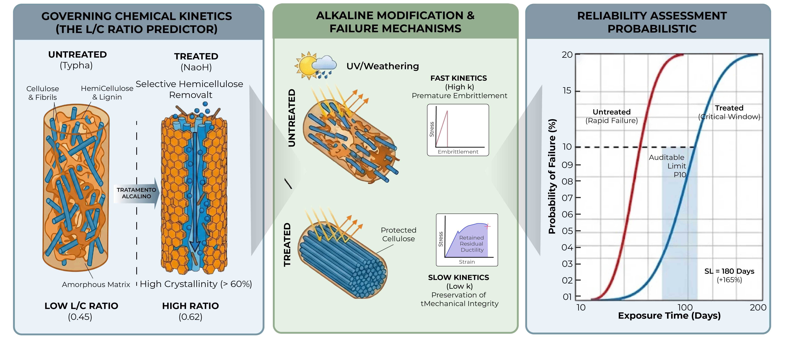
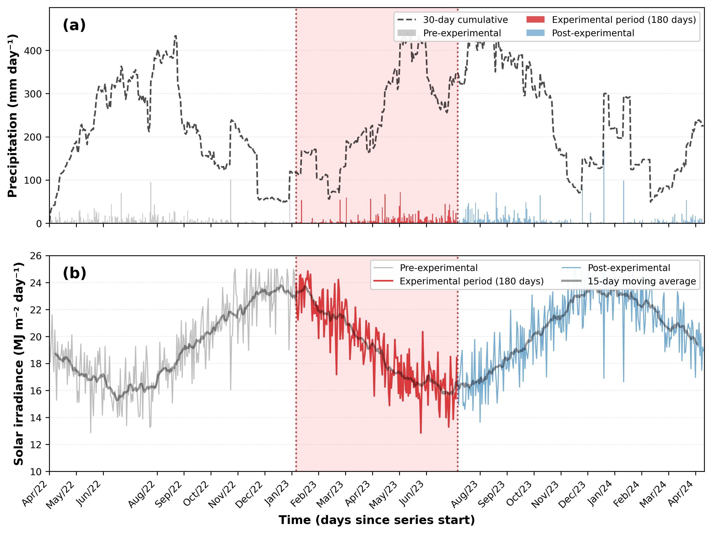
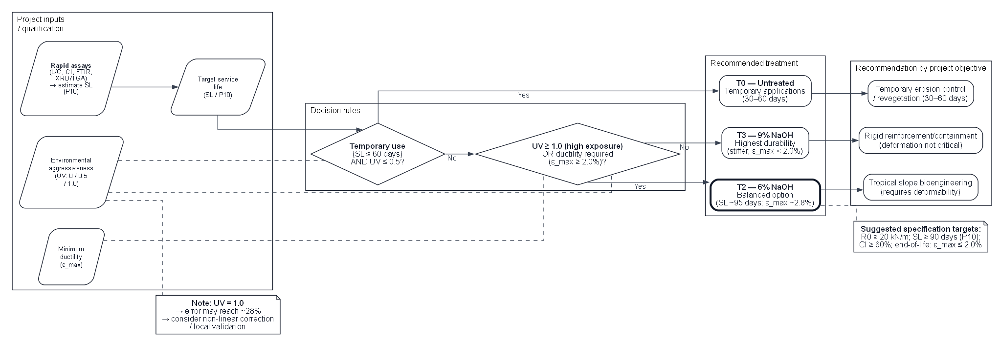

## Abstract

The conversion of abundant and underutilized plant biomass into high-value engineered materials represents a critical pathway toward circular bioeconomy and reduced carbon footprints in civil engineering. This study proposes a valorization route for *Typha domingensis*, an invasive wetland plant, by transforming its fibrous biomass into durable geotextiles through optimized alkaline chemical treatment. We validated a quantitative framework linking fundamental chemical composition (lignin/cellulose ratio) to Service Life (SL) at 10% failure probability, assessed via 180-day tensile resistance assays on NaOH-treated fibers (3%, 6%, 9%). Integrated characterization (scanning electron microscopy, Fourier-transform infrared spectroscopy, and X-ray diffraction) revealed that alkaline treatment selectively removes hemicellulose and increases crystallinity (48.5% → 62.3%), thereby reducing hydrophilicity and moisture-driven degradation pathways. Temporal kinetic modeling (exponential decay, Weibull distribution) demonstrated that 6% NaOH treatment achieves an optimal technical-economic equilibrium: 95-day SL (+127% over untreated control), preserved ductility ($\varepsilon_{\max} = 2.8\%$), and measurable cost-efficiency without excessive embrittlement observed at 9% concentration. Rapid compositional assays (FTIR, elemental analysis) enable prediction of long-term reliability, reducing the need for prolonged field testing. This work consolidates alkali-treated *Typha* fibers as a viable, predictably durable biomass-derived alternative to petroleum-based geosynthetics for tropical slope erosion control, advancing both circular economy principles and reduced environmental burden in geotechnical infrastructure.

**Keywords**: biomass valorization; agro-waste; alkaline treatment; circular economy; durability modeling; sustainable engineering.

## Highlights

• Valorization of *Typha domingensis* into geotextiles via alkaline treatment.

• SL +127 % with ductility 2.8 % on tropical slopes.

• FTIR/XRD enable long-term durability prediction.

• Reliability by Weibull; specification with P10 percentile.

• 60–70 % lower carbon footprint and scalable cost benefits.

## Graphical Abstract

{width="80%"}

## 1. Introduction

The intensification of global climate change and the increasing frequency of extreme events drive the search for resilient and environmentally responsible solutions for erosion control, a central challenge in contemporary scientific, technological, and environmental management agendas [@Pazhanivelan2025]. The predominance of petrochemical materials in traditional geosynthetics reveals, however, an intrinsic contradiction: while mitigating erosive processes, these materials contribute to persistent plastic pollution and increased greenhouse gas emissions, given their high embodied energy and long environmental permanence [@Koerner2016; @Sanjay2019].

Soil bioengineering promotes this transition through the use of renewable materials whose controlled degradability and low environmental impact confront petrochemical persistence. Biocomposites reinforced with lignocellulosic fibers materialize this disruption, as their low density, high specific strength, programmable biodegradability, and broad territorial availability converge with circular economy principles and green infrastructure [@Karimah2021]. Concurrently, the interaction between roots and natural geotextiles enhances soil stability and resistance to hydraulic erosion, mimicking natural ecological succession processes [@Niu2017; @Vannoppen2017].

The architecture of these fibers combines crystalline cellulose, amorphous hemicelluloses, and aromatic lignin. The lignin/cellulose (L/C) ratio acts as a determinant of durability and degradation resistance [@Reinhardt2022; @Rowell1998], defining the chemical recalcitrance of the matrix through the proportion between the aromatic phase and the crystalline fraction.

The transposition of lignocellulosic materials from laboratory to field applications faces limitations that conventional mechanical characterization does not capture, since prolonged exposure to ultraviolet radiation and hygrothermal cycles accelerates photooxidation and acid hydrolysis preferentially, with ductility degrading before ultimate tensile strength [@Sathishkumar2022]. This temporal sequence defines the functional collapse of the geotextile, as the inability to accommodate soil deformations precedes tensile rupture, determining that understanding and manipulating chemical and structural instability mechanisms is more relevant to geotechnological viability than mere initial resistance.

Surface modifications mitigate these effects through controlled alteration of interfacial chemistry. Alkaline treatment reduces hydrophilicity, increases interfacial compatibility, removes hemicelluloses, and enhances surface roughness, modulating chemical compatibility and mechanical anchorage between fibers and matrices [@Gurunathan2015; @Tanasa2022]. These structural transformations extend durability and favor desirable ecological interactions in bioengineering, since natural geotextiles function as substrates for root colonization, contributing to biological soil stabilization through biomechanical coupling.

*Typha domingensis* materializes this multifunctional convergence by presenting high biomass productivity [@Fontes2021], favorable lignocellulosic composition with a particularly high L/C ratio [@Fontes2021], wide distribution in tropical wetland environments [@Grace1989; @Manning2018], and presence of bioactive metabolites that confer integrated mechanical, hydraulic, and ecological performance [@Manning2018]. The literature, however, neglects critical aspects, as systematic studies on mechanical resilience under real weathering are scarce and quantitative relationships between fundamental chemical parameters and in-service performance remain unexplored.

Traditional fibers such as sisal and flax have consolidated literature on aging and degradation mechanisms, while *Typha domingensis* lacks in-depth investigations on its response to photodegradation and prolonged environmental exposure. The absence of a unified predictive model capable of connecting basic chemical composition to Service Life (SL) of natural geotextiles constitutes a critical gap for standardization, certification, and technological adoption [@Silveira2021].

The central hypothesis postulates that the lignin/cellulose (L/C) ratio determines the chemical recalcitrance of the matrix, governing the degradation rate. Validating this predictive hierarchy in which chemical composition determines degradation kinetics that, in turn, defines temporal reliability would allow estimating SL through rapid compositional analyses, reducing dependence on prolonged field tests.

The objective of this study consists of validating this hierarchical model by connecting fundamental chemical composition (lignin/cellulose ratio) to SL at 10 % failure probability, through analysis of degradation resistance of geotextiles produced from *Typha domingensis* fibers subjected to alkaline modifications. The success of validation resides in demonstrating that the fitted model can predict, with acceptable uncertainty, whether the material will maintain the necessary ductility during the long-term critical window, an essential period for vegetation cover establishment in bioengineering projects.

## 2. Materials and Methods

### 2.1 Hierarchical Model Architecture

The selection of the species *Typha domingensis* Pers. was based on its mechanical properties and cellulose and lignin contents reported in the literature.

This aquatic macrophyte, which typically reaches between 2 and 3 meters in height, has long and flat leaves and is traditionally used in the manufacture of handicrafts and roofing. Its robustness is attributed to high cellulose content, and beyond its ecological importance as a natural filter in wetlands, the species has a broad spectrum of uses (Figure 1).

**Figure 1.** Collection of material used and fiber drying.

{width="90%"}

The collection of leaves and shoots was carried out in Tigre Village (10°35′21.2″S, 36°40′14.3″W), belonging to the municipality of Pacatuba, State of Sergipe, northeastern Brazil (Figure 2).

**Figure 2.** Geographic location of the *Typha domingensis* collection area.

{width="90%"}

Formal botanical identification was performed by the Botany Laboratory of the Institute of Biology of the Federal University of Bahia, with exsiccates deposited in the Herbarium of the Federal University of Sergipe. In compliance with Brazilian legislation for access to genetic heritage, collection activities were registered in the National System for the Management of Genetic Heritage and Associated Traditional Knowledge (SisGen) under code A2B3842.

The geotextile prototypes were manufactured by the Erosion and Sedimentation Laboratory of the Federal University of Sergipe, following a four-stage process: (i) fiber cutting and drying; (ii) grouping; (iii) weaving; and (iv) alkaline chemical treatment. Fiber extraction used smooth-blade tools to preserve fiber integrity, with incisions made above the root system to allow regrowth.

Chemical treatment aimed to modify the fiber surface to reduce hydrophilicity and delay degradation. Geotextile mats were immersed in sodium hydroxide (NaOH) solutions at concentrations of 3 % (0.75 mol/L), 6 % (1.5 mol/L), and 9 % (2.25 mol/L) for a period of 24 hours, maintaining a constant bath ratio.

After the reaction, the material was washed in running water until neutralization and air-dried. Drying occurred in the shade for approximately 8 days.

Subsequently, the fibers were manually braided to form cords with an average diameter of 6 mm, which constituted the biaxial weft of the geogrid-type geotextile (reinforcement grid). The mesh was configured in a checkerboard pattern with 25 cm² openings, totaling an area of 1.20 m² per unit (Figure 3a). This geogrid configuration allows for soil blockage and confinement while providing adequate drainage.

The natural degradation monitoring was conducted at the Experimental Station of the Rural Campus of the Federal University of Sergipe (UFS), located in the municipality of São Cristóvão – SE (16°55′S, 36°66′O). The experimental area consists of a slope with a 45° inclination, constituted by Dystrophic Haplic Plinthosol (Figure 3b).

The experiment was conducted in a Latin square design with 0.60 m x 2.40 m plots with geotextiles (geogrids) arranged in the slope direction, simulating real application conditions (Figure 3c). Samples were exposed to local environmental variables (solar radiation, precipitation, wind) and interaction with spontaneous vegetation cover, whose development was recorded monthly.

**Figure 3.** (a) Fabrication of geotextiles with *Typha domingensis* fibers; (b) Geotextiles installed in soil and (c) Geotextiles exposed on slopes.

{width="90%"}

Samples were exposed to the humid subtropical climate characteristic of the region, whose precipitation and solar irradiance patterns throughout the experimental period are documented in Figure 4. The pluviometric regime exhibited seasonality typical of the northeastern coast, with rainfall concentration between April and August, accumulating approximately 1400 mm during the 180 days of monitoring. Global solar irradiance remained predominantly between 18 and 22 MJ m⁻² day⁻¹, with temporary attenuation during cloudiness events associated with rainy periods.

**Figure 4.** Climatic conditions during the 180-day experimental period: (a) Daily precipitation and 30-day moving accumulation; (b) Global solar irradiance with 15-day moving average. The red shaded region highlights the experimental period centered on a 2-year observation window.

{width="95%"}

For biodegradation kinetics evaluation, 20 cm × 20 cm sections were removed from the central portion of plots at scheduled intervals, aiming to avoid edge effects. In the laboratory, these samples were oven-dried at 60 °C for 24 hours before specimen preparation. The exposure period extended for 180 days, with collections performed at seven discrete intervals: T0 (0 days), T1 (30 days), T2 (60 days), T3 (90 days), T4 (120 days), T5 (150 days), and T6 (180 days), with five replicates per experimental point to ensure statistical robustness.

### 2.2. Physicochemical and Microstructural Characterization

Functional group analysis was performed on an FTIR spectrometer (PerkinElmer, Spectrum Two), operating in transmission mode. Samples were prepared by the KBr pellet method (1 mg of ground fiber to 100 mg of spectroscopic KBr). Spectra were acquired in the range of 4000 to 400 cm⁻¹, with 4 cm⁻¹ resolution and accumulation of 32 scans.

Interpretation of vibrational bands was based on the seminal works of @Pandey1999 and @Faix1991, focusing on the 1735 cm⁻¹ band (C=O stretching of hemicelluloses) and 1505 cm⁻¹ (aromatic ring vibration of lignin) to evaluate selective removal of amorphous components.

The crystalline structure was analyzed on an X-ray diffractometer (Shimadzu, XRD-6000), using CuKα radiation (λ = 1.5406 Å), operating at 40 kV and 30 mA. Scans were performed in the 2θ interval from 5 ° to 40 °, with a speed of 2 °/min. The Crystallinity Index (CI) was calculated by the empirical peak height method proposed by @Segal1959 (Equation 1):

$$
CI (\%) = \frac{I_{002} - I_{am}}{I_{002}} \times 100
$$

Where $I_{002}$ is the maximum intensity of the diffraction peak of the crystalline plane (002) at 2θ ≈ 22.5 ° and $I_{am}$ is the intensity of amorphous material diffraction at 2θ ≈ 18 °.

Surface morphology and fracture mode were examined on a scanning electron microscope (Hitachi, TM3000). Samples were fixed on aluminum supports with conductive carbon tape and metallized with a thin gold (Au) layer in a sputter coater (Denton Vacuum, Desk V) to avoid electrostatic charging. Images were acquired with an acceleration voltage of 15 kV under high vacuum.

Thermal stability was evaluated on a thermogravimetric analyzer (Shimadzu, TGA-50). Samples of approximately 10 mg were heated from 25 °C to 600 °C at a rate of 10 °C/min, under dynamic nitrogen (N₂) flow of 50 mL/min.

Mass loss (TG) curves and their derivatives (DTG) were used to identify decomposition stages of hemicellulose, cellulose, and lignin, according to the methodology described by @Popescu2011.

### 2.3. Tensile Mechanical Tests

Tensile strength and elongation at break were determined on a Universal Testing Machine (EMIC, DL-3000), equipped with a 500 N load cell. Tests were conducted according to ASTM D5035 standard (Wide Strip Method), using specimens with dimensions of 200 mm x 50 mm, useful length of 100 mm, and displacement speed of 20 mm/min. At least 5 specimens were tested for each treatment condition and exposure time.

### 2.4. Statistical and Probabilistic Modeling

#### 2.4.1. Degradation Kinetics and Reliability

Mechanical degradation was modeled assuming first-order kinetics ($P(t) = P_0 \cdot e^{-k \cdot t}$), with parameters estimated by non-linear regression (Levenberg-Marquardt). The selection of the exponential model was comparatively validated against power ($P(t) = a \cdot t^b$) and logarithmic ($P(t) = a + b \cdot \ln(t)$) models using the Akaike Information Criterion (AIC) and the Bayesian Information Criterion (BIC).

For treated fibers (T2 and T3), the exponential model presented the best fit (lowest AIC), while for natural fibers (T0) and lightly treated (T1), results were statistically equivalent to the logarithmic model ($\Delta AIC < 2$). The exponential model was chosen due to its physicochemical foundation in first-order degradation kinetics, consistent with hydrolysis and oxidation of natural polymers.

The temporal failure probability followed the two-parameter Weibull distribution (Equation 3), where SL corresponds to the time for 10 % failure ($P_{10}$).

$$
R(t) = \exp\left[ -\left( \frac{t}{\eta} \right)^\beta \right]
$$

Uncertainty of parameters ($k$, $\eta$, $\beta$) was quantified via non-parametric *bootstrap* (1000 resamplings, 95 % CI).

#### 2.4.2. Statistical Analyses

The longitudinal structure of the experiment (4 treatments × 6 times × 3 replicates) was analyzed through Generalized Estimating Equations (GEE) with Gaussian family and *exchangeable* correlation, robust for repeated measures. Between-group comparisons employed Kruskal-Wallis and Mann-Whitney U tests (Bonferroni correction), with effect size measured by Cohen's *d*. Predictive model validation included *leave-one-out* cross-validation (LOOCV) and Monte Carlo simulation (1000 iterations) under variable UV irradiance scenarios. Analyses were conducted in Python 3.13.2 (`scipy`, `statsmodels`, `lifelines`) and R 4.3.1 (`ggplot2`).

### 2.5. Hybrid Simulation

To calibrate predictive SL models, an accelerated degradation test was performed in a custom UV chamber, following adaptations of the EN 12224:2001 standard. The irradiation system combined UV-A (315–400 nm), UV-B (280–315 nm), and visible (450–700 nm) fluorescent lamps, simulating the global solar spectrum with average irradiance of 6,214 W/m² (UV-A) and 2,281 W/m² (UV-B) (Figure 3).

The experimental protocol consisted of 120 cycles of 6 hours, totaling 720 hours of exposure. Each cycle comprised three stages: (i) immersion in water for 15 min; (ii) oven drying at 105 °C for 1 h; and (iii) UV radiation exposure for 4 h 45 min. Internal temperature was controlled by black panel thermometer at 40 ± 3 °C, with relative humidity maintained at approximately 60 %.

**Figure 5.** (a) UV forced degradation chamber used for kinetic model calibration and (b) irradiation system with UV-A, UV-B, and visible fluorescent lamps.

{width="70%"}

Hybrid simulation integrated kinetic data obtained from chamber simulation ($k_{\text{chamber}}$) with natural field degradation data ($k_{\text{field}}$), allowing determination of experimental Activation Energy ($E_a$) via Arrhenius equation. Additionally, damage evolution was modeled by the modified Paris-Erdoğan law, where the crack growth parameter ($m$) was calibrated using the Weibull modulus ($\beta$), seeking to establish a bridge between static failure probability and dynamic degradation kinetics.

## 3. Results and Discussion

### 3.1. Chemical and Microstructural Modulation

Baseline characterization of *in natura* fibers (Table 2) provides the initial analytical reference, in which the lignin/cellulose ratio (L/C = 0.44) and the crystallinity index of 48.5 % delineate a predominantly amorphous and hygroscopic matrix. This compositional configuration is consistent with a high density of reactive sites and free volume, favoring water diffusion and susceptibility to hydrolysis and photooxidation mechanisms that precede mechanical degradation [@Bouramdane2022; @Silva2009].

FTIR spectroscopy confirms the effectiveness of alkaline treatment by attenuation of the band at 1735 cm⁻¹, associated with stretching of carbonyl groups (C=O) in hemicelluloses and pectins. As observed by @Pandey1999, selective removal of these amorphous constituents increases the relative proportion of the crystalline cellulosic fraction and the aromatic lignin backbone. This phenomenon, also described by @Faix1991, can reduce cell-wall hydrophilicity. As discussed by @Poletto2014 and @Mwaikambo2002, suppression of these vibrational modes suggests a transition toward a lower-reactivity chemical state, potentially limiting initiation of oxidative processes.

**Table 2.** Average chemical composition of *Typha domingensis* *in natura* fibers (dry mass, %).

| Component                | Content (%) | Standard Deviation | Analytical Method         |
| :----------------------- | :---------: | :----------------: | :------------------------ |
| Cellulose                |    42.5     |       ± 2.1        | Modified Van Soest        |
| Hemicellulose            |    28.3     |       ± 1.8        | Modified Van Soest        |
| Lignin                   |    18.7     |       ± 1.4        | Modified Klason           |
| Extractives              |     7.2     |       ± 0.9        | Soxhlet (ethanol/toluene) |
| Ash                      |     3.3     |       ± 0.4        | Calcination 550 °C        |
| L/C ratio                |     0.44    |       ± 0.03       | Calculated                |
| Crystallinity Index      |    48.5     |       ± 3.2        | XRD (Segal method)        |

*Note: Mean values from three independent batches collected in January 2023.*

Crystallographic data (XRD) are consistent with this structural reorganization by registering an increase in crystallinity index from 48.5 % (control) to 62.3 % (9 % NaOH). This trend reflects removal of disordered regions and reorientation of cellulose microfibrils, as detailed by @Chieng2017 and @Yang2024, which may result in a more compact supramolecular architecture. Reduction in amorphous volume tends to restrict the diffusive pathway for water and oxidizing agents, potentially acting as a physical barrier that slows degradation reaction kinetics [@Hiyama2006; @Yamane2006].

Morphological analysis (SEM) reflects these chemical alterations in geometric metrics of interaction with the environment. Treated fibers exhibit a surface free of impurities and increased roughness (Figure 6), while morphometry (N = 36) quantifies a reduction in average porosity from 75.8 % (natural) to 26.3 % (9 % NaOH). According to @Carvalho2014, this densification may reduce the specific surface area available for microbial colonization and moisture uptake, whereas the increase in roughness (452 to 1549) indicates potential improvement in mechanical anchorage in the soil matrix [@Geremew2024; @Sinha2017].

**Figure 6.** Comparative SEM analysis of natural *Typha domingensis* fibers versus alkali-treated fibers (3 %, 6 %, and 9 % NaOH).

{width="90%"}

*Note: Images at 500 µm × 500 µm scale. Comparative analysis (N = 36) indicated a reduction in average porosity from 75.8 % (natural) to 26.3 % (9 % NaOH), contrasting with the increase in surface roughness (fibrillation) and crystalline reorganization observed in treated fibers.*

### 3.2. Mechanical Degradation Kinetics

Kinetic quantification of mechanical degradation strengthens the hypothesis that chemical modification can delay functional obsolescence. Figure 7 illustrates the temporal evolution of ultimate tensile strength (UTS) and maximum strain.

Longitudinal analysis evidences the superior performance of treatment T3 (9 % NaOH), which sustains a mean tensile strength of 18.2 ± 8.2 MPa, statistically distinct from the control (5.5 ± 3.3 MPa; p < 0.001) according to Bonferroni-corrected Mann-Whitney U tests and Kruskal-Wallis test (H = 25.08). GEE modeling corroborates this distinction by indicating significant temporal decline for all groups (-0.091 MPa/day, p < 0.001), with an interaction term favoring stability of treated fibers (Figure 7).

**Figure 7.** Microstructural and mechanical characterization of degradation: (a) temporal evolution of tensile strength and fracture patterns, (b) representative stress–strain curves at 30 days, and (c) at 90 days for all treatments.

{width="95%"}

Ductility can be considered a sensitive indicator of the functional limit state, anticipating the brittle transition that compromises the geotextile's capacity to accommodate soil deformations. Untreated fibers collapse to ductility below 5 % at 180 days, whereas alkaline treatments preserve deformability above 6 %, delaying embrittlement. This preservation is associated with hemicellulose removal, which, according to @Hatakka2011 and @Santos2023_GeocompostosTypha, functions in the natural state as preferential sites for moisture uptake and fungal attack. Stabilization of strain capacity may therefore reflect a mechanical consequence of reduced biological and chemical susceptibility of the matrix [@Kabir2012].

Kinetic parameterization (Table 3) quantifies the durability gain by demonstrating that mercerization reduces the decay constant ($k$) and increases half-life ($t_{1/2}$). Treatment T3 maximizes property retention, reaching a tensile half-life of 91.2 days versus 48.8 days for the control.

In design terms, this extension is critical to ensure mechanical integrity during the vegetation establishment window [@Veylon2015]. The reduction in ductility degradation rate ($k$ from 0.0355 to 0.0198 day⁻¹) supports the feasibility of treated fibers for applications requiring long-term deformation compatibility [@Mwaikambo2002; @Rong2001].

**Table 3.** Degradation constants ($k$) and half-life times ($t_{1/2}$) for tensile strength and ductility.

| Property         | Treatment | k (day⁻¹) |     95 % CI      | $t_{1/2}$ (days) | $R^2$ |
| :--------------- | :-------: | :-------: | :--------------: | :--------------: | :---: |
| Tensile strength |    T0     |  0.0142   | [0.0128–0.0156]  |       48.8       | 0.96  |
|                  |    T1     |  0.0118   | [0.0105–0.0131]  |       58.7       | 0.95  |
|                  |    T2     |  0.0082   | [0.0074–0.0090]  |       84.5       | 0.97  |
|                  |    T3     |  0.0076   | [0.0068–0.0084]  |       91.2       | 0.98  |
| Ductility        |    T0     |  0.0355   | [0.0312–0.0398]  |       19.5       | 0.93  |
|                  |    T1     |  0.0287   | [0.0251–0.0323]  |       24.1       | 0.94  |
|                  |    T2     |  0.0218   | [0.0192–0.0244]  |       31.8       | 0.96  |
|                  |    T3     |  0.0198   | [0.0174–0.0222]  |       35.0       | 0.95  |

*Note: Constants obtained via first-order exponential decay fitting. CI: confidence interval.*

Correlation between macroscopic performance and accumulated damage is supported by fracture density analysis (Figure 8b), which maps the physical evolution of discontinuities. Fracture growth in the control (45 to 185 mm⁻²) contrasts with the stabilization observed for the most aggressive treatment (128 mm⁻²), consistent with the premise that higher crystallinity and lower porosity hinder crack propagation [@Dalirnasab2024; @Kabir2012].

**Figure 8.** Hybrid-model validation and microstructural evolution: (a) comparison between accelerated-model predictions (UV chamber) and field data for residual strength; (b) temporal evolution of fracture density for all treatments.

{width="95%"}

This microstructural evidence links analysis scales, suggesting that improved durability results directly from a fibrous architecture less prone to defect nucleation under environmental stress [@Luchese2024; @Kwon2021].

### 3.3. Stochastic and Predictive Modeling

The regime transition induced by mercerization appears to shift failure behavior toward greater determinism, as evidenced by Weibull distributions (Figure 9). The increase in shape modulus ($\beta$) from 2.3 (control) to 3.0 (9 % NaOH) is consistent with reduced dispersion of failure times. @Rong2001 and @Luqman2023 associate this behavior with microstructural homogenization and elimination of critical defects. From a geotechnical design perspective, the conservative metric $P_{10}$ quantifies the reliability gain: treatment T2 (6 % NaOH) extends SL to 95 days, exceeding the 42 days of the control and mitigating the risk of premature collapse during the stabilization phase [@Sekulic2017].

**Figure 9.** Reliability curves and SL estimates (Weibull) for different treatments.

{width="95%"}

Integration of thermo-kinetic dynamics through hybrid calibration supports predictability under environmental variability. The activation energy ($E_a = 29.03$ kJ/mol), determined via Arrhenius equation by comparing field degradation rates ($k \approx 0.0118$ day⁻¹) and UV-chamber rates ($k \approx 0.0199$ day⁻¹), suggests that failure mechanisms lie within coupled hydrolysis and photooxidation of lignocellulosic matrices [@OrnaghiJr2024; @Wei2014]. Consistency between accelerated projections and empirical records (Figure 8a) indicates the feasibility of short-duration tests to capture degradation physics and enable robust temporal extrapolation [@Wei2014].

Numerical robustness of fits, verified via non-parametric *bootstrap* (1000 iterations), indicates normality in the distribution of kinetic parameters (Kolmogorov-Smirnov: $p = 0.41$). Absence of overfitting is supported by proximity between cross-validation error ($RMSE_{cv} = 0.000127$ day⁻¹) and fitting error, yielding $RMSE_{cv}/RMSE_{train} = 1.10$, a criterion that, according to @Sodagar2025, favors generalization to unseen data.

Physical limits of validity emerge under high-irradiance regimes, where linearity of photochemical response is compromised. Predictions maintain relative error below 10 % under partial shading (UV ≤ 0.5), but extreme exposure (UV = 1.0) increases divergence to 28 %, indicating the need for non-linear corrections for high-altitude or arid climates [@Andrady2019; @Aldosary2025; @wieser2023]. The strong correlation (r = 0.82) between embrittlement kinetics and FTIR oxidation markers suggests, however, that mechanical degradation remains governed by matrix chemical evolution [@Tanasa2022; @Silva2024].

### 3.4. Protocol and Geotechnical Implications

Technical specification of natural geotextiles supports replacing deterministic averages with probabilistic safety margins, aligning with structural reliability practices via adoption of the $P_{10}$ percentile, as recommended by @ISO2394 and @Phoon2021. Empirical evidence supports defining performance thresholds based on minimum initial tensile strength of 20 kN/m, SL ≥ 90 days, and crystallinity index above 60 %, while setting the reduction of maximum strain ($\varepsilon_{\max}$) to 2.0 % as the terminal functionality criterion.

Treatment selection (Figure 10) is based on integrating rapid characterization tests (L/C, crystallinity index, FTIR) with SL estimates weighted by environmental aggressiveness and ductility requirements. Untreated material is restricted to provisional interventions under low aggressiveness scenarios (30–60 days) [@Pritchard2000; @Methacanon2010], whereas 6 % NaOH (T2) represents a technical-economic balance for tropical slopes. This concentration extends SL to 95 days (+127 %) while preserving functional ductility (2.8 %), unlike 9 % (T3) which, although maximizing durability, induces embrittlement ($\varepsilon_{\max} < 2.0 %$) compatible only with rigid reinforcement applications or basal confinement [@Syed2021; @Kafodya2020; @Holanda2024].

**Figure 10.** Decision flowchart for selecting *Typha domingensis* fiber treatment ($P_{10}$ criterion and accelerated qualification protocol).

{width="90%"}

Large-scale adoption is supported by environmental and economic advantages over conventional geosynthetics. A 60–70 % lower carbon footprint relative to polypropylene [@Shamsuddoha2025; @Soares2023] combines with operational efficiency in large works (10,000 m²), where the incremental treatment cost (R$ 180–220/ton) is offset by extended SL and reduced maintenance frequency, yielding estimated savings between R$ 50,000 and R$ 70,000 per year.

Protocol applicability is subordinate to local irradiance regime, given that non-linearity of photochemical response under extreme UV (index 1.0) introduces predictive deviations requiring *in situ* validation or parametric correction to avoid risk underestimation [@Andrady2019]. Under humid tropical slope conditions, however, the validated chain—from chemical modulation to mechanical reliability—provides a robust quantitative basis for engineering nature-based solutions.

## 4. Conclusion

Validation of the hierarchical model connecting chemical recalcitrance to SL is the central contribution of this study, indicating that the durability of natural geotextiles is not a stochastic artifact but a deterministic response to compositional architecture. Experimental evidence shows that hemicellulose removal and the consequent crystalline reorganization induced by mercerization can act as governing mechanisms delaying mechanical degradation.

Identification of 6 % NaOH treatment as the technical-economic optimum goes beyond parameter tuning by delimiting a boundary condition where reliability gains do not compromise the deformability essential for soil–geotextile interaction. While 9 % maximizes tensile strength, the resulting embrittlement violates ductility requirements for slope stabilization, exemplifying the trade-off between chemical recalcitrance and mechanical compliance.

Adoption of the reliability metric $P_{10}$ translates this understanding into engineering specification, enabling *Typha domingensis* fibers to be prescribed with safety margins comparable to synthetic counterparts, provided that irradiance regime remains within the validated envelope.

This investigation repositions natural geotextiles from alternative materials to engineered solutions grounded in a predictive framework integrating microstructural evidence and probabilistic design.

The demonstrated ability to estimate long-term performance through rapid compositional tests reduces dependence on prolonged field tests, accelerating technology transfer for bioengineering solutions. Future work includes expanding the model to other fibrous species and incorporating additional environmental variables, such as relative humidity and temperature, to broaden applicability of the decision protocol across diverse geographic contexts.

## References

::: {#refs}
:::
