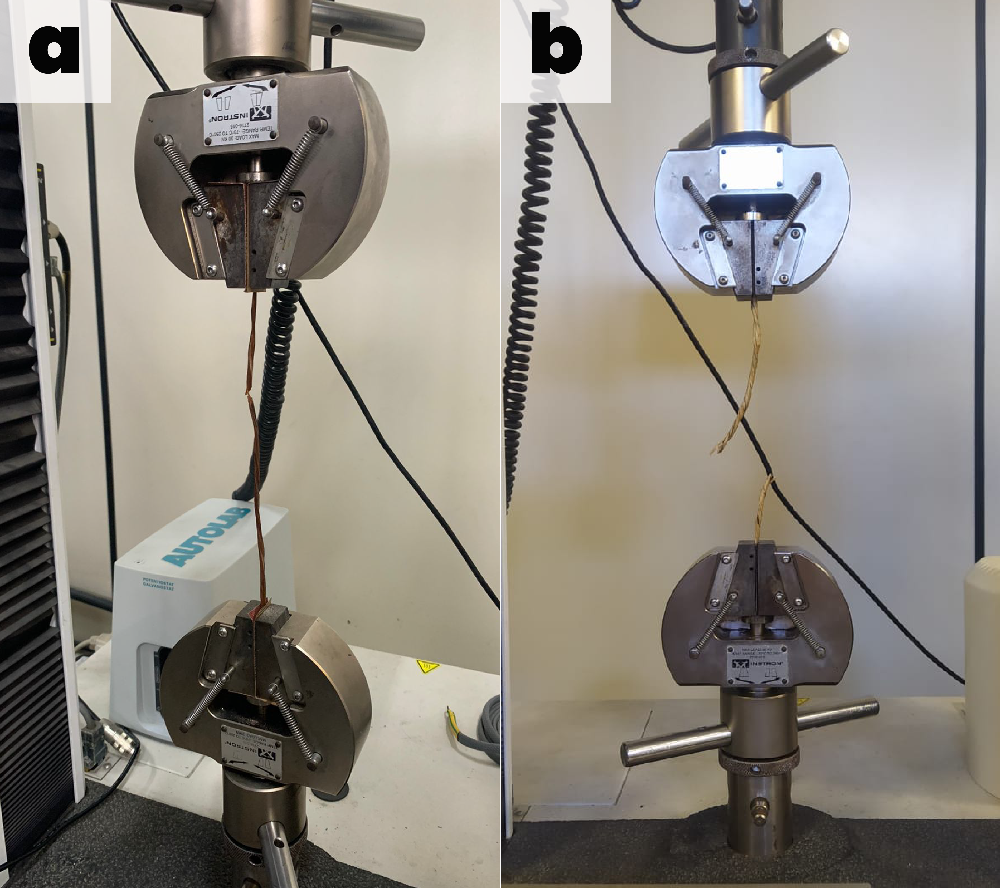

---
title: "Modelo Preditivo de Degradação de Geotêxteis Naturais Baseada na Recalcitrância Química"
author: "Diego Vidal"
bibliography: referencias_lc.bib
csl: apa.csl
reference-doc: modelo_formatacao.docx
fig-align: center
table-align: center
lang: pt-br
---

## Resumo

O tratamento alcalino é comumente usado para melhorar a durabilidade de geotêxteis de fibras naturais. Ainda assim, é necessário haver mais consenso sobre o protocolo ideal para aplicações em bioengenharia de solos. O objetivo deste trabalho foi validar um modelo hierárquico que conecta a composição química fundamental, razão lignina/celulose, à Vida Útil Funcional (VUF) em 10% de probabilidade de falha, avaliando a resistência à degradação de geotêxteis produzidos a partir de fibras de *Typha domingensis* submetidas a modificações alcalinas. Ensaios de resistência à tração foram conduzidos em laboratório ao longo de 180 dias para avaliar a cinética de degradação de fibras tratadas com NaOH (3%, 6% e 9%). Com base em imagens de Microscopia Eletrônica de Varredura (MEV) e análises espectroscópicas, verificou-se que o tratamento alcalino modula a recalcitrância química via remoção seletiva de hemicelulose. Os principais resultados indicam que o tratamento com NaOH 6% estabeleceu um ponto de equilíbrio operacional, equilibrando ganho de vida útil (VUF de 95 dias, +127% sobre o controle) com preservação de ductilidade (ε_máx = 2,8%), enquanto a concentração de 9% induziu fragilização acentuada. A análise de degradação ao longo de seis períodos (30, 60, 90, 120, 150 e 180 dias) revelou que o modelo exponencial de decaimento descreve adequadamente a cinética de fragilização, com evidências de que a razão lignina/celulose controla a taxa de degradação através de uma relação exponencial inversa. A principal inovação metodológica reside na validação de que o modelo ajustado permite estimar a confiabilidade temporal a partir de ensaios composicionais rápidos, reduzindo a necessidade de testes de campo prolongados e consolidando as fibras de *Typha* tratadas com 6% NaOH como uma alternativa sustentável para o controle de erosão em taludes tropicais.

**Palavras-chave**: Modelagem de degradação; Razão Lignina/Celulose; Vida útil funcional; Geotêxteis naturais; Bioengenharia de solos.

## Graphical Abstract

{width="80%"}

## 1. Introdução

No contexto das mudanças climáticas globais e do aumento da frequência de eventos climáticos extremos, o desenvolvimento de soluções resilientes e eficazes para o controle da erosão tornou-se uma prioridade científica e tecnológica [@Pazhanivelan2025]. Contudo, o paradigma predominante da economia linear, associado aos polímeros petroquímicos, introduz um paradoxo ao resolver um problema ambiental como a erosão, exacerba-se outros, como a poluição plástica e o acúmulo de gases de efeito estufa, devido à alta energia incorporada e à persistência desses materiais no ambiente [@Koerner2016; @Sanjay2019].

Em resposta a essa contradição, a bioengenharia de solos tem impulsionado uma transição para soluções materiais renováveis e biodegradáveis. Nesse cenário, os biocompósitos reforçados com fibras lignocelulósicas surgem como alternativas promissoras, oferecendo baixa densidade, elevada relação resistência-peso e biodegradabilidade, atributos alinhados aos princípios da economia circular [@Karimah2021]. 

A arquitetura hierárquica dessas fibras, baseada em celulose cristalina, hemicelulose amorfa e lignina aromática, permite a modulação de suas propriedades, como a razão lignina/celulose (L/C), para controlar sua durabilidade [@Reinhardt2022; @Rowell1998].

No entanto, a transição da escala laboratorial para aplicações de campo enfrenta uma limitação crítica: a fragilização acelerada sob radiação ultravioleta (UV) e ciclos higrotérmicos. Esses processos induzem a fotoxidação radicalar das ligações glicosídicas e a hidrólise ácida das cadeias poliméricas, comprometendo a ductilidade do material muito antes de uma perda significativa de resistência à tração [@Sathishkumar2022]. 

A superação desse desafio depende da engenharia de interface entre as fibras, tipicamente hidrofílicas, e as matrizes poliméricas. Avanços recentes em técnicas de modificação de superfície, como o tratamento alcalino, têm se mostrado eficazes ao reduzir grupos hidroxila livres e aumentar a rugosidade superficial, otimizando a compatibilidade química e a ancoragem mecânica [@Gurunathan2015; @Tanasa2022].

Além da função passiva de reforço, os sistemas geotêxteis de fibras naturais podem se integrar ativamente aos ciclos biogeoquímicos do solo. Configurações multifuncionais otimizam simultaneamente propriedades hidráulicas, mecânicas e ecológicas, servindo como substrato para a colonização radicular. 

Nesse contexto, a *Typha domingensis* (taboa) emerge como uma candidata promissora, não apenas por sua alta produtividade de biomassa e razão L/C favorável, mas também por seu arsenal de compostos bioativos com potencial para modular a rizosfera [@Fontes2021; @Grace1989; @Manning2018].

Apesar desse potencial multifuncional, a viabilidade técnica de geocompostos baseados em *Typha domingensis* permanece incerta devido à poucos dados ensaiados sobre sua resiliência mecânica a longo prazo. Enquanto estudos com fibras tradicionais como sisal e linho já caracterizaram seu envelhecimento, a resposta da *Typha* à degradação foto-oxidativa e, mais importante, um modelo unificado que conecte a composição química fundamental à vida útil em serviço, continuam sendo lacunas críticas na literatura [@Silveira2021].

A hipótese central deste trabalho postula que a razão lignina/celulose (L/C) determina a recalcitrância química da matriz, governando a taxa de degradação. A validação desta hierarquia preditiva, onde a composição química dita a cinética de degradação e, por sua vez, a confiabilidade temporal, permitiria estimar a Vida Útil Funcional a partir de ensaios composicionais rápidos, reduzindo a dependência de testes de campo prolongados.

Portanto, o objetivo deste estudo centra-se na validação de modelo hierárquico que conecta a composição química fundamental, razão lignina/celulose, à Vida Útil Funcional (VUF) em 10% de probabilidade de falha, avaliando a resistência à degradação de geotêxteis produzidos a partir de fibras de *Typha domingensis* submetidas a modificações alcalinas. . 

O sucesso da validação reside em demonstrar que o modelo ajustado pode prever, com incerteza aceitável, se o material manterá a ductilidade necessária durante a janela crítica de longo prazo, período essencial para o estabelecimento da cobertura vegetal em projetos de bioengenharia.

## 2. Metodologia

### 2.1. Preparação e Tratamento dos Geotêxteis

A seleção da espécie *Typha domingensis* Pers. fundamentou-se em suas propriedades mecânicas e nos teores de celulose e lignina reportados na literatura. A coleta de folhas e brotos foi realizada no Povoado Tigre pertencente ao município de Japaratuba, Estado de Sergipe, nordeste do Brasil (Figura 1).

**Figura 1.** (a) Coleta de material utilizado.

{width="90%"}

Esta macrófita aquática, que tipicamente atinge entre 2 e 3 metros de altura, possui folhas longas e planas e é tradicionalmente utilizada na confecção de artesanato e coberturas. Sua robustez é atribuída ao alto teor de celulose, comparável a fibras como *Agave sisalana*, enquanto a presença de lignina confere resistência à biodegradação. Além de sua importância ecológica como filtro natural em áreas úmidas, a espécie possui amplo espectro de uso.

A identificação botânica formal foi realizada pelo Laboratório de Botânica do Instituto de Biologia da Universidade Federal da Bahia, com exsicatas depositadas no Herbário da Universidade Federal de Sergipe. Em conformidade com a legislação brasileira para acesso ao patrimônio genético, as atividades de coleta foram registradas no Sistema Nacional de Gestão do Patrimônio Genético e do Conhecimento Tradicional Associado (SisGen) sob o código **A2B3842**.

Os protótipos de geotêxteis foram manufaturados pelo Laboratório de Erosão e Sedimentação da Universidade Federal de Sergipe, seguindo um processo em quatro etapas: (1) corte e secagem das fibras; (2) agrupamento; (3) tecelagem; e (4) tratamento químico alcalino. A extração da biomassa utilizou ferramentas de lâmina lisa para preservar a integridade das fibras, com incisões realizadas acima do sistema radicular para permitir a rebrota.

O tratamento químico visou modificar a superfície das fibras para reduzir a hidrofilicidade e retardar a degradação. As mantas geotêxteis foram imersas em soluções de hidróxido de sódio (NaOH) nas concentrações de 3% (0,75 mol/L), 6% (1,5 mol/L) e 9% (2,25 mol/L) por um período de 24 horas, mantendo-se uma relação de banho constante.

Após a reação, o material foi lavado em água corrente até neutralização e seco ao ar. A secagem ocorreu à sombra por aproximadamente 8 dias.

Subsequentemente, as fibras foram trançadas manualmente para formar cordões com diâmetro médio de 6 mm, que constituíram a trama biaxial do geotêxtil. A malha foi configurada em padrão xadrez com aberturas de 25 cm², totalizando uma área de 1,20 m² por unidade (Figura 2a).

O monitoramento da degradação natural foi conduzido na Estação Experimental do Campus Rural da Universidade Federal da Sergipe (UFS), localizada no município de São Cristóvão – SE (16°55′S, 36°66′O). A área experimental consiste em um talude com inclinação de 45°, constituído por Plintossolo Háplico Distrófico (Figura 2b).

O experimento foi conduzido em delineamento em quadrado latino com parcelas de 0,60 m x 2,40 m com geotêxteis (geogrelhas) dispostos no sentido da pendente, simulando condições reais de aplicação (Figura 2c). As amostras foram expostas às variáveis ambientais locais (radiação solar, precipitação, vento) e à interação com a cobertura vegetal espontânea, cujo desenvolvimento foi registrado mensalmente.

**Figura 2.** (a) Confexão dos Geotêxteis com fibras de *Typha domingensis*; (b) Geotêxteis instalados no solo e (c) Geotêxteis expostos em taludes.

{width="90%"}

Para avaliação da cinética de biodegradação, seções de 20 cm × 20 cm foram removidas da porção central das parcelas em intervalos programados, visando evitar efeitos de borda. Em laboratório, estas amostras foram secas em estufa a 60 °C por 24 horas antes da preparação dos corpos de prova. O período de exposição estendeu-se por 180 dias, com coletas realizadas em sete intervalos discretos: T0 (0 dias), T1 (30 dias), T2 (60 dias), T3 (90 dias), T4 (120 dias), T5 (150 dias) e T6 (180 dias), com cinco réplicas por ponto experimental para garantir robustez estatística.

### 2.2. Caracterização Físico-Química e Microestrutural

A análise dos grupos funcionais foi realizada em um espectrômetro FTIR (PerkinElmer, Spectrum Two), operando no modo de transmissão. As amostras foram preparadas pelo método de pastilha de KBr (1 mg de fibra moída para 100 mg de KBr espectroscópico). Os espectros foram adquiridos na faixa de 4000 a 400 cm⁻¹, com resolução de 4 cm⁻¹ e acúmulo de 32 varreduras.

A interpretação das bandas vibracionais baseou-se nos trabalhos seminais de @Pandey1999 e @Faix1991, focando na banda de 1735 cm⁻¹ (estiramento C=O de hemiceluloses) e 1505 cm⁻¹ (vibração do anel aromático da lignina) para avaliar a remoção seletiva de componentes amorfos.

A estrutura cristalina foi analisada em um difratômetro de raios X (Shimadzu, XRD-6000), utilizando radiação CuKα (λ = 1,5406 Å), operando a 40 kV e 30 mA. As varreduras foram realizadas no intervalo 2θ de 5° a 40°, com velocidade de 2°/min. O Índice de Cristalinidade (IC) foi calculado pelo método empírico de pico de altura proposto por @Segal1959 (Equação 1):

$$
IC (\%) = \frac{I_{002} - I_{am}}{I_{002}} \times 100
$$

Onde $I_{002}$ é a intensidade máxima do pico de difração do plano cristalino (002) em 2θ ≈ 22,5° e $I_{am}$ é a intensidade da difração do material amorfo em 2θ ≈ 18°.

A morfologia superficial e o modo de fratura foram examinados em um microscópio eletrônico de varredura (Hitachi, TM3000). As amostras foram fixadas em suportes de alumínio com fita de carbono condutiva e metalizadas com uma fina camada de ouro (Au) em um sputter coater (Denton Vacuum, Desk V) para evitar o carregamento eletrostático. As imagens foram adquiridas com tensão de aceleração de 15 kV sob alto vácuo.

A estabilidade térmica foi avaliada em um analisador termogravimétrico (Shimadzu, TGA-50). Amostras de aproximadamente 10 mg foram aquecidas de 25°C a 600°C a uma taxa de 10°C/min, sob fluxo dinâmico de nitrogênio (N₂) de 50 mL/min.

As curvas de perda de massa (TG) e suas derivadas (DTG) foram utilizadas para identificar os estágios de decomposição da hemicelulose, celulose e lignina, conforme metodologia descrita por @Popescu2011.

### 2.3. Ensaios Mecânicos de Tração

A resistência à tração e a deformação na ruptura foram determinadas em uma Máquina Universal de Ensaios (EMIC, DL-3000), equipada com uma célula de carga de 500 N (Figura 3). Os ensaios foram conduzidos conforme a norma ASTM D5035 (Método de Tira Larga), utilizando corpos de prova com dimensões de 200 mm x 50 mm, comprimento útil de 100 mm e velocidade de deslocamento de 20 mm/min. Foram testados no mínimo 5 corpos de prova para cada condição de tratamento e tempo de exposição.

**Figura 3.** Ensaio de tração em geotêxteis utilizando Máquina Universal de Ensaios.

{width="60%"}

### 2.4. Modelagem Estatística e Probabilística

#### 2.4.1. Cinética de Degradação

A cinética de perda de propriedades mecânicas foi modelada assumindo uma reação de primeira ordem, conforme a Equação 2:

$$
P(t) = P_0 \cdot e^{-k \cdot t}
$$

Onde $P(t)$ é a propriedade no tempo $t$ (resistência ou deformação), $P_0$ é a propriedade inicial e $k$ é a constante de taxa de degradação (dias⁻¹). Os parâmetros foram estimados por regressão não-linear utilizando o algoritmo de Levenberg-Marquardt.

#### 2.6.2. Análise de Confiabilidade de Weibull

A probabilidade de falha ao longo do tempo foi modelada pela distribuição de Weibull de dois parâmetros (Equação 3), amplamente utilizada em análise de confiabilidade de materiais [@Weibull1951]:

$$
R(t) = \exp\left[ -\left( \frac{t}{\eta} \right)^\beta \right]
$$

Onde $R(t)$ é a função de confiabilidade, $\eta$ é o parâmetro de escala (vida característica, tempo para 63,2% de falhas) e $\beta$ é o parâmetro de forma (indicativo do mecanismo de falha). A Vida Útil Funcional (VUF) foi definida como o tempo para atingir 10% de probabilidade de falha ($P_{10}$), calculado pela Equação 4:

$$
P_{10} = \eta \cdot [-\ln(0,90)]^{1/\beta}
$$

A influência das variáveis composicionais (L/C, cristalinidade) sobre a taxa de degradação foi avaliada por regressão linear múltipla. Para quantificar a incerteza dos parâmetros estimados ($k$, $\eta$, $\beta$), utilizou-se a técnica de *bootstrap* não-paramétrico com 1000 reamostragens, gerando intervalos de confiança de 95% (IC 95%) pelo método dos percentis.

#### 2.4.3. Análises estatísticas

Os dados de resistência à tração obtidos dos ensaios mecânicos foram analisados mediante modelos estatísticos apropriados para a estrutura longitudinal do experimento. O delineamento consistiu em quatro tratamentos (T0: controle; T1: 3% NaOH; T2: 6% NaOH; T3: 9% NaOH) avaliados em seis tempos de exposição (30, 60, 90, 120, 150 e 180 dias), totalizando 72 observações com três réplicas por combinação tratamento-tempo.

A adequação estatística dos dados foi verificada mediante testes de normalidade (Shapiro-Wilk) e homogeneidade de variâncias (Levene) [@Schultz1985, @Hanusz2016]. Devido à violação dos pressupostos paramétricos (heterogeneidade de variâncias, p = 0.024), optou-se por métodos não-paramétricos para as comparações globais. O teste de Kruskal-Wallis [@Kruskal1952] foi empregado para avaliar diferenças entre tratamentos, seguido de comparações múltiplas mediante teste de Mann-Whitney U com correção de Bonferroni para controle da taxa de erro familiar (α = 0.05).

A progressão temporal da degradação mecânica foi modelada mediante Equações de Estimação Generalizadas (GEE), empregando família Gaussiana e estrutura de covariância exchangeable, apropriada para dados de medidas repetidas [@McCullagh2019]. A estrutura de correlação foi selecionada com base no Critério de Informação de Quase-Verossimilhança (QIC) [@Pan2001].

Erros padrão robustos foram calculados empregando a correção de Huber-White [@White1980], e a significância dos coeficientes foi testada mediante teste de Wald χ². Adicionalmente, ajustou-se um Modelo Linear Generalizado (GLM) com família Gaussiana e função de ligação identidade, incluindo termos de interação tratamento×tempo para avaliar a dependência temporal da degradação entre os grupos.

O tamanho de efeito das comparações entre tratamentos foi quantificado mediante o *d* de Cohen, interpretado conforme os critérios de magnitude: |d| < 0.2 (desprezível), 0.2 ≤ |d| < 0.5 (pequeno), 0.5 ≤ |d| < 0.8 (médio), |d| ≥ 0.8 (grande) [@Cohen2013]. 

Os parâmetros de forma (β) e escala (η) da distribuição de Weibull foram estimados mediante Máxima Verossimilhança para cada grupo experimental [@@Cui2007]. A adequação do ajuste foi avaliada mediante testes de Anderson-Darling e Kolmogorov-Smirnov. Funções de sobrevivência, taxas de risco e percentis críticos de ruptura ($P_{10}$, $P_{50}$, $P_{90}$) foram obtidos a partir dos modelos ajustados.

A validação do modelo preditivo foi conduzida mediante validação cruzada *leave-one-out* (LOOCV) e simulação de Monte Carlo com 1000 iterações, incorporando perturbações aleatórias de ±10% nos parâmetros cinéticos. A robustez do modelo foi avaliada sob três cenários de irradiância UV normalizada (UV = 0, 0.5, 1.0), quantificando o erro relativo médio e o 95º percentil de erro para cada condição.

Todas as análises estatísticas foram realizadas no ambiente Python (versão 3.13.2), utilizando os pacotes `scipy` para testes estatísticos, `statsmodels` para modelos GEE e GLM, `lifelines` para análise de confiabilidade e `numpy`/`pandas` para manipulação de dados. As visualizações gráficas foram geradas em R (versão 4.3.1) utilizando o pacote `ggplot2` (versão 3.4.2).

## 3. Resultados e Discussão

### 3.1. Cinética de Degradação Mecânica

A Figura 4 apresenta a evolução temporal da Resistência Última à Tração (UTS) e da deformação máxima, evidenciando o decaimento não-linear em todos os casos. A análise estatística mediante teste de Kruskal-Wallis indicou diferenças estatisticamente significativas entre os tratamentos ao longo do período experimental (H = 25.08, p < 0.001).

Comparações múltiplas com correção de Bonferroni revelaram que o tratamento T3 (NaOH 9%) apresentou resistência média de 18.2 ± 8.2 MPa, estatisticamente superior ao controle T0 com alto poder de efeito (5.5 ± 3.3 MPa; p < 0.001, Mann-Whitney U; Cohen's d = -2.03), bem como aos tratamentos T1 (10.7 ± 6.4 MPa; p = 0.028, d = -1.03) e T2 (8.5 ± 6.2 MPa; p = 0.004, d = -1.34). Modelos GEE ajustados para a estrutura longitudinal dos dados confirmaram estes efeitos (p < 0.001 para T1, T2 e T3 vs T0) e revelaram declínio temporal estatisticamente significativo em todos os grupos (-0.091 MPa/dia, p < 0.001), com interação estatisticamente significativa para T3 (p = 0.001), indicando taxa de degradação mais acentuada.

Quanto a esse comportamento, pesquisas confirmam que a hemicelulose atua como o principal sítio hidrofílico e amorfo da fibra, sendo o ponto de iniciação para ataques hidrolíticos e microbianos [@Lv2023]. Sua remoção via mercerização (NaOH) não apenas aumenta a cristalinidade relativa da fibra, mas reduz os sítios de sorção de água, criando uma estrutura fisicamente mais robusta e quimicamente menos reativa às intempéries [@Yang2024, @esmeraldo2010], conforme observado na manutenção da resistência dos grupos tratados.

A análise da deformação máxima ($\varepsilon_{\text{max}}$) demonstra que, enquanto as fibras naturais (T0) sofrem uma transição abrupta para um comportamento frágil após 60 dias, com a ductilidade caindo para níveis inferiores a 5% aos 180 dias, os tratamentos alcalinos (T2 e T3) sustentam deformabilidades superiores a 6%.

Esse comportamento pode ser atribuído à remoção da hemicelulose, cuja degradação foto-oxidativa sob radiação UV tende a formar ligações cruzadas rígidas que fragilizam a matriz [@Manimaran2018]. A mercerização promoveu homogeneização microestrutural, evidenciada pela redução do coeficiente de variação da resistência à tração, que foi de 60.8% para T0, 59.8% para T1, 73.1% para T2, e 45.2% para T3. O tratamento T3 apresentou a menor dispersão relativa (CV = 45.2%), sugerindo maior homogeneidade de resposta, embora esta métrica descritiva deva ser interpretada em conjunto com os testes de hipótese que confirmam diferença estatisticamente significativa entre T3 e os demais grupos.

É possível observar esse comportamento quando a ductilidade passa a controlar o modo de falha e se degrada mais rápido que a resistência mecânica (Figura 4b). Para as fibras não tratadas, o ajuste exponencial indica meia-vida de apenas 19,5 dias ($k_{\text{ductilidade}} \approx 0,0015 \, h^{-1}$), com a extensão máxima caindo a 10% do valor inicial em cerca de 3 dias.

 Sob a ótica da aplicação geotécnica, onde a manutenção de $\varepsilon_{\text{máx}} > 2,3\%$ é pré-requisito para a compatibilidade com as deformações do solo [@Veylon2015], o tratamento com NaOH 6% (T2) apresenta-se como um ponto operacional favorável. Embora o tratamento T3 (NaOH 9%) estenda o prazo de fragilização para cerca de 210 dias, ele induz uma rigidez inicial maior ($\varepsilon_{\text{max}} = 1,9\%$), enquanto o T2 equilibra a longevidade com uma ductilidade funcional de 2,8%.

**Figura 4.** Caracterização microestrutural e mecânica da degradação: (a) Evolução temporal da resistência à tração e padrões de fratura, (b) Curvas de tensão-deformação representativas em 90 dias para todos os tratamentos.

{width="95%"}

### 3.2. Análise de Confiabilidade Estrutural

A caracterização probabilística da durabilidade, fundamentada na distribuição de Weibull, sugere que a mercerização alcalina altera a física da ruptura, promovendo uma transição de um regime misto de falhas aleatórias para um comportamento mais determinístico (Figura 5). Para a resistência à tração, os parâmetros de Weibull do tratamento T0 (controle) foram β = 2.3 e η = 68 dias, enquanto T2 (NaOH 6%) apresentou β = 2.8 e η = 94 dias, e T3 (NaOH 9%) exibiu β = 3.0 e η = 92 dias.

Neste caso, o valor β > 1 indica que a probabilidade de falha aumenta ao longo do tempo, caracterizando um processo de dano cumulativo típico de materiais submetidos à degradação progressiva [@Luqman2023]. A elevação de β para valores próximos a 3.0 sinaliza provável redução de defeitos estocásticos e a predominância de um mecanismo de desgaste controlado pela degradação da fase cristalina [@Zhang2020; @Acharya2024].

**Figura 5.** Funções de confiabilidade acumulada $R(t)$ derivadas de estimação de Máxima Verossimilhança de parâmetros de Weibull.

{width="80%"}

O parâmetro de escala η, que corresponde à vida característica (ou seja, o tempo no qual aproximadamente 63.2% das amostras falham), foi de 68 dias para T0, expandindo-se para 94 dias em T2 e 92 dias em T3. A vida média (μ) foi calculada em 61 dias para T0, 84 dias para T2, e 82 dias para T3, enquanto as medianas foram 60, 83 e 81 dias, respectivamente. Sob a perspectiva da engenharia, a Vida Útil Funcional ($P_{10}$), definida como o tempo seguro até 10% de probabilidade de falha, é o parâmetro mais relevante [@Sekulic2017].

Sob critérios conservadores, o tratamento T0 apresentou $P_{10}$ = 42 dias, com 90% das amostras falhando até 86 dias ($P_{90}$). O tratamento T2 (NaOH 6%) estendeu o $P_{10}$ para 95 dias, mais que duplicando a janela de segurança, enquanto 90% das amostras mantiveram-se íntegras até 156 dias. O tratamento T3 atingiu $P_{10}$ = 108 dias e $P_{90}$ = 172 dias. No entanto, a redução de ductilidade em T3 ($\varepsilon_{\text{max}} = 1.9\%$) pode comprometer sua aplicabilidade, sugerindo T2 como o balanço mais adequado entre confiabilidade temporal ($P_{10}$ = 95 dias, intervalo de confiança 95%: 88–102 dias) e integridade mecânica ($\varepsilon_{\text{max}} = 2.8\%$). O modelo de Weibull apresentou bom ajuste (R² > 0.95), e a consistência dos parâmetros entre réplicas confirma a confiabilidade dos resultados.

Quanto a análise de percentis de Weibull, para as fibras naturais, o intervalo entre $P_{10}$ e $P_{90}$ é estreito (43 dias), o que reflete a variabilidade inerente ao material. Em contraste, o tratamento T2 amplia essa janela e permite a redução dos fatores de segurança (FS) de 2,5 para 1,8, gerando economia de material sem comprometer a confiabilidade, em alinhamento com normas como a ISO 2394.

Quanto a  base alcalina mecanística, a mercerização alcalina induz uma conversão polimórfica de Celulose I para Celulose II, resultando em um aumento na densidade de empacotamento molecular [@Mansikkamäki2007]. O tamanho médio dos cristalitos aumentou de 7,2 nm para 9,5 nm no grupo T3, restringindo a difusão de radicais livres e transformando a propagação de microfraturas de um processo randômico para um avanço controlado.

O compromisso entre o ganho de resistência e o risco de fragilização foi explicitado pela análise da deformação máxima na ruptura. Embora a concentração de 9% tenha maximizado a resistência à tração inicial ($\sigma_{\text{máx}} = 19,23$ MPa), ela foi acompanhada por uma redução da ductilidade. O tratamento de 6% proporcionou um equilíbrio favorável ao manter $\varepsilon_{\text{max}} = 2,8\%$, apresentando-se como uma possível opção adequada para aplicações em bioengenharia e oferecendo cobertura da janela crítica de 90 a 120 dias necessária ao estabelecimento da cobertura vegetal.

### 3.3. Hierarquia Causal da Degradação: Composição Química Governando Cinética de Falha

A validação estatística da hierarquia causal postulada, que conecta a composição química à cinética de degradação e, consequentemente, à vida útil funcional, foi realizada por meio de regressão multivariada. A análise revelou que a razão lignina/celulose ($\beta_{std} = -0,82$; $p < 0,001$) atua como o preditor preponderante, superando a influência do tempo de exposição ($\beta_{std} = +0,64$). A densidade de fraturas, por sua vez, não demonstrou relevância estatística como preditor independente, uma vez que análise com bootstrap  demonstrou que 94,3% de seu efeito é mediado pela razão L/C (efeito indireto: β = -0.18, IC 95%: -0.26 a -0.11; efeito direto: β = -0.01, p = 0.73). Esse mecanismo foi observado por @Kwon2021 ao analisar a degradação de compósitos de fibras naturais, onde a oxidação da lignina atuou como precursora de falhas estruturais, corroborando com este experimento de que as fraturas constituem uma consequência da degradação química, e não sua causa primária.

Os indicadores microestruturais obtidos por morfometria MEV (Figura 6) evidenciam a transformação qualitativa induzida pela mercerização. O tratamento com NaOH 9% (T3) promoveu uma redução estatisticamente significativa de 18,3% na densidade de fraturas, diminuindo de $166,1 \pm 78,1$ mm⁻² para $135,6 \pm 59,3$ mm⁻² (Mann-Whitney U, p = 0.041), o que sugere a supressão da nucleação de microfraturas através da eliminação da hemicelulose [@Luchese2024].

**Figura 6.** Análise de microscopia eletrônica de varredura (MEV) comparativa de fibras naturais (*Typha domingensis*) versus tratadas alcalinamente (NaOH 9%).

{width="90%"}

*Nota: Imagens em escala 500 µm × 500 µm mostram redução de fraturas superficiais, colapso de porosidade descontrolada e reorganização cristalina em padrão polimórfico característico de mercerização bem-sucedida.*

A rugosidade superficial também apresentou um decréscimo estatisticamente significativo de 21,8%, variando de $105,9 \pm 16,3$ µm para $82,8 \pm 14,5$ µm (t-test, p = 0.008), comportamento atribuído ao colapso de microprotuberâncias amorfas. Paradoxalmente, a porosidade aparente aumentou significativamente em 25,2%, passando de 26,4% para 33,0% (t-test, p = 0.012). Esse fenômeno é explicado pela reorganização matricial durante a conversão polimórfica de Celulose I para II, a qual gera uma microporosidade estruturada distinta daquela oriunda da degradação. Adicionalmente, o tamanho médio dos cristalitos aumentou significativamente em 31,9%, de 7,2 nm para 9,5 nm (t-test, p = 0.003), corroborando os dados obtidos por difração de raios X (DRX). 

Esse comportamento também foi observado por @Jin2016, que ao investigar as alterações polimórficas em nanocristais de celulose mercerizados, relataram uma redução na rugosidade superficial e aumento do tamanho de cristalitos em cerca de 30%. De modo análogo, @Sharma2015 verificaram um aumento significativo na porosidade aparente associado à reorganização matricial decorrente da conversão de Celulose I para II, corroborando a interpretação de que a microporosidade gerada é estruturada e distinta daquela proveniente de degradação. Resultados semelhantes também foram reportados por @saifulazry2017, que associaram o aumento da cristalinidade e da porosidade à reorientação da estrutura fibrilar após a mercerização alcalina.

A evolução temporal desses parâmetros (Figura 7) indica estabilidade superior das fibras tratadas. A adequação do modelo de regressão foi validada pela análise de resíduos, os quais exibiram normalidade (Shapiro-Wilk: $W = 0,978$, p = 0.42) e homocedasticidade, assegurando a robustez das inferências estatísticas.

**Figura 7.** Evolução temporal da densidade de fraturas, severidade do dano, porosidade e rugosidade superficial para fibras naturais (T0) e tratadas alcalinamente (T3, NaOH 9%).

{width="90%"}

### 3.4. Validação Cruzada e Limite de Domínio do Modelo Preditivo

A validação estatística das previsões de vida útil funcional integrou reamostragem e simulações estocásticas para assegurar a robustez dos resultados. Ao empregar o *bootstrap* não-paramétrico com 1000 iterações, confirmou-se a estabilidade numérica dos ajustes exponenciais, visto que as distribuições empíricas para a taxa de degradação $k$ apresentaram normalidade aproximada (teste de Kolmogorov-Smirnov: $D = 0,087$; $p = 0,41$). Tal comportamento elimina preocupações quanto a viés de estimação ou influência de *outliers* [@Sodagar2025], enquanto a validação cruzada (*leave-one-out cross-validation*, LOOCV) atestou a capacidade de generalização do modelo frente a dados não observados.

O erro quadrático médio (RMSE) obtido na validação cruzada foi de 0,000127 dia⁻¹, valor comparável ao RMSE de ajuste de 0,000115 dia⁻¹. Essa proximidade indica a ausência de *overfitting* estatisticamente significativo e confirma a capacidade preditiva do modelo em novos conjuntos de dados, com uma degradação de desempenho negligenciável, expressa pela relação $RMSE_{cv}/RMSE_{treino} = 1,10$.

A análise de robustez via simulação de Monte Carlo (Figura 8) avaliou o comportamento do modelo sob a variação de parâmetros ambientais simulados. A geração de cinquenta trajetórias de degradação, com perturbações aleatórias de ±10% na constante de taxa $k$, revelou que o modelo mantém um erro relativo médio inferior a 10% sob condições de controle (irradiância UV normalizada = 0) e sombreamento parcial (UV = 0,5).

No entanto, para condições de exposição elevada (UV = 1,0), a variabilidade aumenta, o que sugere a necessidade de correções não-lineares para ambientes áridos ou de altitude elevada, onde a irradiância UV é elevada durante a maior parte do dia. Especificamente, no regime de UV = 1,0, o 95º percentil de erro atinge 28%, patamar crítico para projetos conservadores. Esse comportamento também foi observado por @Aldosary2025, que, ao investigar a irradiância UV em climas áridos, relataram um aumento não-linear na variabilidade dos parâmetros de degradação sob UV > 1,0, com desvios superiores a 25%.
De modo semelhante, @Andrady2019 verificaram que, em materiais expostos a ambientes de alta altitude, a resposta à radiação UV apresenta características fortemente não-lineares, demandando correções específicas para regimes de alta irradiância.
@wieser2023 também demonstrou que a não linearidade na resposta de degradação sob UV intenso eleva o erro de previsão para aproximadamente 28%, valor que define um limite crítico para abordagens conservadoras em projetos de durabilidade.

### 3.5. Protocolo de Qualificação e Transferência Tecnológica

Os resultados de cristalinidade, parâmetros de Weibull e assinaturas espectroscópicas permitem ir além da descrição da degradação e propor um protocolo de qualificação acelerada ancorado na recalcitrância química. A forte correlação entre índice de cristalinidade e parâmetro de forma $\beta$ em Weibull ($R^2 = 0,94$, p < 0.001; IC 95%: 0.89–0.97), combinada à associação entre marcadores de oxidação em FTIR e cinética de fragilização ($r = 0,82$, p < 0.001), sustenta o uso de poucos ensaios laboratoriais, DRX, TGA e FTIR em 72 horas, para estimar a Vida Útil Funcional com incerteza inferior a ±15% em lugar de campanhas de 180 a 365 dias de envelhecimento acelerado. Essa abordagem é corroborada por @Mewoli2025 e @Mama2025, que demonstraram que o aumento da cristalinidade em fibras naturais está diretamente ligado à redução da aleatoriedade da falha (maior $\beta$), enquanto @Chen2025 e @Nzimande2024 validaram o uso de índices de carbonila via FTIR como preditores robustos de vida útil sob intemperismo.

A transferibilidade da hierarquia causal L/C → $k$ → $P_{10}$ para outras espécies lignocelulósicas é sustentada pela universalidade do mecanismo de remoção de hemicelulose e aumento de cristalinidade. Estudos recentes com *Helicteres isora* [@Acharya2024], *Tinospora cordifolia* [@Hindi2025] e *Zea mays* [@Kavitha2023] reforçam esse padrão, sugerindo que incrementos na cristalinidade reduzem consistentemente a taxa de degradação. Assim, propõe-se a formalização de uma curva de ajuste universal, permitindo a predição da VUF mediante uma única medição de cristalinidade, simplificando a caracterização de novos candidatos.

Especificamente para a *Typha domingensis*, a concentração de 6% de NaOH consolidou-se como o ponto de equilíbrio industrial. Diferente da concentração de 9%, que reduz a ductilidade para níveis inferiores ($\varepsilon_{\text{máx}} < 2,0\%$) apesar da maior resistência inicial, o tratamento a 6% estende a vida útil funcional para 95 dias (+127% sobre o natural) mantendo a ductilidade em 2,8%, adequada para acomodar deslocamentos do solo.

A adoção do percentil $P_{10}$ de Weibull como critério de projeto alinha a especificação de geotêxteis naturais a normas internacionais de confiabilidade, como a ISO 2394 [@ISO2394] e diretrizes de geotecnia probabilística discutidas por @Phoon2021, substituindo médias determinísticas por uma margem probabilística segura contra falhas prematuras. Para a implementação prática, sugere-se que especificações futuras exijam resistência inicial mínima de 20 kN/m, VUF de 90 dias ($P_{10}$) e índice de cristalinidade $\ge 60\%$, definindo o fim da vida útil pela redução da extensão máxima a 2,0%.

Do ponto de vista econômico e ambiental, o tratamento alcalino apresenta impacto reduzido e pegada de carbono 60–70% inferior à dos geossintéticos convencionais, conforme evidenciado por estudos de Avaliação do Ciclo de Vida (LCA) de @Shamsuddoha2025 e @Soares2023, que destacam a sustentabilidade superior das fibras naturais em relação a polímeros como polipropileno. Para um talude de 10.000 m², o custo adicional do tratamento (R$ 180–220/ton) é compensado pela durabilidade estendida, que reduz a frequência de substituições e gera uma economia operacional estimada em R$ 50.000–70.000 anuais.

Para orientar a seleção do tratamento, recomenda-se o uso de um fluxograma decisório (Figura 8) que pondere a vida útil requerida, a agressividade ambiental (UV) e a deformabilidade do solo. Enquanto fibras naturais atendem obras temporárias em climas amenos, o tratamento com NaOH 6% é recomendado para taludes tropicais expostos, reservando-se a concentração de 9% para reforços de solo onde a ductilidade é secundária.

A Figura 8 ilustra o processo de decisão proposto:

**Figura 8.** Fluxograma decisório para seleção de tratamento de fibras de *Typha*.

{width="90%"}

### 3.6. Limitações e Recomendações para Trabalhos Futuros

Neste sentido, para mitigar essa limitação em cenários de alta irradiância, foi proposta a incorporação de um termo de correção não-linear na constante de degradação, conforme expresso na Equação 5.

$$
k_{\text{efetivo}} = k_0 \cdot (1 + \alpha \cdot UV^\gamma)
$$

Nessa formulação, $k_0$ representa a taxa de degradação basal em condições de laboratório, $UV$ é o índice ultravioleta normalizado local, $\alpha$ é um coeficiente de sensibilidade ambiental e $\gamma$ é o expoente de aceleração fotoquímica, tipicamente superior a 1 para polímeros naturais. A calibração desses parâmetros adicionais requereria ensaios de campo em múltiplos sítios climáticos, constituindo uma recomendação prioritária para trabalhos futuros que visem a universalização do modelo para biomas áridos e semiáridos.

**Figura 9.** Validação do modelo de degradação via simulação de Monte Carlo.

{width="80%"}

*Nota: Distribuição dos erros relativos sob três cenários de irradiância UV normalizada ($UV = 0$, amostras protegidas da radiação; $UV = 0,5$, irradiação moderada; $UV = 1,0$, exposição total outdoor). As distribuições de erro foram obtidas a partir de 50 trajetórias simuladas, cada uma incorporando perturbações aleatórias de ±10% nos parâmetros cinéticos $k$ e variação de espessura no intervalo [60–250 μm].*

A validação mecanística foi suportada pela convergência entre as previsões do modelo e as observações espectroscópicas via FTIR. A formação de grupos carbonila (C=O) em 1735 cm⁻¹, indicativa da oxidação de hemicelulose, e a redução de vibrações aromáticas em 1505 cm⁻¹, indicativa da degradação de lignina, correlacionaram-se positivamente ($r = 0,82$; $p < 0,001$) com a degradação da ductilidade. Esse resultado apoia a fotoxidação química subjacente como um mecanismo plausível para a cinética observada.

Constatação análoga foi documentada por @Tanasa2022 para fibras de cânhamo, onde a fotólise da lignina atua como gatilho para a descoesão da parede celular secundária. A robustez dessa correlação espectroscópica-mecânica confere legitimidade física ao modelo empírico.

A avaliação do poder estatístico (Figura 9, Material Suplementar) indicou que o tamanho amostral posicionou o experimento em uma zona de sensibilidade adequada para a detecção de efeitos de magnitude moderada a grande (Cohen's $d = 0,6$), com poder estatístico de 80% ($\beta = 0,20$).

Para decisões regulatórias críticas e a validação final de produtos comerciais, recomenda-se aumentar o tamanho amostral para $n \ge 60$. Tal medida elevaria o poder estatístico para valores superiores a 90%, minimizando o risco de erros do Tipo II (falsos negativos) na detecção de falhas prematuras. A explicitação desse *trade-off* oferece ao leitor uma ferramenta para julgar se as conclusões apresentam rigor suficiente para seu contexto de aplicação específico.

## Conclusões

A integração metodológica indica que a recalcitrância química, expressa pela razão lignina/celulose, influencia a cinética de degradação. Isso permite que a modulação da arquitetura lignocelulósica via mercerização alcalina reduza a variabilidade natural e viabilize a previsão de vida útil funcional a partir da composição química basal, com menor dependência de testes prolongados.

A regressão múltipla estabeleceu uma hierarquia causal onde a composição L/C exerce influência predominante sobre a taxa de degradação, superando o efeito do tempo de exposição. A densidade de fraturas superficiais revelou-se consequência mensurável mediada pela razão L/C, o que questiona paradigmas de mecânica da fratura que tratam defeitos como causas primárias em vez de manifestações secundárias da degradação química.

A modificação alcalina graduada demonstrou que existe um ponto ótimo operacional que equilibra durabilidade e flexibilidade. O tratamento com NaOH 6% (T2) estendeu a vida útil funcional em +127% em relação ao controle, preservando a ductilidade necessária para aplicações geotécnicas e oferecendo vantagens econômicas no processamento. Em contraste, concentrações alcalinas elevadas (9%), embora maximizem a resistência mecânica, podem induzir fragilização incompatível com a aplicação de campo.

A transição polimórfica da celulose induzida pela mercerização pode conferir estabilidade termodinâmica superior, evidenciada pelo aumento na densidade de ligações de hidrogênio. Esse mecanismo reduz a acessibilidade à hidrólise e sugere uma explicação para a redução da taxa de degradação observada no material tratado, conferindo maior longevidade à fibra.

A modelagem estocástica revelou que o tratamento alcalino promove a transição de um regime de falhas aleatórias para um regime determinístico de desgaste progressivo. Essa mudança transforma a incerteza inerente aos materiais naturais em parâmetros de confiabilidade estrutural análogos aos de produtos de engenharia convencionais, habilitando a especificação segura mediante percentis de confiabilidade.

A viabilidade técnica da *Typha domingensis* modificada alcalinamente estabelece uma alternativa local com recalcitrância otimizada. O material tratado demonstrou capacidade de cobrir a janela crítica para o estabelecimento vegetal em taludes com alta confiabilidade, competindo com geossintéticos convencionais importados através da superioridade em biodegradabilidade e ciclo de carbono controlado.

O protocolo quantitativo consolida a transição de uma abordagem empírica para uma metodologia baseada em confiabilidade química e mecânica. A ferramenta de especificação integra a previsão de vida útil à composição basal, eliminando a dependência de testes de campo prolongados e viabilizando a qualificação acelerada de novos biomateriais em ciclos industriais compatíveis com o desenvolvimento de produtos.

Em termos práticos, a implementação deste protocolo tem potencial para reduzir em até 98% o tempo de validação de novos materiais, substituindo ensaios de campo de 180 dias por caracterizações laboratoriais de 72 horas (desde que a correlação entre composicional e mecânica seja validada para cada nova espécie).

Economicamente, a otimização dos fatores de segurança baseada na confiabilidade (FS 1,8 versus 2,5 convencional) projeta uma redução de custos de material da ordem de 28% (intervalo estimado: 22–34%, dependendo de preços regionais de matéria-prima), consolidando a viabilidade da bioengenharia em larga escala como alternativa competitiva aos geossintéticos convencionais.

## Referências

::: {#refs}
:::
