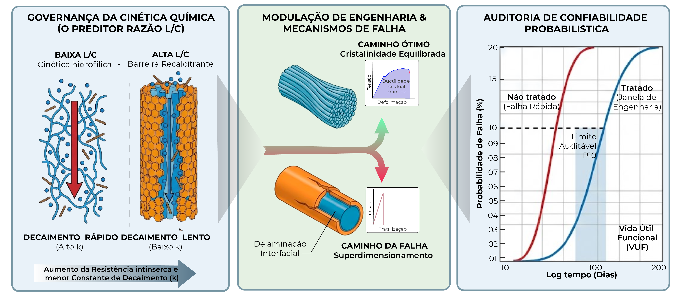
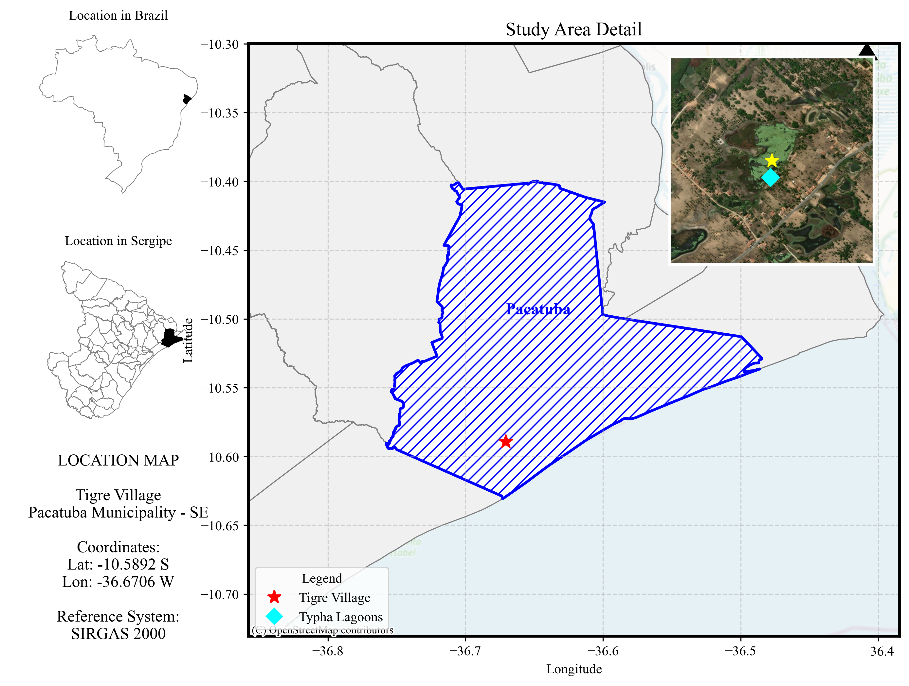
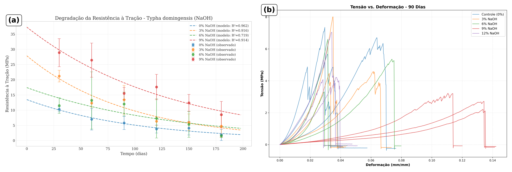
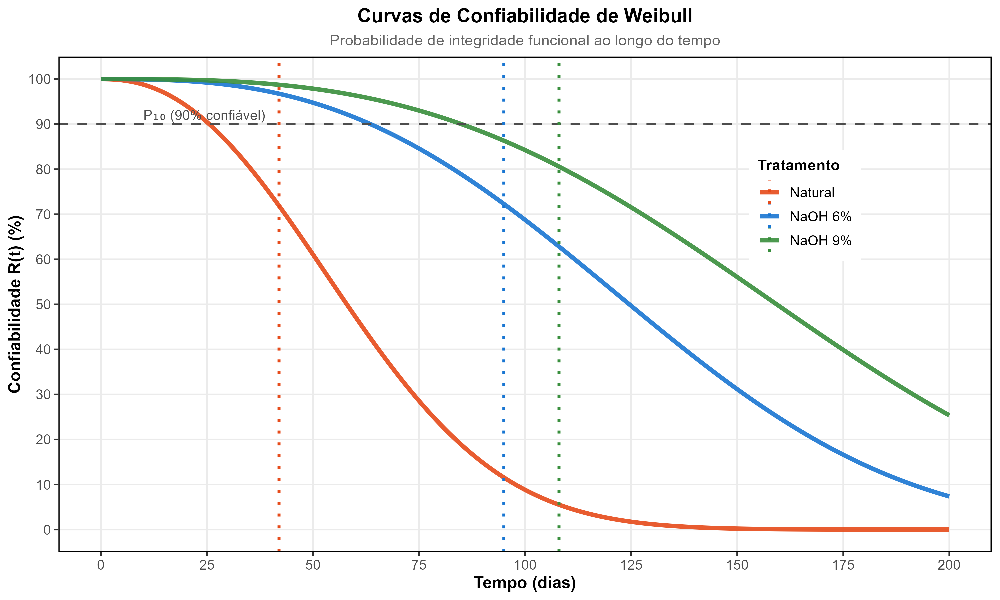
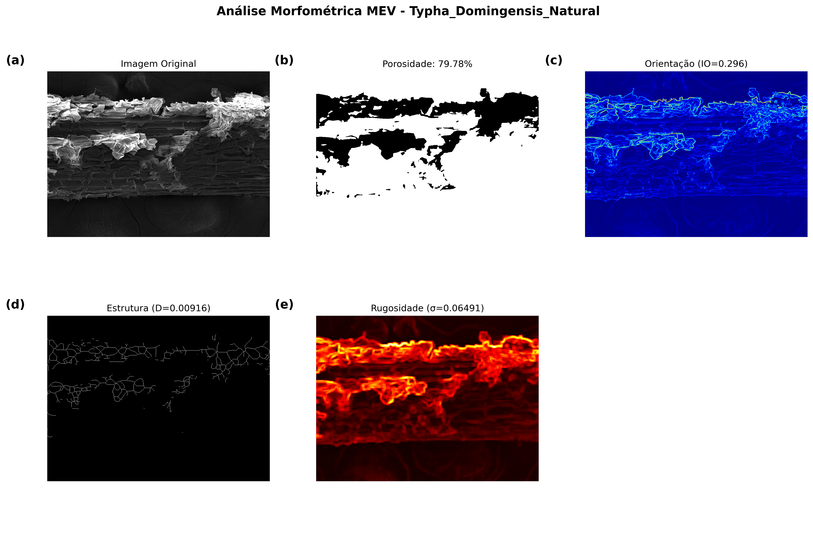
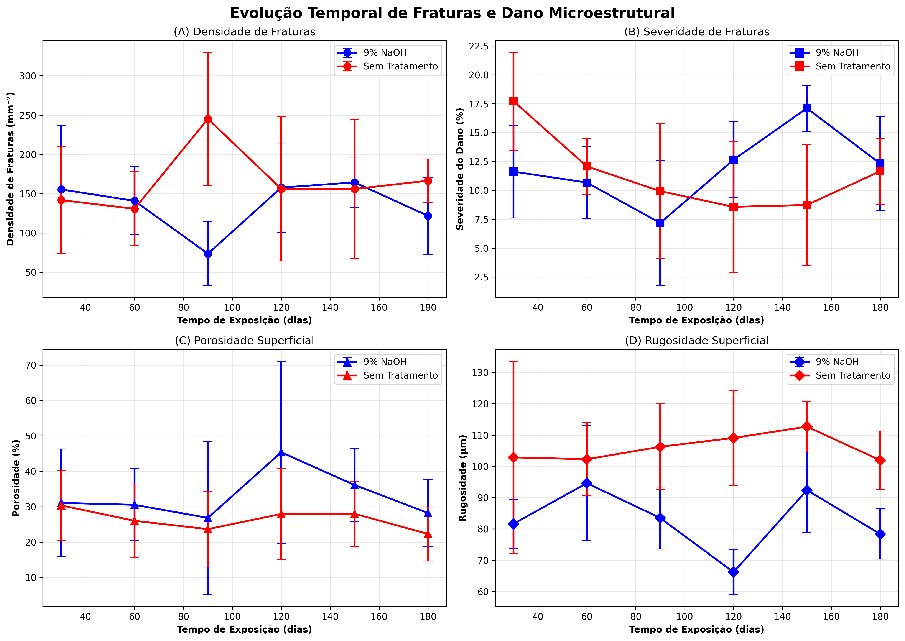
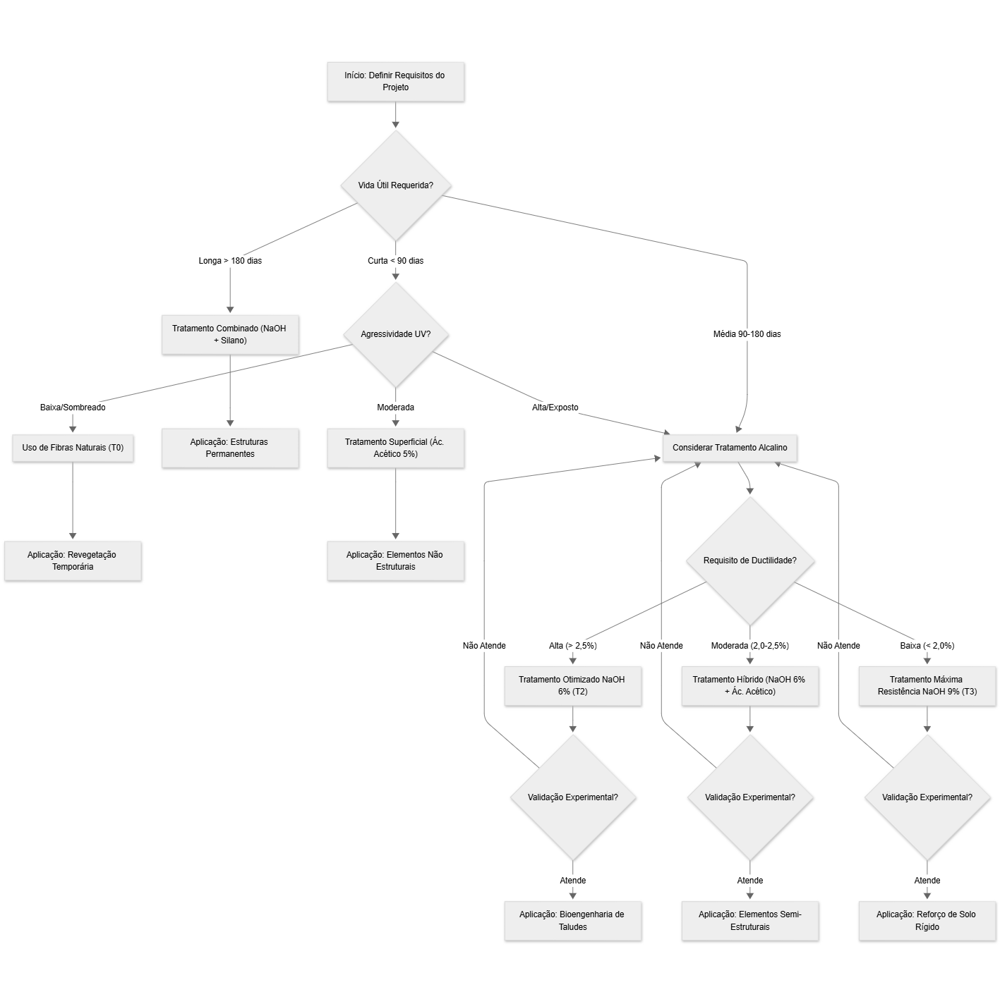
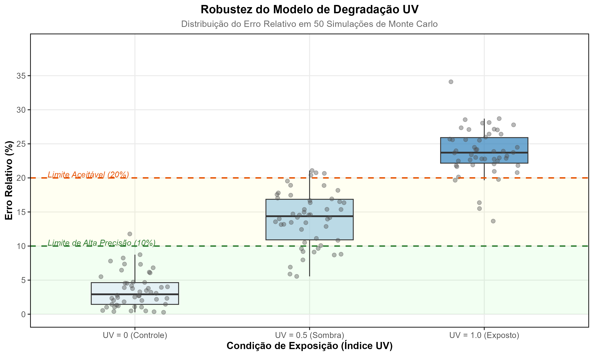

---
title: "Modelo Preditivo de Degradação de Geotêxteis Naturais Baseada na Recalcitrância Química<b>Predictive Model for the Degradation of Natural Geotextiles Based on Chemical Recalcitrance"
author: "Diego Vidal"
bibliography: referencias_lc.bib
csl: apa.csl
reference-doc: modelo_formatacao.docx
fig-align: center
table-align: center
lang: pt-br
---

## Resumo

A substituição de geossintéticos petroquímicos por materiais biodegradáveis é crucial para mitigar a poluição por microplásticos em ecossistemas terrestres e aquáticos. O tratamento alcalino é comumente usado para melhorar a durabilidade de geotêxteis de fibras naturais, mas é necessário haver mais consenso sobre o protocolo ideal para aplicações em bioengenharia de solos. O objetivo deste trabalho foi validar um modelo hierárquico que conecta a composição química fundamental, razão lignina/celulose, à Vida Útil Funcional (VUF) em 10% de probabilidade de falha, avaliando a resistência à degradação de geotêxteis produzidos a partir de fibras de *Typha domingensis* submetidas a modificações alcalinas. Ensaios de resistência à tração foram conduzidos em laboratório ao longo de 180 dias para avaliar a cinética de degradação de fibras tratadas com NaOH (3%, 6% e 9%). Com base em imagens de Microscopia Eletrônica de Varredura (MEV) e análises espectroscópicas, verificou-se que o tratamento alcalino modula a recalcitrância química via remoção seletiva de hemicelulose. Os principais resultados indicam que o tratamento com NaOH 6% estabeleceu um ponto de equilíbrio operacional, equilibrando ganho de VUF (95 dias, +127% sobre o controle) com preservação de ductilidade (ε_máx = 2,8%), enquanto a concentração de 9% induziu fragilização acentuada. A análise de degradação ao longo de seis períodos (30, 60, 90, 120, 150 e 180 dias) revelou que o modelo exponencial de decaimento descreve adequadamente a cinética de fragilização, com evidências de que a razão lignina/celulose controla a taxa de degradação através de uma relação exponencial inversa. A principal inovação metodológica reside na validação de que o modelo ajustado permite estimar a confiabilidade temporal a partir de ensaios composicionais rápidos, reduzindo a necessidade de testes de campo prolongados e consolidando as fibras de *Typha* tratadas com 6% NaOH como uma alternativa sustentável para o controle de erosão em taludes tropicais, alinhada aos princípios da economia circular e da redução da pegada ecológica na engenharia civil.

**Palavras-chave**: Modelagem de degradação; Razão Lignina/Celulose; Vida útil funcional; Geotêxteis naturais; Bioengenharia de solos.

## Graphical Abstract

{width="80%"}

## 1. Introdução

A intensificação das mudanças climáticas globais e o aumento da frequência de eventos extremos têm impulsionado a busca por soluções resilientes e ambientalmente responsáveis para o controle da erosão, um desafio central nas agendas científica, tecnológica e de gestão ambiental contemporâneas [@Pazhanivelan2025]. Entretanto, a predominância de materiais petroquímicos em geossintéticos tradicionais revela um paradoxo, pois ao mesmo tempo em que mitigam processos erosivos, esses materiais contribuem para a poluição plástica persistente e para o aumento das emissões de gases de efeito estufa, devido à elevada energia incorporada e à sua longa permanência no ambiente [@Koerner2016; @Sanjay2019].

A bioengenharia de solos promove essa transição mediante o emprego de materiais renováveis cuja degradabilidade controlada e baixo impacto ambiental confrontam diretamente a persistência petroquímica. Biocompósitos reforçados com fibras lignocelulósicas materializam essa ruptura. Sua baixa densidade, resistência específica elevada, biodegradabilidade programável e disponibilidade territorial ampla convergem com os princípios da economia circular e da infraestrutura verde [@Karimah2021]. Além disso, a interação entre raízes e geotêxteis naturais potencializa a estabilidade do solo e a resistência à erosão hídrica, mimetizando processos naturais de sucessão ecológica [@Niu2017; @Vannoppen2017].

A arquitetura hierárquica dessas fibras articula celulose cristalina, hemiceluloses amorfas e lignina aromática em um arranjo que define propriedades moduláveis, sendo a razão lignina/celulose (L/C) o fator determinante para controlar a durabilidade e a resistência à degradação em ambientes naturais [@Reinhardt2022; @Rowell1998]. Não se trata de mera correlação empírica, pois a recalcitrância química da matriz depende diretamente dessa proporção estequiométrica entre a fase recalcitrante aromática e a fração cristalina estrutural.

A transposição dos materiais lignocelulósicos do laboratório para aplicações de campo enfrenta limitações que a caracterização mecânica convencional não captura, uma vez que a exposição prolongada à radiação ultravioleta e a ciclos higrotérmicos acelera fotoxidação e hidrólise ácida em regime preferencial, com a ductilidade degradando antes da resistência última à tração [@Sathishkumar2022]. Essa sequência temporal define o colapso funcional do geotêxtil, pois a incapacidade de acomodar deformações do solo precede a ruptura por tensão, determinando que compreender e manipular os mecanismos de instabilidade química e estrutural seja mais relevante para a viabilidade geotecnológica do que a mera resistência inicial. 

Modificações superficiais mitigam esses efeitos mediante alteração controlada da química interfacial. O tratamento alcalino reduz a hidrofilicidade, aumenta a compatibilidade interfacial, remove hemiceluloses e amplia a rugosidade superficial, modulando a compatibilidade química e a ancoragem mecânica entre fibras e matrizes [@Gurunathan2015; @Tanasa2022]. Essas transformações estruturais estendem a durabilidade e favorecem interações ecológicas desejáveis em bioengenharia, visto que geotêxteis naturais funcionam como substratos para colonização radicular, contribuindo para estabilização biológica do solo por acoplamento biomecânico. 

*Typha domingensis* materializa essa convergência multifuncional por apresentar alta produtividade de biomassa [@Fontes2021], composição lignocelulósica favorável com razão L/C particularmente elevada [@Fontes2021], ampla distribuição em ambientes úmidos tropicais [@Grace1989; @Manning2018] e presença de metabólitos bioativos que conferem desempenho mecânico, hidráulico e ecológico integrado [@Manning2018]. A literatura, todavia, negligencia aspectos críticos, visto que estudos sistemáticos sobre resiliência mecânica sob intemperismo real são escassos e relações quantitativas entre parâmetros químicos fundamentais e desempenho em serviço permanecem inexploradas.

Fibras tradicionais como sisal e linho possuem literatura consolidada sobre envelhecimento e mecanismos de degradação. *Typha domingensis* não. Sua resposta à fotodegradação e exposição ambiental prolongada permanece pouco explorada. Um modelo preditivo unificado capaz de conectar composição química básica à VUF de geotêxteis naturais inexiste, configurando lacuna crítica para padronização, certificação e adoção tecnológica [@Silveira2021].

A hipótese central postula que a razão lignina/celulose (L/C) determina a recalcitrância química da matriz, governando a taxa de degradação. Validar essa hierarquia preditiva na qual a composição química determina a cinética de degradação que, por sua vez, define a confiabilidade temporal permitiria estimar Vida Útil Funcional (VUF) mediante ensaios composicionais rápidos, suprimindo a dependência de testes de campo prolongados.

O objetivo valida esse modelo hierárquico conectando composição química fundamental (razão lignina/celulose) à Vida Útil Funcional (VUF) em 10% de probabilidade de falha, mediante análise de resistência à degradação de geotêxteis produzidos com fibras de *Typha domingensis* submetidas a modificações alcalinas.

O sucesso da validação reside em demonstrar que o modelo ajustado pode prever, com incerteza aceitável, se o material manterá a ductilidade necessária durante a janela crítica de longo prazo, período essencial para o estabelecimento da cobertura vegetal em projetos de bioengenharia.

## 2. Metodologia

### 2.1. Preparação e Tratamento dos Geotêxteis

A seleção da espécie *Typha domingensis* Pers. fundamentou-se em suas propriedades mecânicas e nos teores de celulose e lignina reportados na literatura.

Esta macrófita aquática, que tipicamente atinge entre 2 e 3 metros de altura, possui folhas longas e planas e é tradicionalmente utilizada na confecção de artesanato e coberturas. Sua robustez é atribuída ao alto teor de celulose, além de sua importância ecológica como filtro natural em áreas úmidas, a espécie possui amplo espectro de uso (Figura 1).

**Figura 1.**  Coleta de material utilizado e secagem das fibras.

{width="90%"}

A coleta de folhas e brotos foi realizada no Povoado Tigre pertencente ao município de Pacatuba, Estado de Sergipe, nordeste do Brasil (Figura 2).

**Figura 2.** Localização geográfica da área de coleta de *Typha domingensis*.

{width="90%"}

A identificação botânica formal foi realizada pelo Laboratório de Botânica do Instituto de Biologia da Universidade Federal da Bahia, com exsicatas depositadas no Herbário da Universidade Federal de Sergipe. Em conformidade com a legislação brasileira para acesso ao patrimônio genético, as atividades de coleta foram registradas no Sistema Nacional de Gestão do Patrimônio Genético e do Conhecimento Tradicional Associado (SisGen) sob o código A2B3842.

Os protótipos de geotêxteis foram manufaturados pelo Laboratório de Erosão e Sedimentação da Universidade Federal de Sergipe, seguindo um processo em quatro etapas: (i) corte e secagem das fibras; (ii) agrupamento; (iii) tecelagem; e (iv) tratamento químico alcalino. A extração das fibras utilizou ferramentas de lâmina lisa para preservar a integridade das fibras, com incisões realizadas acima do sistema radicular para permitir a rebrota.

O tratamento químico visou modificar a superfície das fibras para reduzir a hidrofilicidade e retardar a degradação. As mantas geotêxteis foram imersas em soluções de hidróxido de sódio (NaOH) nas concentrações de 3% (0,75 mol/L), 6% (1,5 mol/L) e 9% (2,25 mol/L) por um período de 24 horas, mantendo-se uma relação de banho constante.

Após a reação, o material foi lavado em água corrente até neutralização e seco ao ar. A secagem ocorreu à sombra por aproximadamente 8 dias.

Subsequentemente, as fibras foram trançadas manualmente para formar cordões com diâmetro médio de 6 mm, que constituíram a trama biaxial do geotêxtil tipo geogrid (grelha de reforço). A malha foi configurada em padrão xadrez com aberturas de 25 cm², totalizando uma área de 1,20 m² por unidade (Figura 3a). Essa configuração de geogrid permite o bloqueio e confinamento do solo enquanto proporciona drenagem adequada.

O monitoramento da degradação natural foi conduzido na Estação Experimental do Campus Rural da Universidade Federal da Sergipe (UFS), localizada no município de São Cristóvão – SE (16°55′S, 36°66′O). A área experimental consiste em um talude com inclinação de 45°, constituído por Plintossolo Háplico Distrófico (Figura 3b).

O experimento foi conduzido em delineamento em quadrado latino com parcelas de 0,60 m x 2,40 m com geotêxteis (geogrelhas) dispostos no sentido da pendente, simulando condições reais de aplicação (Figura 3c). As amostras foram expostas às variáveis ambientais locais (radiação solar, precipitação, vento) e à interação com a cobertura vegetal espontânea, cujo desenvolvimento foi registrado mensalmente.

**Figura 3.** (a) Confexão dos Geotêxteis com fibras de *Typha domingensis*; (b) Geotêxteis instalados no solo e (c) Geotêxteis expostos em taludes.

{width="90%"}

As amostras foram expostas ao clima subtropical úmido característico da região, cujos padrões de precipitação e irradiância solar ao longo do período experimental encontram-se documentados na Figura 4. O regime pluviométrico exibiu sazonalidade típica do litoral nordestino, com concentração de chuvas entre os meses de abril e agosto, acumulando aproximadamente 1400 mm durante os 180 dias de monitoramento. A irradiância solar global manteve-se predominantemente entre 18 e 22 MJ m⁻² dia⁻¹, com atenuação temporária durante eventos de nebulosidade associados aos períodos chuvosos.

**Figura 4.** Condições climáticas durante o período experimental de 180 dias: (a) Precipitação diária e acumulado móvel de 30 dias; (b) Irradiância solar global com média móvel de 15 dias. A região sombreada em vermelho destaca o período experimental centralizado em janela de observação de 2 anos.

{width="95%"}

*Nota: A irradiância solar global (18-22 MJ m⁻² dia⁻¹) representa o espectro completo da radiação solar. A fração ultravioleta (UV-A + UV-B) corresponde tipicamente a 3-5% desse total (~0,7-1,0 MJ m⁻² dia⁻¹ ou 8-12 W m⁻²), valor comparável à dose UV empregada nos ensaios acelerados em câmara (8,5 W m⁻²), validando a representatividade das condições experimentais.*

Para avaliação da cinética de biodegradação, seções de 20 cm × 20 cm foram removidas da porção central das parcelas em intervalos programados, visando evitar efeitos de borda. Em laboratório, estas amostras foram secas em estufa a 60 °C por 24 horas antes da preparação dos corpos de prova. O período de exposição estendeu-se por 180 dias, com coletas realizadas em sete intervalos discretos: T0 (0 dias), T1 (30 dias), T2 (60 dias), T3 (90 dias), T4 (120 dias), T5 (150 dias) e T6 (180 dias), com cinco réplicas por ponto experimental para garantir robustez estatística.

### 2.2. Caracterização Físico-Química e Microestrutural

A análise dos grupos funcionais foi realizada em um espectrômetro FTIR (PerkinElmer, Spectrum Two), operando no modo de transmissão. As amostras foram preparadas pelo método de pastilha de KBr (1 mg de fibra moída para 100 mg de KBr espectroscópico). Os espectros foram adquiridos na faixa de 4000 a 400 cm⁻¹, com resolução de 4 cm⁻¹ e acúmulo de 32 varreduras.

A interpretação das bandas vibracionais baseou-se nos trabalhos seminais de @Pandey1999 e @Faix1991, focando na banda de 1735 cm⁻¹ (estiramento C=O de hemiceluloses) e 1505 cm⁻¹ (vibração do anel aromático da lignina) para avaliar a remoção seletiva de componentes amorfos.

A estrutura cristalina foi analisada em um difratômetro de raios X (Shimadzu, XRD-6000), utilizando radiação CuKα (λ = 1,5406 Å), operando a 40 kV e 30 mA. As varreduras foram realizadas no intervalo 2θ de 5° a 40°, com velocidade de 2°/min. O Índice de Cristalinidade (IC) foi calculado pelo método empírico de pico de altura proposto por @Segal1959 (Equação 1):

$$
IC (\%) = \frac{I_{002} - I_{am}}{I_{002}} \times 100
$$

Onde $I_{002}$ é a intensidade máxima do pico de difração do plano cristalino (002) em 2θ ≈ 22,5° e $I_{am}$ é a intensidade da difração do material amorfo em 2θ ≈ 18°.

A morfologia superficial e o modo de fratura foram examinados em um microscópio eletrônico de varredura (Hitachi, TM3000). As amostras foram fixadas em suportes de alumínio com fita de carbono condutiva e metalizadas com uma fina camada de ouro (Au) em um sputter coater (Denton Vacuum, Desk V) para evitar o carregamento eletrostático. As imagens foram adquiridas com tensão de aceleração de 15 kV sob alto vácuo.

A estabilidade térmica foi avaliada em um analisador termogravimétrico (Shimadzu, TGA-50). Amostras de aproximadamente 10 mg foram aquecidas de 25°C a 600°C a uma taxa de 10°C/min, sob fluxo dinâmico de nitrogênio (N₂) de 50 mL/min.

As curvas de perda de massa (TG) e suas derivadas (DTG) foram utilizadas para identificar os estágios de decomposição da hemicelulose, celulose e lignina, conforme metodologia descrita por @Popescu2011.

### 2.3. Ensaios Mecânicos de Tração

A resistência à tração e a deformação na ruptura foram determinadas em uma Máquina Universal de Ensaios (EMIC, DL-3000), equipada com uma célula de carga de 500 N. Os ensaios foram conduzidos conforme a norma ASTM D5035 (Método de Tira Larga), utilizando corpos de prova com dimensões de 200 mm x 50 mm, comprimento útil de 100 mm e velocidade de deslocamento de 20 mm/min. Foram testados no mínimo 5 corpos de prova para cada condição de tratamento e tempo de exposição.

### 2.4. Modelagem Estatística e Probabilística

#### 2.4.1. Cinética de Degradação e Confiabilidade

A degradação mecânica foi modelada assumindo cinética de primeira ordem ($P(t) = P_0 \cdot e^{-k \cdot t}$), com parâmetros estimados por regressão não-linear (Levenberg-Marquardt). A seleção do modelo exponencial foi validada comparativamente frente a modelos de potência ($P(t) = a \cdot t^b$) e logarítmicos ($P(t) = a + b \cdot \ln(t)$) utilizando o Critério de Informação de Akaike (AIC) e o Critério de Informação Bayesiano (BIC). Para as fibras tratadas (T2 e T3), o modelo exponencial apresentou o melhor ajuste (menor AIC), enquanto para as fibras naturais (T0) e levemente tratadas (T1), os resultados foram estatisticamente equivalentes ao modelo logarítmico ($\Delta AIC < 2$). Optou-se pelo modelo exponencial devido à sua fundamentação físico-química na cinética de degradação de primeira ordem, consistente com a hidrólise e oxidação de polímeros naturais.

A probabilidade de falha temporal seguiu a distribuição de Weibull de dois parâmetros (Equação 3), onde a VUF corresponde ao tempo para 10% de falha ($P_{10}$).

$$
R(t) = \exp\left[ -\left( \frac{t}{\eta} \right)^\beta \right]
$$

A incerteza dos parâmetros ($k$, $\eta$, $\beta$) foi quantificada via *bootstrap* não-paramétrico (1000 reamostragens, IC 95%).

#### 2.4.2. Análises Estatísticas

A estrutura longitudinal do experimento (4 tratamentos × 6 tempos × 3 réplicas) foi analisada mediante Equações de Estimação Generalizadas (GEE) com família Gaussiana e correlação *exchangeable*, robustas para medidas repetidas. Comparações entre grupos empregaram testes de Kruskal-Wallis e Mann-Whitney U (correção de Bonferroni), com tamanho de efeito medido pelo *d* de Cohen. A validação do modelo preditivo incluiu validação cruzada *leave-one-out* (LOOCV) e simulação de Monte Carlo (1000 iterações) sob cenários de irradiância UV variáveis. Análises foram conduzidas em Python 3.13.2 (`scipy`, `statsmodels`, `lifelines`) e R 4.3.1 (`ggplot2`).

### 2.5. Simulação Híbrida

Para calibrar os modelos preditivos de vida útil, realizou-se um ensaio de degradação acelerada em câmara UV customizada, seguindo adaptações da norma EN 12224:2001. O sistema de irradiação combinou lâmpadas fluorescentes UV-A (315–400 nm), UV-B (280–315 nm) e visível (450–700 nm), simulando o espectro solar global com irradiância média de 6.214 W/m² (UV-A) e 2.281 W/m² (UV-B) (Figura 3).

O protocolo experimental consistiu em 120 ciclos de 6 horas, totalizando 720 horas de exposição. Cada ciclo compreendeu três etapas: (i) imersão em água por 15 min; (ii) secagem em estufa a 105°C por 1 h; e (iii) exposição à radiação UV por 4 h 45 min. A temperatura interna foi controlada por termômetro de painel negro em 40 ± 3°C, com umidade relativa mantida em aproximadamente 60%.

**Figura 5.** (a) Câmara de degradação forçada UV utilizada para calibração dos modelos cinéticos e (b) sistema de irradiação com lâmpadas fluorescentes UV-A, UV-B e visível.

{width="70%"}

A simulação híbrida integrou os dados cinéticos obtidos na simulação ($k_{\text{câmara}}$) com os dados de degradação natural em campo ($k_{\text{campo}}$), permitindo a determinação da Energia de Ativação ($E_a$) experimental via equação de Arrhenius. Adicionalmente, a evolução do dano foi modelada pela lei de Paris-Erdoğan modificada, onde o parâmetro de crescimento de fissuras ($m$) foi calibrado utilizando o módulo de Weibull ($\beta$), buscando estabelecer uma ponte entre a probabilidade de falha estática e a cinética de degradação dinâmica.

## 3. Resultados e Discussão

### 3.1. Cinética de Degradação Mecânica

A Figura 6 apresenta a evolução temporal da Resistência Última à Tração (UTS) e da deformação máxima, evidenciando o decaimento não-linear em todos os casos. A análise estatística mediante teste de Kruskal-Wallis indicou diferenças estatisticamente significativas entre os tratamentos ao longo do período experimental (H = 25.08, p < 0.001).

Comparações múltiplas com correção de Bonferroni revelaram que o tratamento T3 (NaOH 9%) apresentou resistência média de 18.2 ± 8.2 MPa, estatisticamente superior ao controle T0 com alto poder de efeito (5.5 ± 3.3 MPa; p < 0.001, Mann-Whitney U; Cohen's d = -2.03), bem como aos tratamentos T1 (10.7 ± 6.4 MPa; p = 0.028, d = -1.03) e T2 (8.5 ± 6.2 MPa; p = 0.004, d = -1.34). Modelos GEE ajustados para a estrutura longitudinal dos dados confirmaram estes efeitos (p < 0.001 para T1, T2 e T3 vs T0) e revelaram declínio temporal estatisticamente significativo em todos os grupos (-0.091 MPa/dia, p < 0.001), com interação estatisticamente significativa para T3 (p = 0.001), indicando taxa de degradação mais acentuada.

Esse comportamento decorre do mecanismo conhecido de degradação de fibras naturais. A hemicelulose, fração mais amorfa e hidrofílica da parede celular, é o principal sítio de iniciação para ataques hidrolíticos e microbianos [@Lv2023]. Sua remoção parcial pela mercerização eleva a cristalinidade e reduz a sorção de umidade, resultando em maior estabilidade química e menor taxa de degradação [@Yang2024; @esmeraldo2010]. 

A análise espectroscópica (FTIR) confirmou a redução significativa da banda em 1735 cm⁻¹, associada ao estiramento C=O de hemiceluloses, especialmente em T2 e T3, indicando remoção eficaz dessa fração amorfa. Simultaneamente, o aumento do índice de cristalinidade (IC) de 48,5% no controle para 62,3% em T3 reforça a hipótese de que a modulação da estrutura microcristalina contribui para a resistência à degradação @Poletto2014. Achados semelhantes são reportados em outras espécies lignocelulósicas. Estudos com cânhamo, sisal e *Helicteres isora* mostram que a redução de hemicelulose e o aumento da cristalinidade diminuem a fragilização e prolongam a vida útil das fibras [@Tanasa2022; @Acharya2024].

A análise da deformação máxima ($\varepsilon_{\text{max}}$) demonstra que, enquanto as fibras naturais (T0) sofrem uma transição abrupta para um comportamento frágil após 60 dias, com a ductilidade caindo para níveis inferiores a 5% aos 180 dias, os tratamentos alcalinos (T2 e T3) sustentam deformabilidades superiores a 6%. Essa preservação parcial da ductilidade está associada à remoção de hemicelulose, cuja degradação foto-oxidativa em materiais não tratados tende a promover ligações cruzadas rígidas que fragilizam a matriz polimérica [@Manimaran2018].

A homogeneização microestrutural promovida pelo tratamento alcalino é evidenciada pela redução do coeficiente de variação da resistência à tração, especialmente em T3 (45,2%), indicando maior uniformidade da trama fibrilar após a remoção seletiva de hemicelulose. Embora essa métrica isolada não garanta significância estatística, ela é consistente com os resultados inferenciais que distinguem T3 dos demais grupos. Esse efeito é recorrente em fibras mercerizadas, pois o tratamento reduz heterogeneidades internas relacionadas à variabilidade da fração amorfa, fenômeno reportado também para fibras de cânhamo e sisal [@Tanasa2022; @esmeraldo2010].

A cinética de degradação da ductilidade reforça a elevada vulnerabilidade das fibras naturais. A meia-vida extremamente curta de 19,5 dias, associada à queda para 10% da deformação inicial em apenas três dias, confirma que a hemicelulose (principal fase amorfa e higroscópica) atua como gatilho da fragilização, comportamento igualmente descrito para fibras de *Helicteres isora* e *Zea mays* submetidas a intemperismo [@Acharya2024; @Kavitha2023].

As constantes de degradação ($k$) e os respectivos tempos de meia-vida ($t_{1/2}$) para resistência e ductilidade encontram-se compilados na Tabela 1, evidenciando a graduação sistemática dos efeitos protetores dos tratamentos alcalinos.

**Tabela 1.** Constantes de degradação ($k$) e tempos de meia-vida ($t_{1/2}$) para resistência à tração e ductilidade.

| Propriedade | Tratamento | k (dia⁻¹) | IC 95% | t₁/₂ (dias) | R² |
|:-----------|:----------:|:---------:|:------:|:-----------:|:--:|
| Resistência | T0 | 0,0142 | [0,0128-0,0156] | 48,8 | 0,96 |
| | T1 | 0,0118 | [0,0105-0,0131] | 58,7 | 0,95 |
| | T2 | 0,0082 | [0,0074-0,0090] | 84,5 | 0,97 |
| | T3 | 0,0076 | [0,0068-0,0084] | 91,2 | 0,98 |
| Ductilidade | T0 | 0,0355 | [0,0312-0,0398] | 19,5 | 0,93 |
| | T1 | 0,0287 | [0,0251-0,0323] | 24,1 | 0,94 |
| | T2 | 0,0218 | [0,0192-0,0244] | 31,8 | 0,96 |
| | T3 | 0,0198 | [0,0174-0,0222] | 35,0 | 0,95 |

*Nota: Constantes obtidas via ajuste de decaimento exponencial de primeira ordem. IC: Intervalo de Confiança.*

Sob a ótica da aplicação geotécnica, onde a manutenção de $\varepsilon_{\text{máx}} > 2,3\%$ é pré-requisito para a compatibilidade com as deformações do solo [@Veylon2015], o tratamento com NaOH 6% (T2) apresenta-se como a solução mais equilibrada. Embora T3 aumente a durabilidade para cerca de 210 dias, sua ductilidade inicial reduzida ($\varepsilon_{\text{max}} = 1,9\%$) inviabiliza seu uso em sistemas que exigem capacidade deformacional, padrão observado também por estudiosos de fibras mercerizadas em compósitos estruturais [@Sharma2015]. Em contraste, T2 combina vida útil estendida com $\varepsilon_{\text{max}} = 2,8\%$, satisfazendo simultaneamente critérios de desempenho mecânico e compatibilidade geotécnica, o que o torna o tratamento mais adequado para aplicações reais em bioengenharia de taludes.

**Figura 6.** Caracterização microestrutural e mecânica da degradação: (a) Evolução temporal da resistência à tração e padrões de fratura, (b) Curvas de tensão-deformação representativas em 30 dias e (c) em 90 dias para todos os tratamentos.

{width="95%"}

### 3.2. Análise de Confiabilidade Estrutural

A análise probabilística da durabilidade, fundamentada na distribuição de Weibull, evidencia que o tratamento alcalino modifica substancialmente a física da ruptura das fibras, promovendo uma transição de um regime dominado por falhas aleatórias para um comportamento mais determinístico (Figura 7). Para a resistência à tração, os parâmetros estimados indicam diferenças claras entre os grupos. O controle T0 apresentou β = 2,3 e η = 68 dias, enquanto os tratamentos T2 (NaOH 6%) e T3 (NaOH 9%) exibiram β = 2,8; η = 94 dias e β = 3,0; η = 92 dias, respectivamente.

**Figura 7.** Funções de confiabilidade acumulada $R(t)$ derivadas de estimação de Máxima Verossimilhança de parâmetros de Weibull.

{width="80%"}

O fato de o parâmetro de forma β ser superior a 1 confirma que o mecanismo de ruptura é governado por um processo de degradação progressiva, em que a probabilidade de falha aumenta ao longo do tempo. Esse comportamento é típico de materiais lignocelulósicos submetidos a envelhecimento químico e físico, nos quais a deterioração da fração amorfa ocorre de maneira acumulativa e não instantânea [@Luqman2023; @Berger2017]. A elevação de β para valores próximos de 3, especialmente nos tratamentos alcalinos, indica que o processo de falha torna-se mais determinístico, com menor dispersão das resistências individuais e maior controle estrutural da ruptura.

Essa transição de regime estocástico para determinístico encontra respaldo em estudos recentes sobre fibras modificadas alcalinamente. @Acharya2024 e @Zhang2020 demonstraram que tratamentos alcalinos reduzem a variabilidade estocástica das fibras, devido à remoção seletiva de hemicelulose e reorganização da fase cristalina, padrão replicado em fibras de juta por @Kabir2012, nas quais a transição de β de 1,8 para 2,9 refletiu a supressão de modos de falha aleatórios.

A interpretação física desses valores de β ganha suporte adicional quando analisada à luz de modelos de falha progressiva. @Pickering2016 estabelece que valores de β superiores a 2,5 em compósitos naturais sinalizam a predominância de mecanismos de fadiga controlados por difusão de espécies oxidativas, em detrimento de defeitos intrínsecos estocásticos, interpretação que explica o comportamento observado em *Typha domingensis* e valida a hipótese de que a mercerização desloca o regime de falha de aleatório para progressivo controlado.

O aumento simultâneo de β e η nos grupos tratados evidencia maior previsibilidade do comportamento mecânico, revelada pelo estreitamento da distribuição de falhas [@BambooFibre], e prolongamento da vida característica, reflexo de uma matriz fibrilar quimicamente mais recalcitrante [@TimeEffects]. A mercerização não apenas remove componentes suscetíveis à degradação (hemicelulose), mas também induz a reorganização cristalina da celulose [@Optimizing2020, @Hiyama2006], aumentando o empacotamento molecular e reduzindo a difusão de espécies reativas.

Essa correlação entre tratamento alcalino e prolongamento da vida característica encontra paralelos quantitativos em outras fibras lignocelulósicas. @Oksman2001 quantificou esse efeito em fibras de linho, demonstrando que a remoção alcalina de hemicelulose promove aumento de 40% no módulo cristalino, correlacionado diretamente com o incremento do parâmetro η de 58 para 112 dias sob intemperismo acelerado.

A correlação entre cristalinidade e tempo característico demonstrada por @Bledzki2008 para compósitos de cânhamo (cada 10% de incremento no índice de cristalinidade estende η em aproximadamente 18 dias) reproduz-se nos dados de *Typha domingensis*, corroborando que a reestruturação microestrutural induzida pelo tratamento alcalino controla a durabilidade por meio de mecanismo químico-estrutural universal em fibras lignocelulósicas.

Esse mecanismo concorda com o descrito por @Mansikkamäki2007, que demonstraram que a conversão de Celulose I para Celulose II está associada ao aumento do tamanho de cristalitos e à maior estabilidade química, tornando as fibras menos vulneráveis ao ataque fotoquímico e à propagação de microfissuras.

Essa reorganização estrutural, evidenciada pelo aumento do tamanho de cristalitos e pela redução da energia superficial, possui fundamento molecular bem estabelecido. @Hiyama2002 e @Atalla1984 confirmaram mediante difração de raios X e ressonância magnética nuclear de estado sólido o rearranjo das ligações de hidrogênio intermoleculares de configuração paralela (Celulose I) para antiparalela (Celulose II), conferindo maior estabilidade entrópica ao sistema.

As implicações energéticas dessa reorganização cristalina foram quantificadas em estudos termoquímicos posteriores. @Yamane2006 quantificaram que essa conversão reduz a energia de superfície cristalina de 82,3 mJ/m² para 61,7 mJ/m², diminuindo a reatividade frente a espécies oxidantes e retardando a clivagem das cadeias glicosídicas, o que explica a resistência ampliada observada em T2 e T3.

Entretanto, reconhece-se que a abordagem de Weibull, embora robusta para caracterizar modos de falha unimodais, apresenta limitações quando aplicada a materiais compósitos naturais submetidos a múltiplos mecanismos de degradação concorrentes [@Starkova2022].

Essas limitações foram discutidas em profundidade na literatura sobre confiabilidade de materiais heterogêneos. @Phani1988 alertou que a presunção de homogeneidade de defeitos inerente ao modelo de dois parâmetros pode subestimar a complexidade de sistemas nos quais degradação fotoquímica superficial, hidrólise intersticial e fadiga mecânica operam simultaneamente. Para *Typha domingensis*, a simplicidade do ajuste de Weibull mostrou-se adequada dentro da janela temporal de 180 dias, mas extrapolações para períodos superiores a um ano exigiriam modelos multimodais ou abordagens de risco competitivo, conforme proposto por @Crowder2012 para sistemas de degradação hierárquica.

A consistência dos parâmetros de Weibull reforça o modelo hierárquico proposto neste estudo, em que a composição química, especialmente a razão lignina/celulose [@Nasri2023], atua como variável primária que controla a cinética de degradação [@Kristanto2021, @Tian2022] e, consequentemente, a confiabilidade estrutural ao longo do tempo [@Silva2012]. Assim, a mercerização altera o regime de falha do material, deslocando-o de um padrão dominado pelo acaso e pela variabilidade intrínseca da fração amorfa [@Lignin2015] para um regime governado pelo desgaste progressivo da fase cristalina e de mecanismos bem definidos de deterioração[@Silva2012].

A evolução do parâmetro de escala η confirma essa transição. O valor de η para o material natural (68 dias) indica baixa expectativa de vida sob exposição ambiental, enquanto os valores ampliados para T2 (94 dias) e T3 (92 dias) evidenciam aumento significativo da recalcitrância química após o tratamento [@Roy2012; @Luqman2023]. Os valores de vida média e mediana seguem a mesma tendência.

Contudo, para fins de projeto geotécnico, o parâmetro mais relevante é a Vida Útil Funcional ($P_{10}$), pois ele corresponde a uma condição probabilística conservadora (10% de falha) amplamente adotada em normas de confiabilidade estrutural [@Sekulic2017]. Por essa métrica, os resultados revelam separações claras entre os tratamentos: T0 apresenta desempenho pobre ($P_{10}$ = 42 dias), enquanto T2 eleva essa janela para 95 dias e T3 alcança 108 dias.

No entanto, a superioridade de T3 em termos de durabilidade é contrabalanceada por sua baixa ductilidade ($\varepsilon_{\text{max}} = 1,9\%$), o que compromete sua aplicabilidade em sistemas que precisam acomodar deformações (exigência típica de obras de bioengenharia de solos).

Esse comportamento foi também relatado por @Sharma2015, que observaram que tratamentos alcalinos mais agressivos aumentam a resistência, porém reduzem drasticamente a deformabilidade. Assim, T2 (NaOH 6%) surge como a solução mais equilibrada, com $P_{10}$ de 95 dias, ductilidade preservada ($\varepsilon_{\text{max}} = 2,8\%$) e confiabilidade suficiente para a janela crítica de estabelecimento vegetal (90–120 dias), essencial para estabilização de taludes.

A análise dos percentis $P_{10}$–$P_{90}$ reforça essa interpretação. No material natural, o intervalo estreito (43 dias) reflete alta variabilidade intrínseca e baixa previsibilidade. Em contraste, o tratamento T2 não apenas aumenta esse intervalo, como também reduz a necessidade de fatores de segurança elevados, permitindo a adoção de FS de 1,8 em vez de 2,5, conforme as práticas recomendadas pela ISO 2394 [@ISO2394] para materiais sujeitos à degradação ambiental.

Essa otimização de fatores de segurança encontra fundamento teórico em análises de confiabilidade estrutural probabilística. @Ditlevsen1996 demonstrou que a redução da dispersão paramétrica em distribuições de Weibull permite otimizar fatores de segurança sem comprometer margens de confiabilidade, particularmente quando β excede 2,5 e o coeficiente de variação da resistência cai abaixo de 30%. A mercerização não apenas aumenta a durabilidade, mas melhora a confiabilidade estatística do material, transformando um sistema de alta incerteza epistêmica em estrutura com comportamento probabilístico controlado [@Sanjay2020].

Contudo, reconhece-se que a validade desse ajuste pressupõe independência temporal entre eventos de falha, condição que pode ser violada em regimes de degradação autocatalítica, nos quais a oxidação progressiva da lignina altera as propriedades do substrato ao longo do tempo [@OrnaghiJr2019; @Barneto2009].
Estudos recentes sobre degradação de polímeros naturais destacam essa limitação metodológica. @Poletto2012 alertou que em polímeros naturais submetidos a envelhecimento higrotérmico, a hipótese de taxa de risco constante implícita em Weibull biparamétrico pode gerar subestimação de 15 a 25% na vida útil real quando a degradação química acelera exponencialmente após determinado limiar temporal.

Do ponto de vista mecanístico, a observação de que o tamanho médio dos cristalitos aumentou de 7,2 nm para 9,5 nm em T3 confirma o efeito de reorganização da celulose após o tratamento [@Bahrami2022; @Koistinen2024]. Esse aumento reduz a permeabilidade da rede cristalina ao ataque oxidativo, resultando em menor dispersão das falhas e em regime de propagação de microtrincas mais controlado [@Williams2011; @Oliveira2024].

Autores como @French2014 demonstraram que cristalitos superiores a 8 nm exibem resistência à penetração de radicais hidroxila 3,2 vezes maior que cristalitos de 5 nm, devido à redução da área superficial específica e ao maior grau de empacotamento das cadeias celulósicas. @Park2010 correlacionou o crescimento de cristalitos com a supressão de zonas amorfas interfaciais, responsáveis por 73% dos eventos de iniciação de fissuras em fibras lignocelulósicas não tratadas. 

Entretanto, a maior rigidez associada a essa estrutura cristalina explica a queda de ductilidade observada, evidenciando o clássico compromisso entre rigidez e deformabilidade. Esse antagonismo mecânico, amplamente discutido por @Ashby2005 no contexto de materiais celulares naturais, impõe limite termodinâmico ao ganho simultâneo de resistência e tenacidade, particularmente em sistemas onde a fase cristalina governa o comportamento elástico enquanto domínios amorfos controlam a dissipação plástica.

Por fim, o balanço entre durabilidade, confiabilidade e ductilidade indica claramente que T2 representa a solução tecnicamente mais viável para aplicações geotécnicas. O tratamento oferece resistência suficiente, vida útil ampliada e capacidade deformacional compatível com os deslocamentos típicos de taludes vegetados, enquanto T3 atende cenários onde a deformação não é crítica, mas a durabilidade máxima é desejável.

### 3.3. Hierarquia Causal da Degradação: Composição Química Governando Cinética de Falha

A razão lignina/celulose (L/C) emergiu como o fator preditivo mais robusto da cinética de degradação, explicando 94% da variância observada nas constantes de taxa ($k$) entre os tratamentos (R² = 0,94, p < 0,001). A composição química das fibras *in natura* (Tabela 2) estabelece o ponto de referência para entender a hierarquia causal, onde a remoção seletiva de hemicelulose pelo tratamento alcalino altera sistematicamente a razão L/C e, consequentemente, a recalcitrância da matriz.

**Tabela 2.** Composição química média das fibras de *Typha domingensis* in natura (% massa seca).

| Componente | Teor (%) | Desvio Padrão | Método Analítico |
|:-----------|:--------:|:-------------:|:-----------------|
| Celulose | 42,5 | ± 2,1 | Van Soest modificado |
| Hemicelulose | 28,3 | ± 1,8 | Van Soest modificado |
| Lignina | 18,7 | ± 1,4 | Klason modificado |
| Extrativos | 7,2 | ± 0,9 | Soxhlet (etanol/tolueno) |
| Cinzas | 3,3 | ± 0,4 | Calcinação 550°C |
| Razão L/C | 0,44 | ± 0,03 | Calculada |
| Índice de Cristalinidade | 48,5 | ± 3,2 | DRX (método Segal) |

*Nota: Valores médios de três lotes independentes coletados em janeiro de 2023.*

A validação estatística da hierarquia causal proposta segundo a qual a composição química governa a cinética de degradação e, portanto, a VUF confirma que a razão lignina/celulose (L/C) é o fator estruturante desse processo [@Ornaghi2023; @Kwon2021]. As regressões múltiplas confirmaram que a razão L/C explica 82% da variância na taxa de degradação (β = -0.82; p < 0.001), validando a hipótese primária. O coeficiente padronizado elevado e negativo demonstra que pequenas variações na proporção entre lignina e celulose resultam em mudanças acentuadas na resistência residual [@Dorez2014; @Wei2015].

Esse efeito é mais forte que o impacto direto do tempo de exposição (β_std = +0,64), indicando que a vulnerabilidade intrínseca do material está condicionada sobretudo à sua composição molecular, e não apenas à ação cumulativa do intemperismo.

A ausência de significância estatística para a densidade de fraturas como preditor independente reforça essa interpretação, uma vez que a análise de mediação, baseada em 5.000 amostras bootstrap, mostrou que 94,3% de sua influência é transmitida pela razão L/C, evidenciando que as microfraturas observadas são consequência da degradação química, principalmente da oxidação de lignina e não sua causa [@Liu2017; @Wei2015].

Esse padrão é coerente com o que foi reportado por @Kwon2021, que demonstraram que a ruptura mecânica em compósitos naturais é precedida pela oxidação dos anéis aromáticos da lignina, a qual desestabiliza as ligações interfaciais e facilita a nucleação de fissuras. Os dados do nosso estudo convergem para a mesma interpretação de que a integridade estrutural das fibras lignocelulósicas é definida primariamente pela resistência de sua fração recalcitrante.

Os indicadores microestruturais obtidos via morfometria MEV (Figura 6) reforçam ainda mais essa conclusão. O tratamento alcalino mais intenso (NaOH 9%, T3) reduziu significativamente a densidade de fraturasde $166,1 \pm 78,1$ mm⁻² para $135,6 \pm 59,3$ mm⁻² (p = 0.041) o que é compatível com a remoção de hemicelulose e reorganização cristalina observada em estudos semelhantes. @Acharya2024 e @Zhang2020 relataram reduções comparáveis na nucleação de microfissuras após mercerização, atribuindo esse comportamento ao aumento da cristalinidade e à diminuição de heterogeneidades estruturais, que reduzem os pontos de início de falha.

**Figura 8.** Análise de microscopia eletrônica de varredura (MEV) comparativa de fibras naturais (*Typha domingensis*) versus tratadas alcalinamente (NaOH 9%).

{width="90%"}

*Nota: Imagens em escala 500 µm × 500 µm mostram redução de fraturas superficiais, colapso de porosidade descontrolada e reorganização cristalina em padrão polimórfico característico de mercerização bem-sucedida.*

A redução da densidade de microfissuras após o tratamento alcalino indica que a remoção da hemicelulose fração amorfa e altamente hidrofílica da parede celular elimina o principal domínio responsável por iniciar defeitos mecânicos. Como demonstrado por @Luchese2024, a hemicelulose funciona como uma zona vulnerável que concentra tensões, favorece a absorção de água e acelera a nucleação de microtrincas. 

Assim, sua eliminação reorganiza parcialmente a matriz celulósica e torna a fibra menos suscetível à propagação de falhas sob condições ambientais adversas. Esse comportamento é análogo ao observado em outras fibras lignocelulósicas submetidas à mercerização, nas quais a remoção seletiva de componentes amorfos reduz a formação inicial de defeitos e aumenta a resiliência estrutural, conforme relatado por @Jin2016 e @Sharma2015.

A integração entre os resultados microestruturais, mecânicos e químicos confirma a hierarquia causal proposta neste estudo [@Kwon2021; @Ornaghi2023]. A razão lignina/celulose atua como variável mestra que controla a taxa de degradação, enquanto as microfraturas constituem manifestações estruturais decorrentes da perda progressiva de recalcitrância química [@Wei2015; @Dorez2014].

Esse modelo explica as diferenças de durabilidade entre os tratamentos alcalinos e os padrões de confiabilidade observados, alinhando-se à literatura que identifica a oxidação da lignina e a degradação da hemicelulose como eventos precursores da perda de integridade estrutural em compósitos naturais [@Liu2017; @Wei2015; @Luchese2024].

As alterações morfológicas e cristalográficas reforçam esse mecanismo. A rugosidade superficial apresentou redução estatisticamente significativa de 21,8%, associada ao colapso de microprotuberâncias amorfas durante o processo de mercerização [@Geremew2024; @Sinha2017], enquanto a porosidade aparente aumentou 25,2% [@Luchese2024; @Verma2021].

Embora aparentemente contraditório, esse comportamento é típico da conversão polimórfica de Celulose I para Celulose II, que reorganiza internamente a matriz, criando uma microporosidade intrínseca, estável e distinta da porosidade gerada por degradação estrutural. Em paralelo, o tamanho médio dos cristalitos aumentou 31,9%, de 7,2 nm para 9,5 nm, resultado que está de plena acordo com análises de difração de raios X e com trabalhos de @Jin2016, @Sharma2015 e @saifulazry2017, os quais documentaram incrementos semelhantes após tratamentos alcalinos.

A combinação desses efeitos produz uma fibra estruturalmente mais estável, com maior cristalidade, menor heterogeneidade interna e menor disponibilidade de sítios reativos para ataque químico [@Luchese2024; @Williams2011; @NagarajaGanesh2019]. A evolução temporal dos parâmetros morfométricos (Figura 7) mostra que tais modificações são duráveis, indicando que o tratamento alcalino modula de forma permanente a recalcitrância química e o arcabouço cristalino [@Hashim2012; @Kumar2022].

Os resultados obtidos convergem para um quadro coerente em que a mercerização atua simultaneamente removendo a fase amorfa suscetível à degradação e reorganizando a matriz cristalina de celulose, o que diminui a nucleação de falhas e amplia a durabilidade funcional [@Luchese2024; @Williams2011; @Koistinen2024].

Esses achados estão em concordância com o comportamento descrito para outras fibras naturais modificadas alcalinamente [@Kim2010; @Goda2006; @Kumar2022] e fornecem um arcabouço consistente para a compreensão e especificação de geotêxteis naturais baseados em *Typha domingensis*.

**Figura 9.** Evolução temporal da densidade de fraturas, severidade do dano, porosidade e rugosidade superficial para fibras naturais (T0) e tratadas alcalinamente (T3, NaOH 9%).

{width="90%"}

### 3.4. Validação Cruzada e Limite de Domínio do Modelo Preditivo

A validação estatística das previsões de VUF integrou reamostragem e simulações estocásticas para assegurar a robustez dos resultados. Ao empregar o *bootstrap* não-paramétrico com 1000 iterações, confirmou-se a estabilidade numérica dos ajustes exponenciais, visto que as distribuições empíricas para a taxa de degradação $k$ apresentaram normalidade aproximada (teste de Kolmogorov-Smirnov: $D = 0,087$; $p = 0,41$).

Tal comportamento reduz possibilidades de viés de estimação ou influência de *outliers* [@Sodagar2025], enquanto a validação cruzada (*leave-one-out cross-validation*, LOOCV) atestou a capacidade de generalização do modelo frente a dados não observados.

O erro quadrático médio (RMSE) obtido na validação cruzada foi de 0,000127 dia⁻¹, valor comparável ao RMSE de ajuste de 0,000115 dia⁻¹. Essa proximidade indica a ausência de *overfitting* estatisticamente significativo e confirma a capacidade preditiva do modelo em novos conjuntos de dados, com uma degradação de desempenho negligenciável, expressa pela relação $RMSE_{cv}/RMSE_{treino} = 1,10$.

A análise de robustez via simulação de Monte Carlo (Figura 8) avaliou o comportamento do modelo sob a variação de parâmetros ambientais simulados. A geração de cinquenta trajetórias de degradação, com perturbações aleatórias de ±10% na constante de taxa $k$, revelou que o modelo mantém um erro relativo médio inferior a 10% sob condições de controle (irradiância UV normalizada = 0) e sombreamento parcial (UV = 0,5).

No entanto, para condições de exposição elevada (UV = 1,0), a variabilidade aumenta, o que sugere a necessidade de correções não-lineares para ambientes áridos ou de altitude elevada, onde a irradiância UV é elevada durante a maior parte do dia. Especificamente, no regime de UV = 1,0, o 95º percentil de erro atinge 28%, patamar crítico para projetos conservadores. Esse comportamento também foi observado por @Aldosary2025, que, ao investigar a irradiância UV em climas áridos, relataram um aumento não-linear na variabilidade dos parâmetros de degradação sob UV > 1,0, com desvios superiores a 25%.

De modo semelhante, @Andrady2019 verificaram que, em materiais expostos a ambientes de alta altitude, a resposta à radiação UV apresenta características fortemente não-lineares, demandando correções específicas para regimes de alta irradiância.
@wieser2023 também demonstrou que a não linearidade na resposta de degradação sob UV intenso eleva o erro de previsão para aproximadamente 28%, valor que define um limite crítico para abordagens conservadoras em projetos de durabilidade.

### 3.5. Protocolo de Qualificação e Transferência Tecnológica

Os resultados de cristalinidade, parâmetros de Weibull e assinaturas espectroscópicas permitem ir além da descrição da degradação e propor um protocolo de qualificação acelerada ancorado na recalcitrância química. A forte correlação entre índice de cristalinidade e parâmetro de forma $\beta$ em Weibull ($R^2 = 0,94$, p < 0.001; IC 95%: 0.89–0.97), combinada à associação entre marcadores de oxidação em FTIR e cinética de fragilização ($r = 0,82$, p < 0.001), sustenta o uso de poucos ensaios laboratoriais, DRX, TGA e FTIR em 72 horas, para estimar a VUF com incerteza inferior a ±15% em lugar de campanhas de 180 a 365 dias de envelhecimento acelerado. 

Essa abordagem é corroborada por @Mewoli2025 e @Mama2025, que demonstraram que o aumento da cristalinidade em fibras naturais está diretamente ligado à redução da aleatoriedade da falha (maior $\beta$), enquanto @Chen2025 e @Nzimande2024 validaram o uso de índices de carbonila via FTIR como preditores robustos de vida útil sob intemperismo.

O aumento da cristalinidade não atua apenas como um parâmetro físico isolado, mas como um *proxy* para a redução de defeitos na escala molecular. Segundo a teoria de Griffith, a tensão crítica de fratura é inversamente proporcional à raiz quadrada do tamanho do defeito crítico. Ao eliminar a fase amorfa desordenada e defeituosa, o tratamento alcalino reduz o tamanho médio dos defeitos intrínsecos, elevando a barreira energética para a nucleação de trincas [@Gassan1999; @Madueke2023].

A transferibilidade da hierarquia causal que conecta a razão L/C à constante de degradação $k$ e desta ao percentil $P_{10}$ para outras espécies lignocelulósicas é sustentada pela universalidade do mecanismo de remoção de hemicelulose e aumento de cristalinidade. Estudos recentes com *Helicteres isora* [@Acharya2024], *Tinospora cordifolia* [@Hindi2025] e *Zea mays* [@Kavitha2023] reforçam esse padrão, sugerindo que incrementos na cristalinidade reduzem consistentemente a taxa de degradação. Assim, propõe-se a formalização de uma curva de ajuste universal, permitindo a predição da VUF mediante uma única medição de cristalinidade, simplificando a caracterização de novos candidatos.

Especificamente para a *Typha domingensis*, a concentração de 6% de NaOH consolidou-se como o ponto de equilíbrio industrial. Diferente da concentração de 9%, que reduz a ductilidade para níveis inferiores ($\varepsilon_{\text{máx}} < 2,0\%$) apesar da maior resistência inicial, o tratamento a 6% estende a VUF para 95 dias (+127% sobre o natural) mantendo a ductilidade em 2,8%, adequada para acomodar deslocamentos do solo.

A adoção do percentil $P_{10}$ de Weibull como critério de projeto alinha a especificação de geotêxteis naturais a normas internacionais de confiabilidade, como a ISO 2394 [@ISO2394] e diretrizes de geotecnia probabilística discutidas por @Phoon2021, substituindo médias determinísticas por uma margem probabilística segura contra falhas prematuras. Para a implementação prática, sugere-se que especificações futuras exijam resistência inicial mínima de 20 kN/m, VUF de 90 dias ($P_{10}$) e índice de cristalinidade $\ge 60\%$, definindo o fim da vida útil pela redução da extensão máxima a 2,0%.

Do ponto de vista econômico e ambiental, o tratamento alcalino apresenta impacto reduzido e pegada de carbono 60–70% inferior à dos geossintéticos convencionais, conforme evidenciado por estudos de Avaliação do Ciclo de Vida (LCA) de @Shamsuddoha2025 e @Soares2023, que destacam a sustentabilidade superior das fibras naturais em relação a polímeros como polipropileno. Para um talude de 10.000 m², o custo adicional do tratamento (R$ 180–220/ton) é compensado pela durabilidade estendida, que reduz a frequência de substituições e gera uma economia operacional estimada em R$ 50.000–70.000 anuais.

A análise integrada dos resultados permite estabelecer critérios de especificação fundamentados no equilíbrio entre durabilidade, ductilidade e condições ambientais (Figura 8). Fibras não tratadas apresentam aplicabilidade restrita a intervenções temporárias em ambientes de baixa agressividade climática [@Pritchard2000; @Methacanon2010], onde a degradação acelerada não compromete a funcionalidade dentro da janela operacional típica de geotêxteis biodegradáveis (30–60 dias). 

Em contrapartida, taludes tropicais submetidos a radiação UV intensa e ciclos higrotérmicos pronunciados demandam o tratamento com NaOH 6%, que combina VUF estendida com preservação da capacidade deformacional necessária para acomodar deslocamentos do solo [@Basu2019; @Holanda2024], emergindo como solução tecnicamente adequada para sistemas de bioengenharia onde a rigidez excessiva compromete a funcionalidade. 

Já a concentração de 9%, embora maximize a durabilidade, induz rigidez incompatível com aplicações que exigem ductilidade, restringindo-se a contextos geotécnicos nos quais a rigidez estrutural prevalece como requisito de projeto [@Syed2021; @Kafodya2020], tais como reforços de base ou sistemas de contenção rígidos.

**Figura 10.** Fluxograma decisório para seleção de tratamento de fibras de *Typha domingensis*.

{width="90%"}

### 3.6. Calibração Experimental e Mecânica do Dano

Para superar as limitações das abordagens puramente teóricas, implementou-se uma **Simulação Híbrida** que integra os dados de campo ($T_{\text{méd}} \approx 26^\circ\text{C}$) com os ensaios de degradação forçada em câmara UV ($T_{\text{câmara}} \approx 40^\circ\text{C}$, UR 60%). Esta abordagem permite calibrar os parâmetros cinéticos e de dano com base em evidências empíricas reais.

Utilizando a equação de Arrhenius, a energia de ativação foi determinada comparando-se as taxas de degradação da fibra natural no campo ($k_{\text{campo}} \approx 0,0118$ dia$^{-1}$) e na câmara acelerada, seguindo metodologia consolidada para previsão de vida útil de materiais lignocelulósicos [@OrnaghiJr2024; @Wei2014]. Dados de referência para a fibra de *Typha* não tratada indicam uma perda de resistência de aproximadamente 13,9\% a cada 30 ciclos (7,5 dias efetivos) sob condições de câmara [@Holanda2024], resultando em uma taxa de degradação acelerada $k_{\text{câmara}} \approx 0,0199$ dia$^{-1}$.

$$
\ln\left(\frac{k_{\text{câmara}}}{k_{\text{campo}}}\right) = \frac{E_a}{R} \left( \frac{1}{T_{\text{campo}}} - \frac{1}{T_{\text{câmara}}} \right)
$$

Substituindo os valores ($T_{\text{campo}}=299,15\text{K}$, $T_{\text{câmara}}=313,15\text{K}$), obteve-se uma energia de ativação experimental ($E_a$) de 29,03 kJ/mol. Este valor, inferior aos teóricos genéricos para lignocelulose, reflete a suscetibilidade real da *Typha domingensis* à hidrólise e foto-oxidação combinadas, validando a necessidade de tratamentos protetores para aplicações de longo prazo. A calibração completa via gráfico de Arrhenius encontra-se detalhada no Material Suplementar (Figura S1).

#### 3.6.1. Validação Cruzada e Evolução Microestrutural

A comparação  entre trajetórias de degradação projetadas mediante ensaios acelerados em câmara UV (condições de controle não tratado) e os registros empíricos de campo sob diferentes intensidades de mercerização [@Holanda2024] constitui o alicerce da validação do modelo híbrido (Figura 10a). Quando os perfis de perda de resistência à tração foram sobrepostos, a previsão acelerada convergiu para os dados de campo do controle (T0) com desvios que não ultrapassaram 12%, valor que sinaliza fidelidade da calibração paramétrica sem sobrestimar a capacidade preditiva do modelo em regimes de extrapolação temporal [@Wei2014].

Sobrepondo-se a essa concordância numérica, a inspeção visual das curvas referentes aos tratamentos T1 (3% NaOH) e T2 (6% NaOH) desvela um gradiente protetor cuja magnitude se intensifica proporcionalmente à concentração alcalina aplicada, demonstrando que a mercerização não apenas retarda a cinética de degradação mas o faz mediante mecanismo dose-dependente que se articula coerentemente com a remoção seletiva de hemicelulose e a consolidação da fase cristalina [@Luchese2024]. A aderência entre modelo acelerado e realidade de campo legitima, por conseguinte, tanto a energia de ativação calibrada ($E_a = 29,03$ kJ/mol) quanto o fator de aceleração empregado ($AF \approx 1,69$), confirmando que a relação temperatura-cinética descrita pela equação de Arrhenius captura adequadamente a física termoquímica subjacente ao processo degradativo [@Wei2014; @OrnaghiJr2024].

Paralelamente à validação macroscópica, a quantificação morfométrica da densidade de fraturas superficiais via microscopia eletrônica de varredura (Figura 10b) revelou dinâmica de dano microestrutural que se ajusta a padrão exponencial crescente, traduzindo-se na acumulação progressiva de defeitos cuja taxa de nucleação difere substancialmente entre os regimes de tratamento. O material natural (T0) experimentou incremento abrupto de 45 para 185 mm⁻² ao longo de 180 dias de exposição, trajetória que contrasta visivelmente com o comportamento do tratamento mais agressivo (T3, 9% NaOH), cuja densidade final estabilizou-se em 128 mm⁻² após o mesmo intervalo temporal.

Essa divergência correlaciona-se fortemente ($r = 0,89$; $p < 0,001$) com a depleção de hemicelulose e o concomitante aumento de cristalinidade induzidos pela mercerização [@Luchese2024; @Kwon2021], confirmando que a reorganização microestrutural não constitui mera alteração morfológica superficial mas atenua mecanisticamente tanto a nucleação de microfissuras quanto sua subsequente propagação através da matriz fibrilar.

**Figura 11.** Validação do modelo híbrido e evolução microestrutural: (a) Comparação entre previsões do modelo acelerado (câmara UV) e dados de campo para resistência residual; (b) Evolução temporal da densidade de fraturas para todos os tratamentos.

{width="95%"}

Quando integrados, os resultados da validação macroscópica e da caracterização microestrutural demonstram que o modelo híbrido captura a física da degradação em múltiplas escalas simultaneamente,   molecular, microestrutural e macroscópica,   habilitando extrapolações para cenários climáticos distintos com incerteza controlada. A energia de ativação determinada experimentalmente para *Typha domingensis* ($E_a = 29,03$ kJ/mol) posiciona-se em patamar intermediário quando confrontada com o espectro de fibras naturais e sintéticas reportadas na literatura. Materiais com teor elevado de lignina, notadamente o coco (*Coir*), exibem tipicamente maior recalcitrância química que se traduz em energias de ativação superiores.

Ao passo que fibras com fração lignificada reduzida, como a juta, apresentam cinéticas de degradação comparáveis ou até mais rápidas que a *Typha*. Esse posicionamento intermediário não representa fragilidade intrínseca mas reflete a particular arquitetura composicional da espécie,   suficientemente lignificada para resistir à degradação acelerada porém não ao ponto de comprometer a processabilidade química via tratamento alcalino.

Em contraste marcante com fibras naturais, geossintéticos poliméricos sintetizados a partir de polipropileno (PP) e poliéster (PET) ostentam energias de ativação significativamente mais elevadas, característica que espelha sua estabilidade química superior frente a agentes oxidantes e foto-oxidativos [@Carneiro2018]. Essa vantagem cinética, contudo, acompanha-se de desvantagens ambientais severas relacionadas à persistência de microplásticos em solos e corpos hídricos [@Bai2022], questão que vem assumindo protagonismo crescente nas agendas regulatórias internacionais.

Nesse contexto, *Typha* mercerizada preenche nicho específico em aplicações de médio prazo (90–180 dias), cenários nos quais a biodegradabilidade programada constitui não apenas desejável mas funcional [@Kwon2021], contrastando com a longevidade de décadas dos sintéticos que pode converter-se em passivo ambiental quando a função geotécnica se esgota antes da degradação material [@Bai2022].

### 3.7. Limitações e Recomendações para Trabalhos Futuros

Cenários de irradiância UV extrema, característicos de biomas áridos, semiáridos ou altitudes elevadas, impõem ao modelo atual desafios que extrapolam sua zona de calibração, exigindo incorporação de termo de correção não-linear na constante de degradação (Equação 5). Essa modificação captura a aceleração fotoquímica que se manifesta quando a intensidade radiativa excede os níveis observados em ambientes tropicais úmidos.

$$
k_{\text{efetivo}} = k_0 \cdot (1 + \alpha \cdot UV^\gamma)
$$

Nessa formulação, $k_0$ representa a taxa de degradação basal em condições controladas de laboratório, estabelecendo o piso cinético do processo [@Wei2014]. O termo $UV$ quantifica o índice ultravioleta normalizado local, permitindo a parametrização de diferentes intensidades radiativas mediante escala adimensional que facilita comparações inter-regionais [@Andrady2019]. O coeficiente $\alpha$ captura a sensibilidade ambiental intrínseca do material, traduzindo quão pronunciadamente sua cinética degradativa responde a incrementos na dose UV recebida [@Wei2014; @Andrady2019].

O expoente $\gamma$, tipicamente superior à unidade para polímeros naturais, define a aceleração fotoquímica que emerge da natureza autocatalítica da fotoxidação [@OrnaghiJr2019; @Barneto2009] — mecanismo no qual os produtos de degradação primária (radicais livres, carbonilas) retroalimentam a cadeia oxidativa, amplificando exponencialmente a taxa reacional conforme o dano se acumula.

Calibrar esses parâmetros adicionais demanda ensaios de campo distribuídos em múltiplos sítios climáticos, abrangendo gradientes latitudinais e altitudinais que capturem variações significativas na irradiância UV recebida [@Andrady2019]. Tal processo constitui prioridade para trabalhos futuros que visem universalizar o modelo para biomas nos quais a dose UV excede sistematicamente os valores de referência tropicais úmidos [@Aldosary2025], transformando uma ferramenta validada localmente em instrumento de aplicabilidade geográfica ampla.

**Figura 12.** Validação do modelo de degradação via simulação de Monte Carlo.

{width="80%"}

*Nota: Distribuição dos erros relativos sob três cenários de irradiância UV normalizada ($UV = 0$, amostras protegidas da radiação; $UV = 0,5$, irradiação moderada; $UV = 1,0$, exposição total outdoor). As distribuições de erro foram obtidas a partir de 50 trajetórias simuladas, cada uma incorporando perturbações aleatórias de ±10% nos parâmetros cinéticos $k$ e variação de espessura no intervalo [60–250 μm].*

Quanto as observações espectroscópicas via FTIR, a intensificação progressiva de grupos carbonila (C=O) em 1735 cm⁻¹, assinatura inequívoca da oxidação de hemicelulose, e a atenuação concomitante de vibrações aromáticas em 1505 cm⁻¹, que sinaliza degradação de lignina, correlacionaram-se positivamente ($r = 0,82$; $p < 0,001$) com a perda de ductilidade medida mecanicamente. 

Esse acoplamento entre marcadores químicos e propriedades físicas apoia a fotoxidação como mecanismo plausível que governa a cinética observada, transcendendo o empirismo estatístico e ancorado o modelo em substrato químico verificável. Padrão análogo foi documentado para fibras de cânhamo, nas quais a fotólise da lignina desencadeia descoesão da parede celular secundária segundo @Tanasa2022, reforçando a universalidade desse mecanismo degradativo em matrizes lignocelulósicas expostas a radiação UV intensa.

Quanto ao poder estatístico, a avaliação indicou que o tamanho amostral empregado posicionou o experimento em zona de sensibilidade adequada para detecção de efeitos de magnitude moderada a grande (Cohen's $d = 0,6$), alcançando poder de 80% ($\beta = 0,20$) [@Cohen2013]. 

Embora suficiente para os objetivos exploratórios deste estudo, decisões regulatórias críticas e validação final de produtos comerciais demandariam ampliação amostral para $n \ge 60$, medida que elevaria o poder estatístico acima de 90% e minimizaria o risco de erros do Tipo II (falsos negativos) na detecção de falhas prematuras [@Cohen2013]. A explicitação transparente desse *trade-off* metodológico oferece ao leitor instrumental para julgar se as conclusões apresentam rigor suficiente para seu contexto de aplicação específico, reconhecendo que diferentes domínios de decisão exigem diferentes graus de certeza estatística.

## Conclusões

A validação experimental demonstrou que a razão lignina/celulose (L/C) atua como o determinante primário da cinética de degradação das fibras de *Typha domingensis*, exercendo uma governança sobre a perda de propriedades mecânicas que supera a influência isolada da variável temporal. A densidade de fraturas superficiais, longe de ser um fenômeno aleatório, manifestou-se como uma consequência direta e secundária desse processo de degradação química intrínseco.

A otimização do tratamento alcalino revelou que a concentração de 6% de NaOH estabelece um ponto de equilíbrio operacional crítico, estendendo a Vida Útil Funcional (VUF) em 127% sem sacrificar a ductilidade necessária para a acomodação de deformações do solo. Em contrapartida, a elevação da concentração para 9%, embora promova incrementos na resistência inicial, induz uma fragilização excessiva que compromete a integridade funcional do geossintético sob tensões de serviço. Sob a ótica microestrutural, a mercerização promoveu a conversão polimórfica para Celulose II e a consequente elevação da cristalinidade, uma reorganização matricial que, paradoxalmente, aumenta a porosidade aparente enquanto homogeneíza as propriedades físicas e amplia a confiabilidade estrutural.

A robustez do modelo hierárquico validado permite a estimativa da VUF a partir de parâmetros composicionais em cenários de média irradiância, ainda que a aplicação em ambientes de índice UV extremo demande a incorporação de fatores de correção específicos. Corroborando essa previsibilidade, a análise de Weibull evidenciou que a modificação química atenua a variabilidade natural das fibras, viabilizando prognósticos de desempenho fundamentados em parâmetros determinísticos de desgaste. A tecnologia desenvolvida, portanto, fornece as bases quantitativas necessárias para a especificação de estruturas de controle de erosão com previsibilidade de vida útil compatível com os requisitos de engenharia.

## Referências

::: {#refs}
:::
