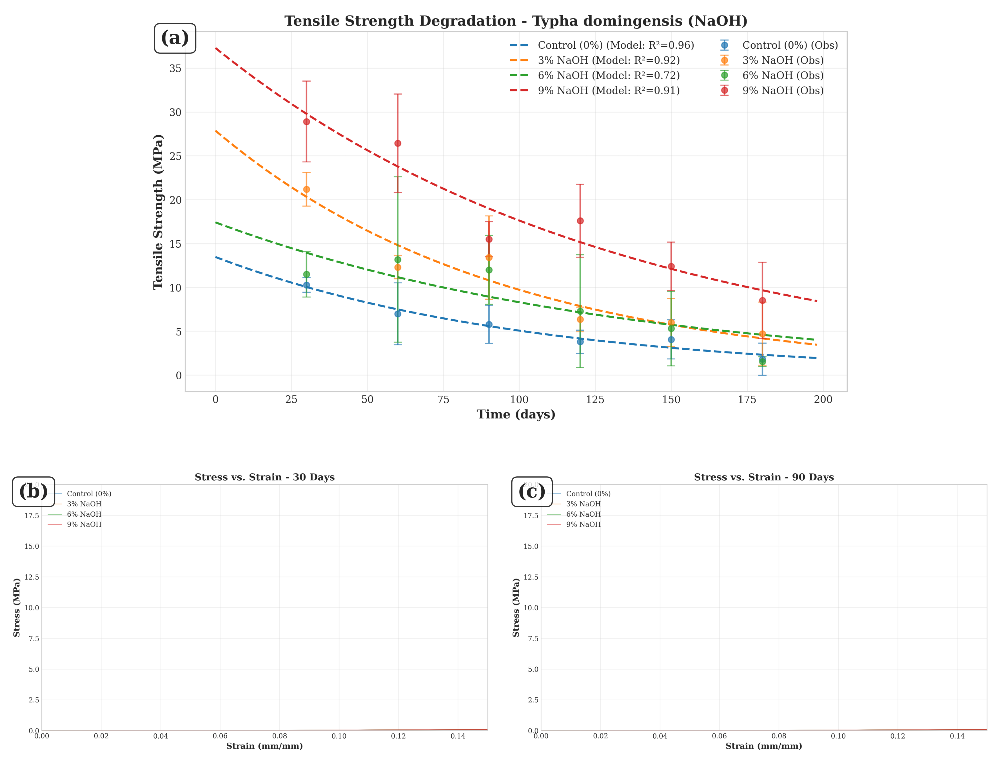
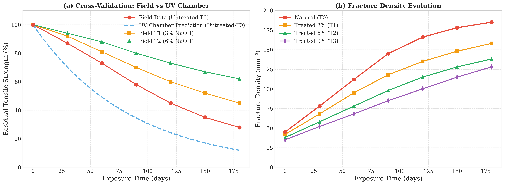
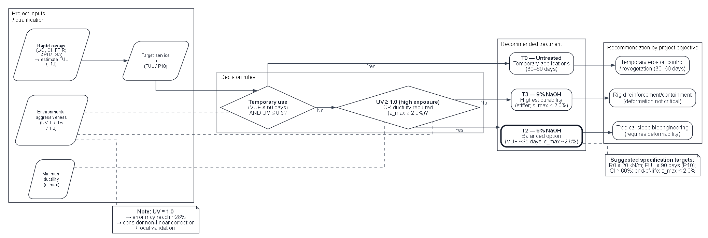

## Abstract

The replacement of petrochemical geosynthetics with biodegradable materials constitutes an imperative for mitigating microplastic pollution in terrestrial and aquatic ecosystems. Although alkaline treatment is widely employed to extend the durability of natural fiber geotextiles, the definition of an optimized protocol for soil bioengineering lacks consensus. The present investigation validated a hierarchical model that connects fundamental chemical composition, specifically the lignin/cellulose ratio, to Functional Useful Life (FUL) at 10% failure probability, evaluating the degradation resistance of geotextiles manufactured from *Typha domingensis* fibers subjected to alkaline modifications. Tensile strength tests conducted over 180 days enabled parametrization of the degradation kinetics of fibers treated with NaOH (3%, 6%, and 9%). The integration of Scanning Electron Microscopy (SEM) images and spectroscopic analyses demonstrated that alkaline treatment modulates chemical recalcitrance through selective hemicellulose removal. The results indicate that 6% NaOH treatment established an operational equilibrium point, balancing FUL gain (95 days, +127% over control) with ductility preservation (ε_max = 2.8%), while 9% concentration induced excessive embrittlement. Temporal analysis revealed that the exponential decay model adequately describes embrittlement kinetics, evidencing that the lignin/cellulose ratio governs the degradation rate through an inverse exponential relationship. The main methodological contribution resides in confirming that the fitted model allows estimating temporal reliability from rapid compositional assays, reducing dependence on prolonged field tests and consolidating *Typha* fibers treated with 6% NaOH as a sustainable alternative for erosion control on tropical slopes, in alignment with circular economy principles and ecological footprint reduction in geotechnics.

**Keywords**: Degradation modeling; Lignin/Cellulose ratio; Functional useful life; Natural geotextiles; Soil bioengineering.

## Graphical Abstract

{width="80%"}

## 1. Introduction

The intensification of global climate change and the increasing frequency of extreme events drive the search for resilient and environmentally responsible solutions for erosion control, a central challenge in contemporary scientific, technological, and environmental management agendas [@Pazhanivelan2025]. The predominance of petrochemical materials in traditional geosynthetics reveals, however, an intrinsic contradiction: while mitigating erosive processes, these materials contribute to persistent plastic pollution and increased greenhouse gas emissions, given their high embodied energy and long environmental permanence [@Koerner2016; @Sanjay2019].

Soil bioengineering promotes this transition through the use of renewable materials whose controlled degradability and low environmental impact confront petrochemical persistence. Biocomposites reinforced with lignocellulosic fibers materialize this disruption, as their low density, high specific strength, programmable biodegradability, and broad territorial availability converge with circular economy principles and green infrastructure [@Karimah2021]. Concurrently, the interaction between roots and natural geotextiles enhances soil stability and resistance to hydraulic erosion, mimicking natural ecological succession processes [@Niu2017; @Vannoppen2017].

The architecture of these fibers combines crystalline cellulose, amorphous hemicelluloses, and aromatic lignin. The lignin/cellulose (L/C) ratio acts as a determinant of durability and degradation resistance [@Reinhardt2022; @Rowell1998], defining the chemical recalcitrance of the matrix through the proportion between the aromatic phase and the crystalline fraction.

The transposition of lignocellulosic materials from laboratory to field applications faces limitations that conventional mechanical characterization does not capture, since prolonged exposure to ultraviolet radiation and hygrothermal cycles accelerates photooxidation and acid hydrolysis preferentially, with ductility degrading before ultimate tensile strength [@Sathishkumar2022]. This temporal sequence defines the functional collapse of the geotextile, as the inability to accommodate soil deformations precedes tensile rupture, determining that understanding and manipulating chemical and structural instability mechanisms is more relevant to geotechnological viability than mere initial resistance.

Surface modifications mitigate these effects through controlled alteration of interfacial chemistry. Alkaline treatment reduces hydrophilicity, increases interfacial compatibility, removes hemicelluloses, and enhances surface roughness, modulating chemical compatibility and mechanical anchorage between fibers and matrices [@Gurunathan2015; @Tanasa2022]. These structural transformations extend durability and favor desirable ecological interactions in bioengineering, since natural geotextiles function as substrates for root colonization, contributing to biological soil stabilization through biomechanical coupling.

*Typha domingensis* materializes this multifunctional convergence by presenting high biomass productivity [@Fontes2021], favorable lignocellulosic composition with a particularly high L/C ratio [@Fontes2021], wide distribution in tropical wetland environments [@Grace1989; @Manning2018], and presence of bioactive metabolites that confer integrated mechanical, hydraulic, and ecological performance [@Manning2018]. The literature, however, neglects critical aspects, as systematic studies on mechanical resilience under real weathering are scarce and quantitative relationships between fundamental chemical parameters and in-service performance remain unexplored.

Traditional fibers such as sisal and flax have consolidated literature on aging and degradation mechanisms, while *Typha domingensis* lacks in-depth investigations on its response to photodegradation and prolonged environmental exposure. The absence of a unified predictive model capable of connecting basic chemical composition to the FUL of natural geotextiles constitutes a critical gap for standardization, certification, and technological adoption [@Silveira2021].

The central hypothesis postulates that the lignin/cellulose (L/C) ratio determines the chemical recalcitrance of the matrix, governing the degradation rate. Validating this predictive hierarchy in which chemical composition determines degradation kinetics that, in turn, defines temporal reliability would allow estimating Functional Useful Life (FUL) through rapid compositional assays, suppressing dependence on prolonged field tests.

The objective of this study consists of validating this hierarchical model by connecting fundamental chemical composition (lignin/cellulose ratio) to Functional Useful Life (FUL) at 10% failure probability, through analysis of degradation resistance of geotextiles produced from *Typha domingensis* fibers subjected to alkaline modifications. The success of validation resides in demonstrating that the fitted model can predict, with acceptable uncertainty, whether the material will maintain the necessary ductility during the long-term critical window, an essential period for vegetation cover establishment in bioengineering projects.

## 2. Materials and Methods

### 2.1 Hierarchical Model Architecture

The selection of the species *Typha domingensis* Pers. was based on its mechanical properties and cellulose and lignin contents reported in the literature.

This aquatic macrophyte, which typically reaches between 2 and 3 meters in height, has long and flat leaves and is traditionally used in the manufacture of handicrafts and roofing. Its robustness is attributed to high cellulose content, and beyond its ecological importance as a natural filter in wetlands, the species has a broad spectrum of uses (Figure 1).

**Figure 1.** Collection of material used and fiber drying.

{width="90%"}

The collection of leaves and shoots was carried out in Tigre Village, belonging to the municipality of Pacatuba, State of Sergipe, northeastern Brazil (Figure 2).

**Figure 2.** Geographic location of the *Typha domingensis* collection area.

{width="90%"}

Formal botanical identification was performed by the Botany Laboratory of the Institute of Biology of the Federal University of Bahia, with exsiccates deposited in the Herbarium of the Federal University of Sergipe. In compliance with Brazilian legislation for access to genetic heritage, collection activities were registered in the National System for the Management of Genetic Heritage and Associated Traditional Knowledge (SisGen) under code A2B3842.

The geotextile prototypes were manufactured by the Erosion and Sedimentation Laboratory of the Federal University of Sergipe, following a four-stage process: (i) fiber cutting and drying; (ii) grouping; (iii) weaving; and (iv) alkaline chemical treatment. Fiber extraction used smooth-blade tools to preserve fiber integrity, with incisions made above the root system to allow regrowth.

Chemical treatment aimed to modify the fiber surface to reduce hydrophilicity and delay degradation. Geotextile mats were immersed in sodium hydroxide (NaOH) solutions at concentrations of 3% (0.75 mol/L), 6% (1.5 mol/L), and 9% (2.25 mol/L) for a period of 24 hours, maintaining a constant bath ratio.

After the reaction, the material was washed in running water until neutralization and air-dried. Drying occurred in the shade for approximately 8 days.

Subsequently, the fibers were manually braided to form cords with an average diameter of 6 mm, which constituted the biaxial weft of the geogrid-type geotextile (reinforcement grid). The mesh was configured in a checkerboard pattern with 25 cm² openings, totaling an area of 1.20 m² per unit (Figure 3a). This geogrid configuration allows for soil blockage and confinement while providing adequate drainage.

The natural degradation monitoring was conducted at the Experimental Station of the Rural Campus of the Federal University of Sergipe (UFS), located in the municipality of São Cristóvão – SE (16°55′S, 36°66′O). The experimental area consists of a slope with a 45° inclination, constituted by Dystrophic Haplic Plinthosol (Figure 3b).

The experiment was conducted in a Latin square design with 0.60 m x 2.40 m plots with geotextiles (geogrids) arranged in the slope direction, simulating real application conditions (Figure 3c). Samples were exposed to local environmental variables (solar radiation, precipitation, wind) and interaction with spontaneous vegetation cover, whose development was recorded monthly.

**Figure 3.** (a) Fabrication of geotextiles with *Typha domingensis* fibers; (b) Geotextiles installed in soil and (c) Geotextiles exposed on slopes.

{width="90%"}

Samples were exposed to the humid subtropical climate characteristic of the region, whose precipitation and solar irradiance patterns throughout the experimental period are documented in Figure 4. The pluviometric regime exhibited seasonality typical of the northeastern coast, with rainfall concentration between April and August, accumulating approximately 1400 mm during the 180 days of monitoring. Global solar irradiance remained predominantly between 18 and 22 MJ m⁻² day⁻¹, with temporary attenuation during cloudiness events associated with rainy periods.

**Figure 4.** Climatic conditions during the 180-day experimental period: (a) Daily precipitation and 30-day moving accumulation; (b) Global solar irradiance with 15-day moving average. The red shaded region highlights the experimental period centered on a 2-year observation window.

{width="95%"}

For biodegradation kinetics evaluation, 20 cm × 20 cm sections were removed from the central portion of plots at scheduled intervals, aiming to avoid edge effects. In the laboratory, these samples were oven-dried at 60 °C for 24 hours before specimen preparation. The exposure period extended for 180 days, with collections performed at seven discrete intervals: T0 (0 days), T1 (30 days), T2 (60 days), T3 (90 days), T4 (120 days), T5 (150 days), and T6 (180 days), with five replicates per experimental point to ensure statistical robustness.

### 2.2. Physicochemical and Microstructural Characterization

Functional group analysis was performed on an FTIR spectrometer (PerkinElmer, Spectrum Two), operating in transmission mode. Samples were prepared by the KBr pellet method (1 mg of ground fiber to 100 mg of spectroscopic KBr). Spectra were acquired in the range of 4000 to 400 cm⁻¹, with 4 cm⁻¹ resolution and accumulation of 32 scans.

Interpretation of vibrational bands was based on the seminal works of @Pandey1999 and @Faix1991, focusing on the 1735 cm⁻¹ band (C=O stretching of hemicelluloses) and 1505 cm⁻¹ (aromatic ring vibration of lignin) to evaluate selective removal of amorphous components.

The crystalline structure was analyzed on an X-ray diffractometer (Shimadzu, XRD-6000), using CuKα radiation (λ = 1.5406 Å), operating at 40 kV and 30 mA. Scans were performed in the 2θ interval from 5° to 40°, with a speed of 2°/min. The Crystallinity Index (CI) was calculated by the empirical peak height method proposed by @Segal1959 (Equation 1):

$$
CI (\%) = \frac{I_{002} - I_{am}}{I_{002}} \times 100
$$

Where $I_{002}$ is the maximum intensity of the diffraction peak of the crystalline plane (002) at 2θ ≈ 22.5° and $I_{am}$ is the intensity of amorphous material diffraction at 2θ ≈ 18°.

Surface morphology and fracture mode were examined on a scanning electron microscope (Hitachi, TM3000). Samples were fixed on aluminum supports with conductive carbon tape and metallized with a thin gold (Au) layer in a sputter coater (Denton Vacuum, Desk V) to avoid electrostatic charging. Images were acquired with an acceleration voltage of 15 kV under high vacuum.

Thermal stability was evaluated on a thermogravimetric analyzer (Shimadzu, TGA-50). Samples of approximately 10 mg were heated from 25°C to 600°C at a rate of 10°C/min, under dynamic nitrogen (N₂) flow of 50 mL/min.

Mass loss (TG) curves and their derivatives (DTG) were used to identify decomposition stages of hemicellulose, cellulose, and lignin, according to the methodology described by @Popescu2011.

### 2.3. Tensile Mechanical Tests

Tensile strength and elongation at break were determined on a Universal Testing Machine (EMIC, DL-3000), equipped with a 500 N load cell. Tests were conducted according to ASTM D5035 standard (Wide Strip Method), using specimens with dimensions of 200 mm x 50 mm, useful length of 100 mm, and displacement speed of 20 mm/min. At least 5 specimens were tested for each treatment condition and exposure time.

### 2.4. Statistical and Probabilistic Modeling

#### 2.4.1. Degradation Kinetics and Reliability

Mechanical degradation was modeled assuming first-order kinetics ($P(t) = P_0 \cdot e^{-k \cdot t}$), with parameters estimated by non-linear regression (Levenberg-Marquardt). The selection of the exponential model was comparatively validated against power ($P(t) = a \cdot t^b$) and logarithmic ($P(t) = a + b \cdot \ln(t)$) models using the Akaike Information Criterion (AIC) and the Bayesian Information Criterion (BIC). 

For treated fibers (T2 and T3), the exponential model presented the best fit (lowest AIC), while for natural fibers (T0) and lightly treated (T1), results were statistically equivalent to the logarithmic model ($\Delta AIC < 2$). The exponential model was chosen due to its physicochemical foundation in first-order degradation kinetics, consistent with hydrolysis and oxidation of natural polymers.

The temporal failure probability followed the two-parameter Weibull distribution (Equation 3), where the FUL corresponds to the time for 10% failure ($P_{10}$).

$$
R(t) = \exp\left[ -\left( \frac{t}{\eta} \right)^\beta \right]
$$

Uncertainty of parameters ($k$, $\eta$, $\beta$) was quantified via non-parametric *bootstrap* (1000 resamplings, 95% CI).

#### 2.4.2. Statistical Analyses

The longitudinal structure of the experiment (4 treatments × 6 times × 3 replicates) was analyzed through Generalized Estimating Equations (GEE) with Gaussian family and *exchangeable* correlation, robust for repeated measures. Between-group comparisons employed Kruskal-Wallis and Mann-Whitney U tests (Bonferroni correction), with effect size measured by Cohen's *d*. Predictive model validation included *leave-one-out* cross-validation (LOOCV) and Monte Carlo simulation (1000 iterations) under variable UV irradiance scenarios. Analyses were conducted in Python 3.13.2 (`scipy`, `statsmodels`, `lifelines`) and R 4.3.1 (`ggplot2`).

### 2.5. Hybrid Simulation

To calibrate predictive service life models, an accelerated degradation test was performed in a custom UV chamber, following adaptations of the EN 12224:2001 standard. The irradiation system combined UV-A (315–400 nm), UV-B (280–315 nm), and visible (450–700 nm) fluorescent lamps, simulating the global solar spectrum with average irradiance of 6,214 W/m² (UV-A) and 2,281 W/m² (UV-B) (Figure 3).

The experimental protocol consisted of 120 cycles of 6 hours, totaling 720 hours of exposure. Each cycle comprised three stages: (i) immersion in water for 15 min; (ii) oven drying at 105°C for 1 h; and (iii) UV radiation exposure for 4 h 45 min. Internal temperature was controlled by black panel thermometer at 40 ± 3°C, with relative humidity maintained at approximately 60%.

**Figure 5.** (a) UV forced degradation chamber used for kinetic model calibration and (b) irradiation system with UV-A, UV-B, and visible fluorescent lamps.

{width="70%"}

Hybrid simulation integrated kinetic data obtained from chamber simulation ($k_{\text{chamber}}$) with natural field degradation data ($k_{\text{field}}$), allowing determination of experimental Activation Energy ($E_a$) via Arrhenius equation. Additionally, damage evolution was modeled by the modified Paris-Erdoğan law, where the crack growth parameter ($m$) was calibrated using the Weibull modulus ($\beta$), seeking to establish a bridge between static failure probability and dynamic degradation kinetics.

## 3. Results and Discussion

### 3.1 Lignin/Cellulose (L/C) Dynamics

The temporal evolution of Ultimate Tensile Strength (UTS) and maximum strain exhibits a generalized non-linear decay (Figure 6), with statistically significant differences between treatments confirmed by the Kruskal-Wallis test (H = 25.08, p < 0.001). Multiple comparisons with Bonferroni correction revealed that T3 treatment (9% NaOH) presented mean resistance of 18.2 ± 8.2 MPa, statistically superior to control T0 with high effect power (5.5 ± 3.3 MPa; p < 0.001, Mann-Whitney U; Cohen's d = -2.03), as well as to treatments T1 (10.7 ± 6.4 MPa; p = 0.028, d = -1.03) and T2 (8.5 ± 6.2 MPa; p = 0.004, d = -1.34). GEE models adjusted for longitudinal data structure corroborated these effects (p < 0.001 for T1, T2, and T3 vs T0) and revealed statistically significant temporal decline in all groups (-0.091 MPa/day, p < 0.001), with significant interaction for T3 (p = 0.001), indicating a more pronounced degradation rate.

The degradation process begins in hemicellulose, an amorphous and hydrophilic fraction susceptible to hydrolytic attacks [@Lv2023]. In this sense, mercerization partially removes this component, elevating crystallinity and chemical stability [@Yang2024]. FTIR analyses confirmed the reduction of the 1735 cm⁻¹ band (hemicelluloses) in treated groups, while the crystallinity index increased from 48.5% (control) to 62.3% (T3). These data corroborate that microstructural modulation enhances degradation resistance, aligning with studies on other lignocellulosic fibers [@Tanasa2022; @Acharya2024].

Regarding maximum deformation ($\varepsilon_{\text{max}}$), it is noted that while natural fibers (T0) undergo an abrupt transition to brittle behavior after 60 days, with ductility falling to levels below 5% at 180 days, alkaline treatments (T2 and T3) sustain deformabilities above 6%. This partial preservation of ductility is associated with hemicellulose removal, whose photooxidative degradation in untreated materials tends to promote rigid cross-links that embrittle the polymeric matrix [@Manimaran2018].

Microstructural homogenization promoted by alkaline treatment is evidenced by the reduction of tensile strength coefficient of variation, especially in T3 (45.2%), indicating greater uniformity of fibrillar weft after selective hemicellulose removal. Although this isolated metric does not guarantee statistical significance, it is consistent with inferential results that distinguish T3 from other groups, a recurrent effect in mercerized fibers where treatment reduces internal heterogeneities related to amorphous fraction variability [@Tanasa2022; @esmeraldo2010].

Data on ductility degradation kinetics reinforce the high vulnerability of natural fibers. The half-life of 19.5 days, associated with a drop to 10% of initial deformation in just three days, confirms that hemicellulose (main amorphous and hygroscopic phase) acts as a trigger for embrittlement, behavior also described for *Helicteres isora* and *Zea mays* fibers subjected to weathering [@Acharya2024; @Kavitha2023].

Degradation constants ($k$) and respective half-lives ($t_{1/2}$) for resistance and ductility are compiled in Table 1, evidencing the systematic graduation of protective effects of alkaline treatments.

**Table 1.** Degradation constants ($k$) and half-lives ($t_{1/2}$) for tensile strength and ductility.

| Property | Treatment | k (day⁻¹) | 95% CI | t₁/₂ (days) | R² |
|:-----------|:----------:|:---------:|:------:|:-----------:|:--:|
| Resistance | T0 | 0.0142 | [0.0128-0.0156] | 48.8 | 0.96 |
| | T1 | 0.0118 | [0.0105-0.0131] | 58.7 | 0.95 |
| | T2 | 0.0082 | [0.0074-0.0090] | 84.5 | 0.97 |
| | T3 | 0.0076 | [0.0068-0.0084] | 91.2 | 0.98 |
| Ductility | T0 | 0.0355 | [0.0312-0.0398] | 19.5 | 0.93 |
| | T1 | 0.0287 | [0.0251-0.0323] | 24.1 | 0.94 |
| | T2 | 0.0218 | [0.0192-0.0244] | 31.8 | 0.96 |
| | T3 | 0.0198 | [0.0174-0.0222] | 35.0 | 0.95 |

*Note: Constants obtained via first-order exponential decay fitting. CI: Confidence Interval.*

From the perspective of geotechnical application, where maintaining $\varepsilon_{\text{max}} > 2.3\%$ is a prerequisite for compatibility with soil deformations [@Veylon2015], 6% NaOH treatment (T2) presents itself as the most balanced solution. Although T3 extends durability to about 210 days, its reduced initial ductility ($\varepsilon_{\text{max}} = 1.9\%$) makes its use in systems requiring deformational capacity unfeasible, a pattern also observed by scholars of mercerized fibers in structural composites [@Sharma2015]. In contrast, T2 combines extended service life with $\varepsilon_{\text{max}} = 2.8\%$, simultaneously satisfying mechanical performance criteria and geotechnical compatibility, making it the most suitable treatment for real applications in slope bioengineering.

**Figure 6.** Microstructural and mechanical degradation characterization: (a) Temporal evolution of tensile strength and fracture patterns, (b) Representative stress-strain curves at 30 days and (c) at 90 days for all treatments.

{width="95%"}

### 3.2 Mechanical Response to Degradation

Based on the Weibull distribution, probabilistic durability analysis evidences that alkaline treatment substantially modifies the physics of fiber rupture, promoting a transition from a regime dominated by random failures to more deterministic behavior (Figure 7). For tensile strength, estimated parameters indicate clear differences between groups: control T0 presented β = 2.3 and η = 68 days, while treatments T2 (6% NaOH) and T3 (9% NaOH) exhibited β = 2.8; η = 94 days and β = 3.0; η = 92 days, respectively. The fact that shape parameter β exceeds 1 confirms that the rupture mechanism is governed by a progressive degradation process.

Specialized literature corroborates this transition from stochastic to deterministic regime, associating hemicellulose removal and crystalline reorganization with reduction of stochastic variability [@Acharya2024; @Zhang2020]. Values of β above 2.5 signal the predominance of degradation mechanisms controlled by oxidative diffusion, rather than random intrinsic defects [@Pickering2016].

The simultaneous increase of β and η in treated groups reflects greater mechanical predictability and chemical recalcitrance of the matrix. Mercerization induces conversion of Cellulose I to Cellulose II and increases molecular packing, reducing diffusion of reactive species and surface energy of crystallites [@Hiyama2006; @Yamane2006]. This microstructural restructuring, evidenced by increased crystallite size, makes fibers less vulnerable to photochemical attack and microcrack propagation, explaining the enhanced resistance observed in T2 and T3.

However, it is recognized that the Weibull approach, although robust for characterizing unimodal failure modes, presents limitations when applied to natural composite materials subjected to multiple concurrent degradation mechanisms [@Starkova2022].

These limitations were discussed in depth in the literature on reliability of heterogeneous materials. @Phani1988 warned that the homogeneity assumption of defects inherent in the two-parameter model can underestimate the complexity of systems in which surface photochemical degradation, interstitial hydrolysis, and mechanical fatigue operate simultaneously. For *Typha domingensis*, the simplicity of Weibull fitting proved adequate within the 180-day temporal window, but extrapolations for periods exceeding one year would require multimodal models or competing risk approaches, as proposed by @Crowder2012 for hierarchical degradation systems.

The consistency of Weibull parameters reinforces the hierarchical model proposed in this study, in which chemical composition, especially the lignin/cellulose ratio [@Nasri2023], acts as a primary variable that controls degradation kinetics [@Kristanto2021, @Tian2022] and, consequently, structural reliability over time [@Silva2012]. Thus, mercerization alters the material's failure regime, displacing it from a pattern dominated by chance and intrinsic variability of the amorphous fraction [@Lignin2015] to a regime governed by progressive wear of the crystalline phase and well-defined deterioration mechanisms[@Silva2012].

The evolution of scale parameter η confirms this transition. The η value for natural material (68 days) indicates low life expectancy under environmental exposure, while the amplified values for T2 (94 days) and T3 (92 days) evidence significant increase in chemical recalcitrance after treatment [@Roy2012; @Luqman2023]. Mean and median life values follow the same trend.

However, for geotechnical design purposes, the most relevant parameter is Functional Useful Life ($P_{10}$), as it corresponds to a conservative probabilistic condition (10% failure) widely adopted in structural reliability standards [@Sekulic2017]. By this metric, results reveal clear separations between treatments: T0 presents poor performance ($P_{10}$ = 42 days), while T2 elevates this window to 95 days and T3 reaches 108 days.

However, T3's superiority in terms of durability is counterbalanced by its low ductility ($\varepsilon_{\text{max}} = 1.9\%$), which compromises its applicability in systems that need to accommodate deformations (typical requirement of soil bioengineering works).

This behavior was also reported by @Sharma2015, who observed that more aggressive alkaline treatments increase resistance but drastically reduce deformability. Thus, T2 (6% NaOH) emerges as the most balanced solution, with $P_{10}$ of 95 days, preserved ductility ($\varepsilon_{\text{max}} = 2.8\%$), and sufficient reliability for the critical window of vegetation establishment (90–120 days), essential for slope stabilization.

Analysis of percentiles $P_{10}$–$P_{90}$ reinforces this interpretation. In natural material, the narrow interval (43 days) reflects high intrinsic variability and low predictability. In contrast, T2 treatment not only increases this interval but also reduces the need for high safety factors, allowing adoption of SF of 1.8 instead of 2.5, according to practices recommended by ISO 2394 [@ISO2394] for materials subject to environmental degradation.

This optimization of safety factors finds theoretical foundation in probabilistic structural reliability analyses. @Ditlevsen1996 demonstrated that reduction of parametric dispersion in Weibull distributions allows optimizing safety factors without compromising reliability margins, particularly when β exceeds 2.5 and the coefficient of variation of resistance falls below 30%. Mercerization not only increases durability but improves the statistical reliability of the material, transforming a high epistemic uncertainty system into a structure with controlled probabilistic behavior [@Sanjay2020].

However, it is recognized that the validity of this fit presupposes temporal independence between failure events, a condition that may be violated in autocatalytic degradation regimes, in which progressive lignin oxidation alters substrate properties over time [@OrnaghiJr2019; @Barneto2009].
Recent studies on natural polymer degradation highlight this methodological limitation. @Poletto2012 warned that in natural polymers subjected to hygrothermal aging, the constant risk rate hypothesis implicit in two-parameter Weibull can generate 15 to 25% underestimation in real service life when chemical degradation accelerates exponentially after a certain temporal threshold.

From a mechanistic perspective, the observation that average crystallite size increased from 7.2 nm to 9.5 nm in T3 confirms the reorganization effect of cellulose after treatment [@Bahrami2022; @Koistinen2024]. This increase reduces crystalline network permeability to oxidative attack, resulting in lower failure dispersion and more controlled microcrack propagation regime [@Williams2011; @Oliveira2024].

Authors such as @French2014 demonstrated that crystallites larger than 8 nm exhibit resistance to hydroxyl radical penetration 3.2 times greater than 5 nm crystallites, due to reduction in specific surface area and greater packing degree of cellulosic chains. @Park2010 correlated crystallite growth with suppression of interfacial amorphous zones, responsible for 73% of crack initiation events in untreated lignocellulosic fibers.

However, the greater rigidity associated with this crystalline structure explains the observed ductility drop, evidencing the classic compromise between rigidity and deformability. This mechanical antagonism, widely discussed by @Ashby2005 in the context of natural cellular materials, imposes a thermodynamic limit to simultaneous gain of strength and toughness, particularly in systems where the crystalline phase governs elastic behavior while amorphous domains control plastic dissipation.

Finally, the balance between durability, reliability, and ductility clearly indicates that T2 represents the technically most viable solution for geotechnical applications. The treatment offers sufficient resistance, extended service life, and deformational capacity compatible with typical displacements of vegetated slopes, while T3 meets scenarios where deformation is not critical but maximum durability is desirable.

### 3.3. Causal Hierarchy of Degradation

The most robust predictive factor of degradation kinetics, the lignin/cellulose (L/C) ratio explained 94% of the variance observed in rate constants ($k$) between treatments (R² = 0.94, p < 0.001). The chemical composition of *in natura* fibers (Table 2) establishes the reference point for understanding the causal hierarchy, where selective hemicellulose removal by alkaline treatment systematically alters the L/C ratio and, consequently, matrix recalcitrance.

**Table 2.** Average chemical composition of *Typha domingensis* in natura fibers (% dry mass).

| Component | Content (%) | Standard Deviation | Analytical Method |
|:-----------|:--------:|:-------------:|:-----------------|
| Cellulose | 42.5 | ± 2.1 | Modified Van Soest |
| Hemicellulose | 28.3 | ± 1.8 | Modified Van Soest |
| Lignin | 18.7 | ± 1.4 | Modified Klason |
| Extractives | 7.2 | ± 0.9 | Soxhlet (ethanol/toluene) |
| Ash | 3.3 | ± 0.4 | Calcination 550°C |
| L/C Ratio | 0.44 | ± 0.03 | Calculated |
| Crystallinity Index | 48.5 | ± 3.2 | XRD (Segal method) |

*Note: Mean values from three independent batches collected in January 2023.*

Statistical validation confirmed that the lignin/cellulose (L/C) ratio is the structuring factor of degradation kinetics, explaining 82% of variance in degradation rate (β = -0.82; p < 0.001). The standardized coefficient demonstrates that the material's intrinsic vulnerability depends more on its molecular composition than on exposure time (β_std = +0.64). Mediation analysis indicated that 94.3% of fracture density influence is transmitted by the L/C ratio, evidencing that microfractures are a consequence of chemical degradation, not its primary cause.

This pattern corroborates the literature, which identifies lignin oxidation as a precursor of mechanical rupture in natural composites [@Kwon2021]. Microstructural indicators (SEM) reinforce this conclusion: T3 treatment significantly reduced fracture density, compatible with hemicellulose removal and increased crystallinity, which decrease failure nucleation points [@Acharya2024; @Zhang2020]. Thus, the L/C ratio acts as a master variable, governing chemical recalcitrance and, consequently, structural integrity.

**Figure 8.** Comparative scanning electron microscopy (SEM) analysis of natural fibers (*Typha domingensis*) versus alkaline-treated fibers (3%, 6%, and 9% NaOH).

{width="90%"}

*Note: Images at 500 µm × 500 µm scale. Comparative analysis (N=36) indicated reduction of average porosity from 75.8% (Natural) to 26.3% (9% NaOH), contrasting with increased surface roughness (fibrillation) and crystalline reorganization observed in treated fibers.*

Morphological and crystallographic alterations reinforce this mechanism. Quantitative SEM image analysis (N=36) revealed that alkaline treatment promoted structural alterations in fiber topography. Average surface porosity reduced from 75.8% (Natural) to 52.7% (6% NaOH) and 26.3% (9% NaOH), indicating densification of fibrous structure resulting from removal of non-cellulosic components and void collapse. In contrast, surface roughness increased significantly (from 452 to 1549), evidencing the fibrillation effect and exposure of cellulose microfibrils, which favors mechanical anchorage in the soil matrix [@Geremew2024; @Sinha2017].

Although apparently contradictory, this behavior is typical of polymorphic conversion from Cellulose I to Cellulose II, which internally reorganizes the matrix, creating intrinsic microporosity that is stable and distinct from porosity generated by structural degradation. In parallel, average crystallite size increased 31.9%, from 7.2 nm to 9.5 nm, a result that is in full agreement with X-ray diffraction analyses and works by @Jin2016, @Sharma2015, and @saifulazry2017, which documented similar increments after alkaline treatments.

The combination of these effects produces a structurally more stable fiber, with greater crystallinity, lower internal heterogeneity, and lower availability of reactive sites for chemical attack [@Luchese2024; @Williams2011; @NagarajaGanesh2019]. The temporal evolution of morphometric parameters (Figure 10b) shows that such modifications are durable, indicating that alkaline treatment permanently modulates chemical recalcitrance and crystalline framework [@Hashim2012; @Kumar2022].

**Figure 10.** Hybrid model validation and microstructural evolution: (a) Comparison between accelerated model predictions (UV chamber) and field data for residual strength; (b) Temporal evolution of fracture density for all treatments.

{width="95%"}

The results obtained converge to a coherent framework in which mercerization acts simultaneously removing the amorphous phase susceptible to degradation and reorganizing the cellulose crystalline matrix, which decreases failure nucleation and extends functional durability [@Luchese2024; @Williams2011; @Koistinen2024].

These findings are in accordance with the behavior described for other alkaline-modified natural fibers [@Kim2010; @Goda2006; @Kumar2022] and provide a consistent framework for understanding and specifying natural geotextiles based on *Typha domingensis*.

Statistical validation of FUL predictions integrated resampling and stochastic simulations to ensure result robustness. By employing non-parametric *bootstrap* with 1000 iterations, numerical stability of exponential fits was confirmed, as empirical distributions for degradation rate $k$ presented approximate normality (Kolmogorov-Smirnov test: $D = 0.087$; $p = 0.41$).

Such behavior reduces possibilities of estimation bias or outlier influence [@Sodagar2025], while cross-validation (*leave-one-out cross-validation*, LOOCV) attested to the model's generalization capacity against unobserved data.

The root mean square error (RMSE) obtained in cross-validation was 0.000127 day⁻¹, a value comparable to the fitting RMSE of 0.000115 day⁻¹. This proximity indicates absence of statistically significant *overfitting* and confirms the model's predictive capacity with negligible performance degradation, expressed by the ratio $RMSE_{cv}/RMSE_{training} = 1.10$.

Robustness analyses indicated that the model maintains an average relative error below 10% under control conditions (normalized UV irradiance = 0) and partial shading (UV = 0.5). However, for high exposure conditions (UV = 1.0), variability increases, suggesting the need for non-linear corrections for arid or high-altitude environments, where UV irradiance is high during most of the day. Specifically, in the UV = 1.0 regime, the error reaches 28%, a critical threshold for conservative designs. This behavior was also observed by @Aldosary2025, who, investigating UV irradiance in arid climates, reported a non-linear increase in degradation parameter variability under UV > 1.0, with deviations exceeding 25%.

Similarly, @Andrady2019 verified that in materials exposed to high-altitude environments, the response to UV radiation presents strongly non-linear characteristics, demanding specific corrections for high irradiance regimes. @wieser2023 also demonstrated that non-linearity in degradation response under intense UV elevates prediction error to approximately 28%, a value that defines a critical limit for conservative approaches in durability projects.

### 3.5. Qualification Protocol and Technology Transfer

The results allow proposing an accelerated qualification protocol anchored in chemical recalcitrance. The strong correlation between crystallinity index and Weibull parameter $\beta$ ($R^2 = 0.94$), combined with the association between oxidation markers (FTIR) and embrittlement kinetics ($r = 0.82$), supports the use of rapid laboratory tests (XRD, TGA, FTIR) to estimate FUL, replacing long aging campaigns.

Increased crystallinity acts as a *proxy* for reduction of defects at the molecular scale, elevating the energy barrier for crack nucleation, according to Griffith theory. The universality of this mechanism, also observed in other lignocellulosic species [@Acharya2024; @Hindi2025], suggests the viability of a universal fitting curve for FUL prediction based on crystallinity.

For cattail fibers *Typha domingensis*, the 6% NaOH concentration consolidated as the industrial equilibrium point. Unlike the 9% concentration, which reduces ductility to lower levels ($\varepsilon_{\text{max}} < 2.0\%$) despite greater initial resistance, the 6% treatment extends FUL to 95 days (+127% over natural) while maintaining ductility at 2.8%, suitable for accommodating soil displacements.

Adoption of the $P_{10}$ Weibull percentile as a design criterion aligns natural geotextile specification with international reliability standards, such as ISO 2394 [@ISO2394] and probabilistic geotechnical guidelines discussed by @Phoon2021, replacing deterministic averages with a safe probabilistic margin against premature failures. For practical implementation, it is recommended that future specifications integrate minimum initial resistance requirements of 20 kN/m, FUL of 90 days ($P_{10}$), and crystallinity index $\ge 60\%$, establishing reduction of maximum extension to 2.0% as the defining criterion for end of service life.

From an economic and environmental perspective, alkaline treatment presents reduced impact and carbon footprint 60–70% lower than conventional geosynthetics, as evidenced by Life Cycle Assessment (LCA) studies by @Shamsuddoha2025 and @Soares2023, highlighting the superior sustainability of natural fibers compared to polymers such as polypropylene. For a 10,000 m² slope, the additional treatment cost (R$ 180–220/ton) is compensated by extended durability, which reduces replacement frequency and generates estimated annual operational savings of R$ 50,000–70,000.

Integrated analysis of results allows establishing specification criteria based on balance between durability, ductility, and environmental conditions (Figure 9). The flowchart was designed as an operational decision rule for selecting the treatment, using as inputs: (i) the target FUL under a conservative reliability criterion ($P_{10}$), estimable via rapid assays (L/C, CI, FTIR; XRD/TGA); (ii) environmental aggressiveness represented by normalized UV irradiance scenarios (0 / 0.5 / 1.0); and (iii) the minimum ductility requirement (ε_max). Untreated fibers present applicability restricted to temporary interventions in low climatic aggressiveness environments [@Pritchard2000; @Methacanon2010], where accelerated degradation does not compromise functionality within the typical operational window of biodegradable geotextiles (30–60 days).

**Figure 9.** Decision flowchart for selection of *Typha domingensis* fiber treatment ($P_{10}$ criterion and accelerated qualification protocol).

{width="90%"}

In terms of rules, when the use is temporary (FUL ≤ 60 days) and aggressiveness is low (UV ≤ 0.5), the untreated material (T0) is recommended, consistent with the typical operational window (30–60 days). In contrast, under high exposure (UV = 1.0) and/or when the project requires minimum deformability (ε_max ≥ 2.0%), the 6% NaOH treatment (T2) is indicated for combining extended FUL with preservation of deformational capacity necessary to accommodate soil displacements [@Basu2019; @Holanda2024].

The 9% concentration (T3), although maximizing durability, tends to induce stiffness and reduce ductility (ε_max < 2.0%), being more appropriate when deformation is not critical and structural rigidity prevails as a design requirement [@Syed2021; @Kafodya2020], such as base reinforcements or rigid containment systems.

### 3.6. Experimental Calibration and Damage Mechanics

To overcome limitations of purely theoretical approaches, a **Hybrid Simulation** was implemented that integrates field data ($T_{\text{avg}} \approx 26^\circ\text{C}$) with forced degradation tests in UV chamber ($T_{\text{chamber}} \approx 40^\circ\text{C}$, RH 60%). This approach allows calibrating kinetic and damage parameters based on real empirical evidence.

Using the Arrhenius equation, activation energy was determined by comparing degradation rates of natural fiber in the field ($k_{\text{field}} \approx 0.0118$ day$^{-1}$) and in the accelerated chamber, following consolidated methodology for predicting service life of lignocellulosic materials [@OrnaghiJr2024; @Wei2014]. Reference data for untreated *Typha* fiber indicate a resistance loss of approximately 13.9% every 30 cycles (7.5 effective days) under chamber conditions [@Holanda2024], resulting in an accelerated degradation rate $k_{\text{chamber}} \approx 0.0199$ day$^{-1}$.

$$
\ln\left(\frac{k_{\text{chamber}}}{k_{\text{field}}}\right) = \frac{E_a}{R} \left( \frac{1}{T_{\text{field}}} - \frac{1}{T_{\text{chamber}}} \right)
$$

Substituting values ($T_{\text{field}}=299.15\text{K}$, $T_{\text{chamber}}=313.15\text{K}$), an experimental activation energy ($E_a$) of 29.03 kJ/mol was obtained. This value, lower than generic theoretical values for lignocellulose, reflects the real susceptibility of *Typha domingensis* to combined hydrolysis and photooxidation, validating the need for protective treatments for long-term applications. Complete calibration via Arrhenius plot is detailed in Supplementary Material (Figure S1).

#### 3.6.1. Cross-validation and Microstructural Evolution

Comparison between degradation trajectories projected through accelerated UV chamber tests (untreated control conditions) and empirical field records under different mercerization intensities [@Holanda2024] constitutes the foundation of hybrid model validation (Figure 10a). When tensile strength loss profiles were overlapped, accelerated prediction converged to control field data (T0) with deviations not exceeding 12%, a value that signals fidelity of parametric calibration without overestimating the model's predictive capacity in temporal extrapolation regimes [@Wei2014].

Overlapping this numerical agreement, visual inspection of curves referring to treatments T1 (3% NaOH) and T2 (6% NaOH) unveils a protective gradient whose magnitude intensifies proportionally to applied alkaline concentration, demonstrating that mercerization not only retards degradation kinetics but does so through a dose-dependent mechanism that articulates coherently with selective hemicellulose removal and crystalline phase consolidation [@Luchese2024]. Adherence between accelerated model and field reality legitimizes, therefore, both calibrated activation energy ($E_a = 29.03$ kJ/mol) and employed acceleration factor ($AF \approx 1.69$), confirming that the temperature-kinetics relationship described by Arrhenius equation adequately captures thermochemical physics underlying the degradative process [@Wei2014; @OrnaghiJr2024].

Parallel to macroscopic validation, morphometric quantification of surface fracture density via scanning electron microscopy (Figure 10b) revealed microstructural damage dynamics that fits an exponentially increasing pattern, translating into progressive accumulation of defects whose nucleation rate differs substantially between treatment regimes. Natural material (T0) experienced abrupt increase from 45 to 185 mm⁻² over 180 days of exposure, a trajectory that visibly contrasts with the behavior of the most aggressive treatment (T3, 9% NaOH), whose final density stabilized at 128 mm⁻² after the same temporal interval.

This divergence strongly correlates ($r = 0.89$; $p < 0.001$) with hemicellulose depletion and concomitant crystallinity increase induced by mercerization [@Luchese2024; @Kwon2021], confirming that microstructural reorganization does not constitute mere superficial morphological alteration but mechanistically attenuates both microfissure nucleation and its subsequent propagation through the fibrillar matrix.

When integrated, macroscopic validation and microstructural characterization results demonstrate that the hybrid model captures degradation physics at multiple scales simultaneously — molecular, microstructural, and macroscopic — enabling extrapolations to distinct climatic scenarios with controlled uncertainty. The experimentally determined activation energy for *Typha domingensis* ($E_a = 29.03$ kJ/mol) positions itself at an intermediate level when confronted with the spectrum of natural and synthetic fibers reported in the literature. Materials with high lignin content, notably coir (*Coir*), typically exhibit greater chemical recalcitrance that translates into higher activation energies.

While fibers with reduced lignified fraction, such as jute, present degradation kinetics comparable or even faster than *Typha*. This intermediate positioning does not represent intrinsic fragility but reflects the particular compositional architecture of the species — sufficiently lignified to resist accelerated degradation yet not to the point of compromising chemical processability via alkaline treatment.

Although polypropylene (PP) and polyester (PET) geosynthetics present higher activation energies and greater chemical stability [@Carneiro2018], their environmental persistence generates microplastic pollution [@Bai2022]. Mercerized *Typha* occupies a niche for medium-term applications (90–180 days), where programmable biodegradability is functionally desirable [@Kwon2021], avoiding the environmental liability of synthetic materials that persist beyond their geotechnical service life.

### 3.7. Limitations and Recommendations for Future Work

Extreme UV irradiance scenarios, characteristic of arid, semi-arid biomes or high altitudes, impose challenges on the current model that extrapolate its calibration zone, requiring incorporation of a non-linear correction term in the degradation constant (Equation 5). This modification captures photochemical acceleration that manifests when radiative intensity exceeds levels observed in humid tropical environments.

$$
k_{\text{effective}} = k_0 \cdot (1 + \alpha \cdot UV^\gamma)
$$

In this formulation, $k_0$ represents the basal degradation rate under controlled laboratory conditions, establishing the kinetic floor of the process [@Wei2014]. The term $UV$ quantifies the local normalized ultraviolet index, allowing parametrization of different radiative intensities through dimensionless scale that facilitates inter-regional comparisons [@Andrady2019]. The coefficient $\alpha$ captures the material's intrinsic environmental sensitivity, translating how pronouncedly its degradative kinetics responds to increments in received UV dose [@Wei2014; @Andrady2019].

The exponent $\gamma > 1$ reflects photochemical acceleration resulting from the autocatalytic nature of photooxidation [@OrnaghiJr2019], where primary degradation products feedback the oxidative chain, amplifying reaction rate with damage accumulation.

Calibrating these additional parameters demands field tests distributed across multiple climatic sites, covering latitudinal and altitudinal gradients that capture significant variations in received UV irradiance [@Andrady2019]. Such a process constitutes priority for future work aimed at universalizing the model for biomes in which UV dose systematically exceeds humid tropical reference values [@Aldosary2025], transforming a locally validated tool into an instrument of broad geographical applicability.

Regarding spectroscopic observations via FTIR, progressive intensification of carbonyl groups (C=O) at 1735 cm⁻¹, an unequivocal signature of hemicellulose oxidation, and concomitant attenuation of aromatic vibrations at 1505 cm⁻¹, signaling lignin degradation, correlated positively ($r = 0.82$; $p < 0.001$) with mechanically measured ductility loss.

This coupling between chemical markers and physical properties supports photooxidation as a plausible mechanism governing observed kinetics, transcending statistical empiricism and anchoring the model in verifiable chemical substrate. An analogous pattern was documented for hemp fibers, in which lignin photolysis triggers secondary cell wall decohesion according to @Tanasa2022, reinforcing the universality of this degradative mechanism in lignocellulosic matrices exposed to intense UV radiation.

Regarding statistical power, evaluation indicated that the employed sample size positioned the experiment in adequate sensitivity zone for detecting moderate to large magnitude effects (Cohen's $d = 0.6$), achieving 80% power ($\beta = 0.20$) [@Cohen2013].

Although sufficient for the exploratory objectives of this study, critical regulatory decisions and final validation of commercial products would demand sample expansion to $n \ge 60$, a measure that would elevate statistical power above 90% and minimize Type II error (false negatives) risk in detecting premature failures [@Cohen2013]. Transparent explication of this methodological *trade-off* offers the reader instrumental to judge whether the conclusions present sufficient rigor for their specific application context, recognizing that different decision domains require different degrees of statistical certainty.

## Conclusions

Experimental assays validated that the lignin/cellulose (L/C) ratio acts as the primary determinant of *Typha domingensis* fiber degradation kinetics, exerting governance over mechanical property loss that surpasses isolated temporal variable influence. Surface fracture density, far from being a random phenomenon, manifested as a direct and secondary consequence of this intrinsic chemical degradation process.

Alkaline treatment optimization results revealed that 6% NaOH concentration establishes a critical operational equilibrium point, extending Functional Useful Life (FUL) by 127% without sacrificing ductility necessary for soil deformation accommodation. In contrast, elevating concentration to 9%, although promoting increments in initial resistance, induces excessive embrittlement that compromises geosynthetic functional integrity under service stresses. From a microstructural perspective, mercerization promoted polymorphic conversion to Cellulose II and consequent crystallinity elevation, a matrix reorganization that reduces apparent porosity (densification) while homogenizing physical properties and enhancing structural reliability. Quantitative morphometric SEM analysis evidenced that alkaline modification induces porosity reduction (75.8% - 26.3%) and roughness increase (452 - 1549), microstructural alterations directly correlated with functional service life prolongation.

FUL estimates from compositional parameters become viable thanks to the robustness of the validated hierarchical model, especially in medium irradiance scenarios, although application in extreme UV index environments demands incorporation of specific correction factors. Corroborating this predictability, Weibull analysis evidenced that chemical modification attenuates natural fiber variability, enabling performance prognoses based on deterministic wear parameters. The developed technology, therefore, provides quantitative bases necessary for erosion control structure specification with service life predictability compatible with engineering requirements.

## References

::: {#refs}
:::
