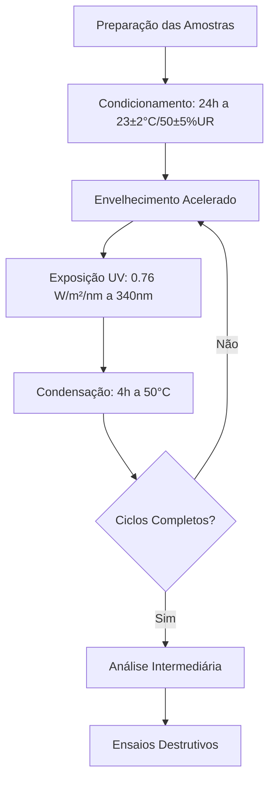

# PROTOCOLO EXPERIMENTAL V2 - GEOTÊXTEIS DE TYPHA DOMINGENSIS

## 1. Objetivos e Hipóteses
- **Objetivo Primário:** Validar a hipótese de que a razão Lignina/Celulose (L/C) prediz a taxa de degradação (k) e Vida Útil Funcional (VUF)
- **Hipótese:** Fibras com maior L/C apresentam menor k e maior VUF devido à proteção da lignina
- **Métrica Primária:** t_P10 (tempo para 10% de falha) ≥ 90 dias para NaOH 6%

## 2. Materiais
- **Matéria-prima:** Fibras de *Typha domingensis* (Taboa)
- **Tratamentos:**
  - Natural
  - NaOH 6% (30 min)
  - NaOH 9% (30 min)
  - Resina poliéster (monocamada)
  - Resina + UV-stabilizer (bicamada)
- **Grupos Controle:** Juta (L/C=0.20), Sisal (L/C=0.15), Coco (L/C=1.05)

## 3. Protocolo de Envelhecimento

- **1 Ciclo = 6h (4h UV + 2h condensação)**
- **Duração:** 60 ciclos (15 dias)
- **Pontos de Análise:** 0, 5, 10, 20, 30, 40, 50, 60 ciclos

## 4. Protocolo de Ensaios Mecânicos
- **Norma:** ASTM D5035 - Ensaio de Tração
- **Parâmetros:**
  - Velocidade: 10 mm/min
  - Comprimento útil: 100 mm
- **Métricas:**
  - Tensão Máxima (MPa)
  - Extensão na Ruptura (%)
  - Módulo de Elasticidade (MPa)
- **Tamanho Amostral:** n=15 por grupo/tempo

## 5. Fluxo de Análise de Dados
```python
def fluxo_analise_v2():
    # 1. Extração e limpeza
    dados = extrair_dados('DB_original.xlsx')
    
    # 2. Conversão unidades
    dados['dias'] = dados['ciclos'] * 0.25
    
    # 3. Split temporal
    treino = dados[dados['dias'] <= 10]
    teste = dados[dados['dias'] > 10]
    
    # 4. Modelagem
    k_strain = ajuste_exponencial(treino, 'strain')
    k_uts = ajuste_exponencial(treino, 'uts')
    
    # 5. Weibull com censura
    params = ajustar_weibull_censura(dados, 'dias', 'censura')
    vuf = calcular_tp10(params['eta'], params['beta'])
    
    # 6. Validação UV
    validar_uv(teste, uv_index=5)
    
    # 7. Exportar resultados
    salvar_resultados('resultados_v2.csv')
```

## 6. Critérios de Qualidade
- **Reprodutibilidade:** R² > 0.85 para modelo L/C→k
- **Precisão:** IC95% para t_P10 < ±15% do valor central
- **Sensibilidade:** Detectar Δk ≥ 0.005 entre tratamentos
- **Limite Falha:** Strain < 3% ou redução UTS > 20%

## 7. Checklist de Reprodutibilidade
- [ ] `requirements.txt` com versões exatas de pacotes
- [ ] `random_seed = 42` em todos os scripts
- [ ] Logging com MLflow para rastrear parâmetros
- [ ] Dockerfile para ambiente replicável
- [ ] `dados_resumo_extraidos.csv` com metadados completos
- [ ] Versionamento de dados com DVC

## 8. Recursos e Cronograma
| Fase | Duração | Recursos |
|------|---------|----------|
| Preparação | 1 semana | Estufa, balanças |
| Envelhecimento | 15 dias | Câmara UV/condensação |
| Ensaios | 2 semanas | Máquina universal |
| Análise | 1 semana | Workstation Python |

## 9. Mitigação de Riscos
- **Perda Amostras:** 20% de amostras extras
- **Variação Umidade:** Controle com sílica gel
- **Falha Equipamento:** Plano de contingência com laboratório parceiro
- **Viés Analítico:** Análise cega por pesquisador independente

*Documento gerado em 05/12/2025 - Versão 2.0*